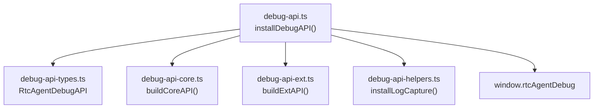
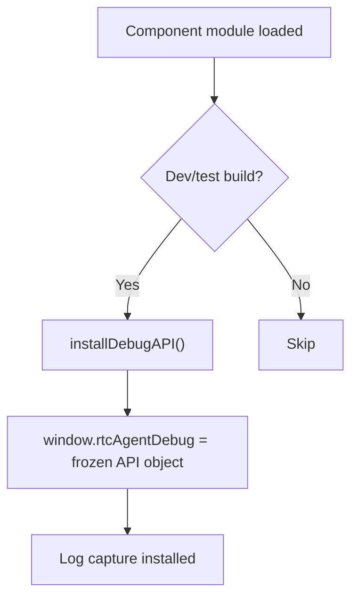

# DebugAPI

window.rtcAgentDebug：运行时调试 API（状态/数据/事件/VFS/日志）。

**所属 package**: `component`

## 关键代码文件

- [debug-api.ts](~/Workspaces/rtc-agent/web-components/packages/component/src/debug-api.ts) — `installDebugAPI()` 入口
- [debug-api-types.ts](~/Workspaces/rtc-agent/web-components/packages/component/src/debug-api-types.ts) — `RtcAgentDebugAPI` 接口
- [debug-api-core.ts](~/Workspaces/rtc-agent/web-components/packages/component/src/debug-api-core.ts) — 核心 API
- [debug-api-ext.ts](~/Workspaces/rtc-agent/web-components/packages/component/src/debug-api-ext.ts) — 扩展 API
- [debug-api-helpers.ts](~/Workspaces/rtc-agent/web-components/packages/component/src/debug-api-helpers.ts) — 共享工具

## 模块结构

## 安装时机

DebugAPI 仅在 dev/test 构建中注入，生产构建不包含。

## API 清单

### 状态查询

- `getState()` — 返回所有 Controller 状态的快照
- `getMetrics()` — DOM 节点数、内存、导航计时、资源摘要
- `isOffline` — 网络模拟状态

### 数据操作

- `clearData()` — 完整清理：断开连接 → 重置认证 → 清除所有存储
- `seedData(data)` — 注入测试数据（tokens, files）
- `loginAs(userId, tokens?)` — 跳过 OAuth2 直接登录
- `logout()` — 登出当前用户

### 事件模拟

- `triggerEvent(name, detail?)` — 派发 CustomEvent

### VirtualFS

- `listFiles(path?)` — 列出文件
- `readFile(path)` — 读取文件
- `writeFile(path, content)` — 写入文件
- `deleteFile(path)` — 删除文件

### Session 管理

- `createSession()` — 创建并切换到新 session
- `switchSession(clientId)` — 切换 session
- `deleteSession(clientId)` — 删除 session
- `renameSession(clientId, title)` — 重命名 session
- `getSessions()` — 获取所有 session 列表
- `getCurrentSessionId()` — 获取当前 session ID

### Message 操作

- `sendMessage(content)` — 发送消息（触发完整提交流程）
- `getMessages()` — 获取当前 session 的消息列表
- `addDemoMessage(content, role?)` — 添加演示消息（不经过服务器）
- `clearMessages()` — 清空当前 session 消息

### Tool Call 模拟

- `getToolCalls()` — 获取待处理的工具调用
- `addPendingToolCall(call)` — 模拟添加工具调用
- `approveToolCall(callId)` — 批准工具调用
- `denyToolCall(callId)` — 拒绝工具调用
- `approveAllToolCalls(toolName)` — 批量批准某工具的所有调用

### Toast / Notification

- `showToast(message, type?)` — 显示 Toast
- `getToasts()` — 获取当前 Toast 列表

### Settings

- `getSettings()` — 获取设置状态
- `updateSettings(section, patch)` — 更新设置（appearance/chat/files/notifications）

### Activity / Layout

- `setActivity(activity)` — 切换活动面板（chat/files/settings）
- `getActivity()` — 获取当前活动状态

### UI Control

- `click(selector)` — 点击元素（支持 `>>>` 跨 Shadow DOM）
- `scrollIntoView(selector)` — 滚动到元素
- `typeText(selector, text)` — 输入文本

### Component Reference

- `element` — 直接引用 `<rtc-agent>` 元素
- `waitForReady(timeout?)` — 等待 Ready 事件
- `waitForConnected(timeout?)` — 等待持久化连接

### Logs

- `logs` — 日志缓冲区（只读）
- `clearLogs()` — 清空日志

## 关键设计

> **Getter 保留** — [debug-api.ts:43-62](~/Workspaces/rtc-agent/web-components/packages/component/src/debug-api.ts#L43-L62)
>
> 不能使用简单 spread 合并，因为 `isOffline` 和 `logs` 是 getter，需要保持动态。解构排除 getter 属性，spread 其余部分，然后重新以内联 getter 附加。

## 跨维度关联

- [[Logger]] — log capture 收集所有模块的日志
- [[ConnectionState]] — 查询连接状态
- [[VirtualFS]] — 调试 VFS 内容
- [[IndexedDB]] — 直接查询数据库
- [[AuthController]] — 查询认证状态
