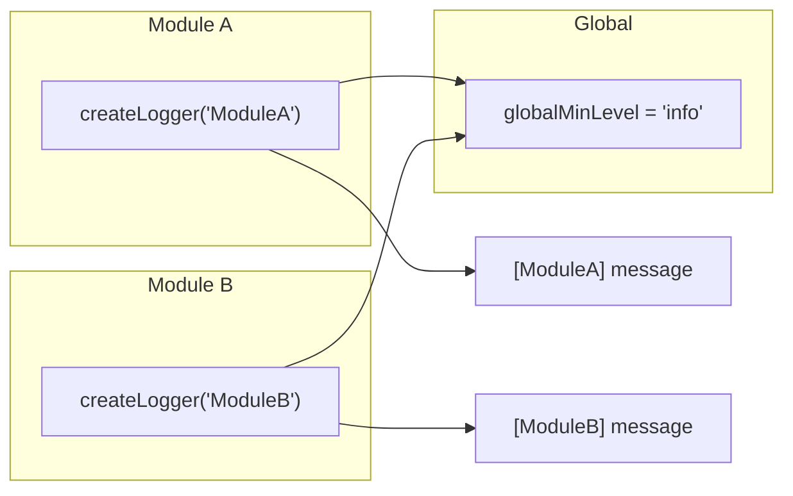

# Logger

轻量级作用域日志：createLogger + 全局级别控制。所有 package 统一使用。

**所属 package**: `client`（定义）/ 所有 package（消费）

## 关键代码文件

- [logger.ts](~/Workspaces/rtc-agent/web-components/packages/client/src/logger.ts) — `createLogger()` + `setGlobalLogLevel()` + `Logger` 接口

## 设计



实现机制：

```typescript
// logger.ts:41-42
const shouldEmit = (level: LogLevel): boolean =>
  LOG_LEVEL_PRIORITY[level] >= LOG_LEVEL_PRIORITY[globalMinLevel];
```

每次调用检查全局级别。`globalMinLevel` 默认为 `'debug'`。

## Logger 接口

```typescript
interface Logger {
  debug(...args: unknown[]): void;
  info(...args: unknown[]): void;
  warn(...args: unknown[]): void;
  error(...args: unknown[]): void;
}
```

每个方法内部先检查级别，再调用对应的 `console.*` 方法，并添加 `[scope]` 前缀。

## 日志级别

| Level | Priority | Console Method |
| --- | --- | --- |
| `debug` | 0 | `console.debug` |
| `info` | 1 | `console.info` |
| `warn` | 2 | `console.warn` |
| `error` | 3 | `console.error` |

级别比较：`LOG_LEVEL_PRIORITY[level] >= LOG_LEVEL_PRIORITY[globalMinLevel]`。低于全局级别的消息被静默丢弃。

## 使用模式

```typescript
import { createLogger } from '@rtc-agent/client';

const log = createLogger('RTCAgentClient');
log.debug('connecting...');  // [RTCAgentClient] connecting...
log.info('connected');       // [RTCAgentClient] connected
log.warn('retry in 3s');     // [RTCAgentClient] retry in 3s
log.error('failed:', err);   // [RTCAgentClient] failed: Error...
```

所有参数通过 `...args` 透传给 `console.*`，支持对象展开：`log.debug('payload', { key: 'value' })`。

## 全局级别控制

```typescript
import { setGlobalLogLevel } from '@rtc-agent/client';
setGlobalLogLevel('warn');  // Only warn + error emitted
```

## Scope 命名约定

各模块使用固定 scope 名称，便于日志过滤：

| Scope | Package | 说明 |
| --- | --- | --- |
| `RTCAgentClient` | client | WebSocket 客户端 |
| `UIUpdateBus` | persistence | UI 更新事件总线 |
| `PersistenceLayer` | persistence | 持久化层 |
| `PermissionChecker` | persistence | 权限检查器 |
| `WorkerCore` | worker | Worker 核心 |
| `RtcProcessor` | persistence | RTC 处理器 |
| `OffsetManager` | persistence | Offset 管理 |
| `WindowInteractionController` | component | 窗口交互 |
| `NotificationController` | component | 通知系统 |
| ... | ... | 更多模块 |

## 与 DebugAPI 的关系

`installLogCapture()`（[debug-api-helpers.ts](~/Workspaces/rtc-agent/web-components/packages/component/src/debug-api-helpers.ts)）劫持 `console.debug/info/warn/error`，将所有输出收集到 `window.rtcAgentDebug.logs` 缓冲区，用于运行时调试。

## 关键注释摘录

> **设计动机** — [logger.ts:1-11](~/Workspaces/rtc-agent/web-components/packages/client/src/logger.ts#L1-L11)
>
> ```text
> Lightweight scoped logger for @rtc-agent/client.
> Provides levelled logging (debug < info < warn < error) with a module prefix.
> In production builds the min level defaults to 'info'; in dev it defaults to 'debug'.
> ```

## 跨维度关联

- [[DebugAPI]] — DebugAPI 通过 log capture 收集日志到 `window.rtcAgentDebug.logs`
- [[PersistenceLayer]] — 使用 `createLogger('PersistenceLayer')`
- [[Connection]] — 使用 `createLogger('RTCAgentClient')`
- [[UIUpdateBus]] — 使用 `createLogger('UIUpdateBus')`
- [[RtcProcessor]] — 使用 `createLogger('RtcProcessor')`
- 所有 package 使用此日志系统
