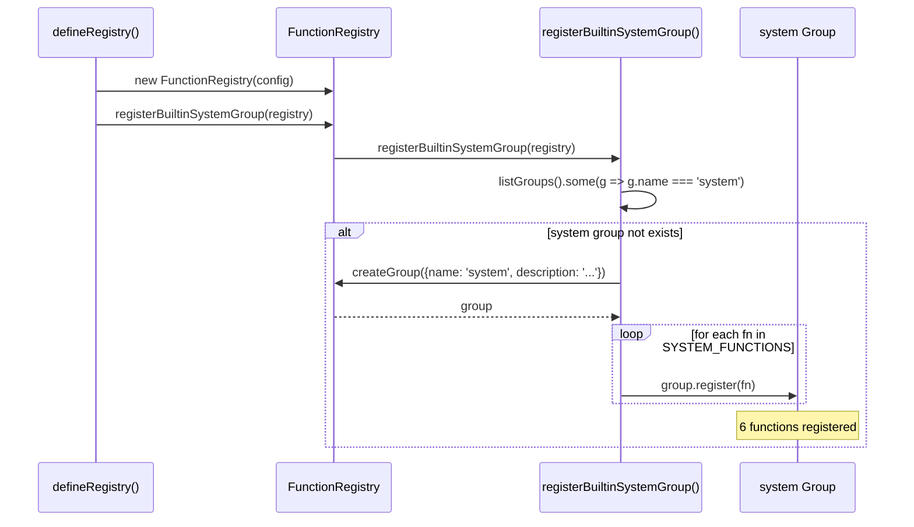

# BuiltinSystemGroup

内置 system 工具组：为脚本沙箱提供被安全策略阻断的平台 API 包装。

**所属 package**: `component`

## 关键代码文件

- [builtin-system-group.ts](~/Workspaces/rtc-agent/web-components/packages/component/src/core/builtin-system-group.ts) — 6 个 system 函数定义 + `registerBuiltinSystemGroup()` 注册入口
- [validation/index.ts](~/Workspaces/rtc-agent/web-components/packages/component/src/validation/index.ts) — Zod schema + `withMeta()` 辅助函数
- [validation/zod-to-openapi.ts](~/Workspaces/rtc-agent/web-components/packages/component/src/validation/zod-to-openapi.ts) — Zod -> OpenAPI Schema 转换

## 设计动机

脚本沙箱（ScriptEngine）通过 Babel AST 变换阻断了灰色 API（`setTimeout`、`crypto.randomUUID` 等）。`system` 组通过标准 `FunctionDef` 注册机制，将这些 API 以受控方式重新暴露给 LLM 脚本。

LLM 发现路径：`/AGENT.md` -> `/functions/INDEX.md` -> `/functions/system/delay.md`

## 注册流程



## 函数清单

| 函数 | 功能 | Zod Schema | 返回值 |
| ---- | ---- | ---------- | ------ |
| `system.delay(ms)` | Promise-based sleep (0-60000ms) | `z.object({ms: z.number().int().min(0).max(60000)})` | `{completed, elapsed}` |
| `system.uuid(count?)` | 生成 UUID v4（1-100 个） | `z.object({count: z.number().int().min(1).max(100).default(1)})` | `string \| string[]` |
| `system.now()` | 当前时间戳（ms since epoch） | 无参数 | `number` |
| `system.random(options?)` | 随机数生成（整数/浮点） | `z.object({min, max, integer})` | `number` |
| `system.time(format?)` | 格式化当前时间 (默认 `locale`) | `z.object({format: z.enum(['iso','locale','timestamp']).default('locale')})` | `string` |
| `system.timezone()` | 本地时区信息 (IANA name + UTC offset) | 无参数 | `{name: string, offset: string}` |

## 调用方式

LLM 通过 `rtcAgent.system.*` 链式调用：

```javascript
// 延迟 1 秒
await rtcAgent.system.delay({ ms: 1000 });

// 生成 UUID
const id = await rtcAgent.system.uuid();
const ids = await rtcAgent.system.uuid({ count: 5 });

// 获取当前时间（默认 locale 格式）
const time = await rtcAgent.system.time();
const isoTime = await rtcAgent.system.time({ format: 'iso' });

// 获取本地时区信息
const tz = await rtcAgent.system.timezone();
// => { name: "Asia/Shanghai", offset: "+08:00" }
```

## Zod vs OpenAPI

`builtin-system-group.ts` 演示了推荐的 Zod schema 注册方式。`FunctionRegistry` 同时兼容直接传入 OpenAPI Schema 的 `parameters` 字段。注册时通过 `zodToParams()` 将 Zod schema 转换为 `ParameterDef[]`（内部使用 OpenAPI 格式）。

## 关键注释摘录

> **设计定位** — [builtin-system-group.ts:1-12](~/Workspaces/rtc-agent/web-components/packages/component/src/core/builtin-system-group.ts#L1-L12)
>
> ```text
> 内置 system 工具组
> 默认注册到每个 FunctionRegistry，提供脚本常用系统级工具函数。
> 这些函数包装了被沙箱阻断的灰色 API（setTimeout、crypto.randomUUID 等），
> 通过 rtcAgent.system.* 暴露给脚本，使 LLM 无需直接访问平台 API。
> ```

> **幂等注册** — [builtin-system-group.ts:33-34](~/Workspaces/rtc-agent/web-components/packages/component/src/core/builtin-system-group.ts#L33-L34)
>
> ```typescript
> if (registry.listGroups().some(g => g.name === 'system')) return;
> ```

## 跨维度关联

- [[FunctionRegistry]] — system 组通过标准 `createGroup()` + `group.register()` 注册
- [[ScriptEngine]] — 沙箱阻断了平台 API，system 组是安全的替代通道
- [[SchemaValidation]] — Zod -> OpenAPI 转换管线
- [[SkillSystem]] — system 组参与 VFS 文档生成（文档由 markdown-generator.ts 生成）
