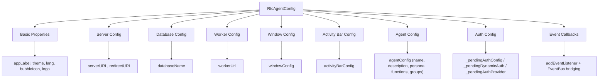
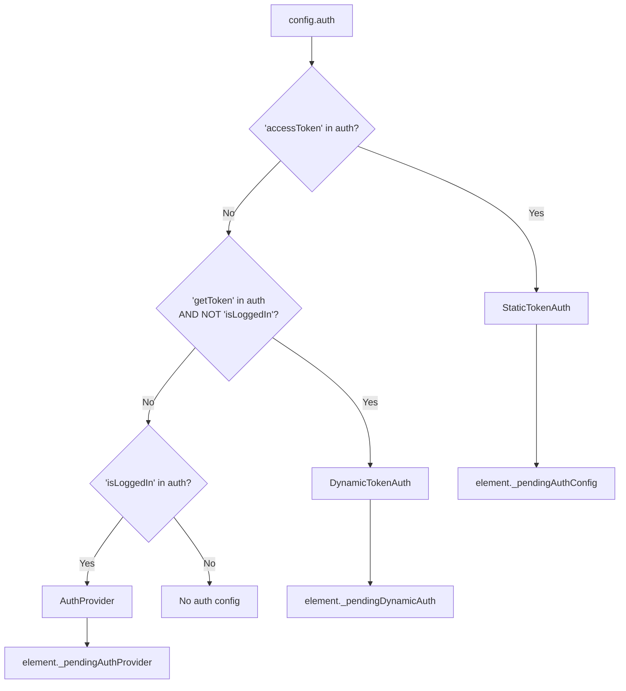
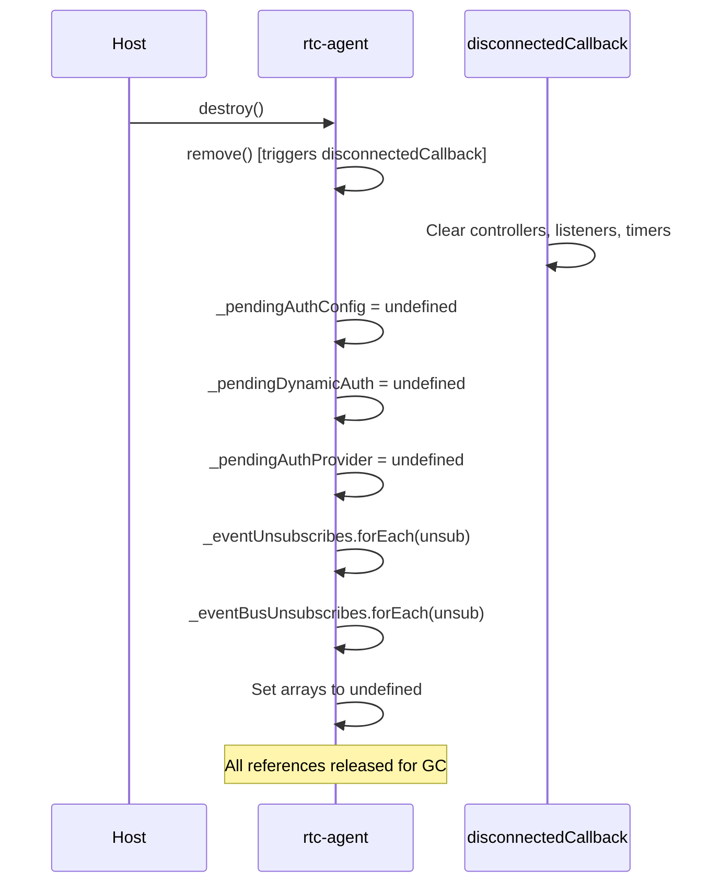

# Factory

createRtcAgent 工厂函数：声明式配置 -> Web Component 实例。

**所属 package**: `component`

## 关键代码文件

- [factory.ts](~/Workspaces/rtc-agent/web-components/packages/component/src/factory.ts) — `createRtcAgent()` 函数（355 行）
- [types/factory.ts](~/Workspaces/rtc-agent/web-components/packages/component/src/types/factory.ts) — `RtcAgentConfig` / `AuthConfig` / `EventCallbacks` / `RtcAgentWithLifecycle` 类型

## 配置到属性的映射

## 三种认证模式检测

## destroy() 清理流程

## 跨维度关联

- [[RtcAgentConfig]] — 配置类型详解
- [[ComponentEvents]] — 事件回调映射
- [[EventBus]] — EventBus 桥接
- [[Ready]] — 就绪信号
- [[AuthController]] — 认证配置的最终消费者
- [[ControllerPattern]] — 工厂创建的组件内部使用控制器模式
- [[ContextSystem]] — 工厂创建的组件内部使用 Context 系统
