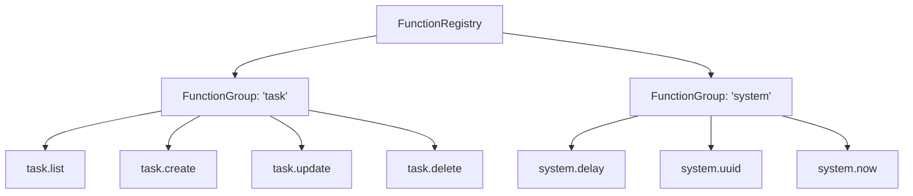
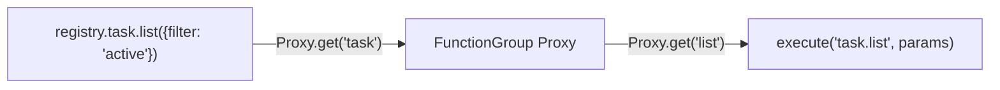
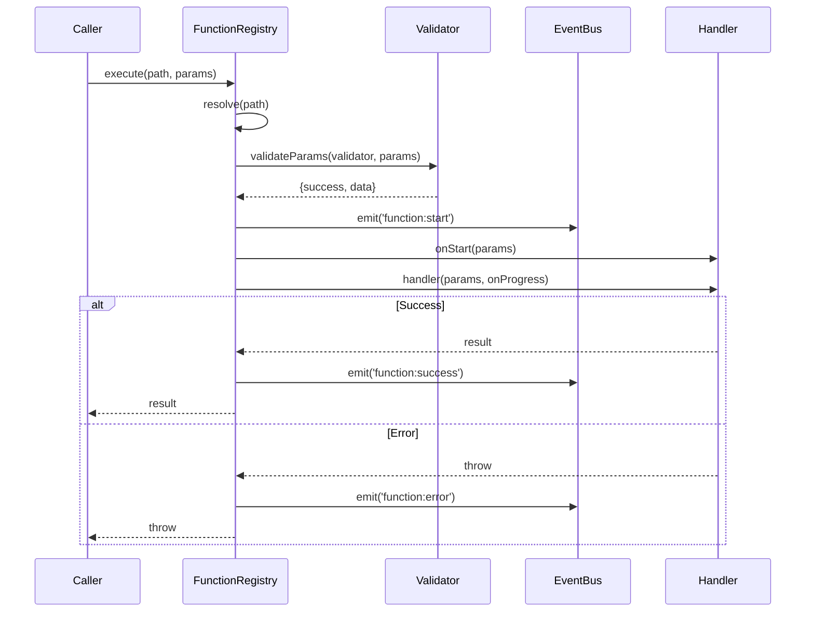
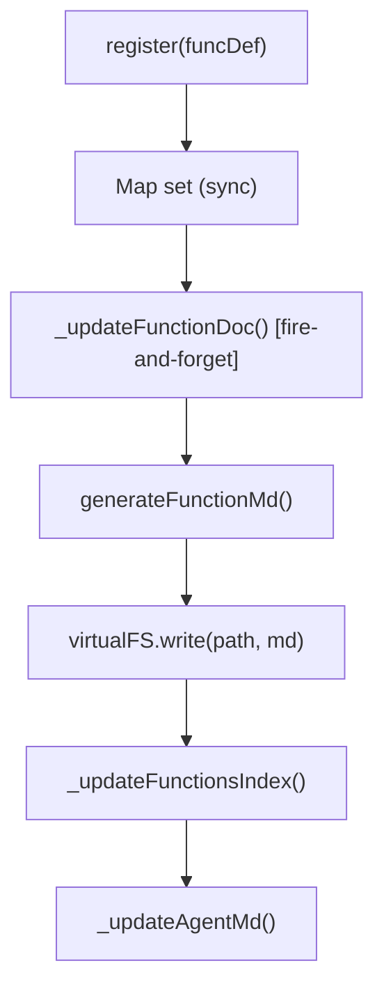

# FunctionRegistry

Function 注册/执行/文档生成，Group 分组与 Proxy 链式调用。

**所属 package**: `component`

## 关键代码文件

- [function-registry.ts](~/Workspaces/rtc-agent/web-components/packages/component/src/core/function-registry.ts) — `FunctionRegistry` + `FunctionGroup` + `defineRegistry()`
- [registry.ts](~/Workspaces/rtc-agent/web-components/packages/component/src/registry.ts) — 示例用法：TaskManager demo

## 核心概念



## Proxy 链式调用



通过 `Proxy` 拦截属性访问，支持 `rtcAgent.groupName.funcName(params)` 的链式语法。

## 执行流程



## 文档自动生成

### 单函数注册时的增量更新



文档路径规则：

- 有 group: `/functions/{group}/{funcName}.md`
- 无 group: `/functions/{funcName}.md`
- 索引: `/functions/INDEX.md`
- Agent: `/AGENT.md`

> **register 是 sync，文档是 fire-and-forget** — [function-registry.ts:119-122](~/Workspaces/rtc-agent/web-components/packages/component/src/core/function-registry.ts#L119-L122)
>
> ```text
> M10: 注意，文档生成（_updateFunctionDoc）是异步的 fire-and-forget 操作。
> register() 返回后，文档可能尚未写入虚拟文件系统。
> ```

### 全量生成与文档对账

`generateAllDocsContent()` 在连接后全量重新生成所有文档，并执行 **文档对账**（Doc Reconciliation）：

```typescript
async generateAllDocsContent(scenarioCount = 0): Promise<{
  files: { path: string; content: string }[];
  deletePaths: string[];  // 孤儿路径：VFS 中有但注册表中已无的文档
}>
```

对账流程：查询 VFS 中 `/functions/` 下所有文件，减去当前注册列表生成的路径，差集即为孤儿。孤儿通过 `deletePaths` 返回，由 `WorkerBridge.batchWriteFiles()` 在事务中一并删除。

> **全量生成用途** — [function-registry.ts:237-242](~/Workspaces/rtc-agent/web-components/packages/component/src/core/function-registry.ts#L237-L242)
>
> 增量 `_updateFunctionDoc()` 在 SharedWorker 重启后可能丢失。`generateAllDocsContent()` 用于连接后全量重建，确保 VFS 文档与注册表一致。

## 跨维度关联

- [[EventBus]] — 执行期间发出 function:* 事件
- [[ToolRegistry]] — FunctionRegistry 与 ToolRegistry 是不同层级的注册表
- [[VirtualFS]] — 文档写入目标
- [[Factory]] — createRtcAgent 支持预配置 functions/groups
