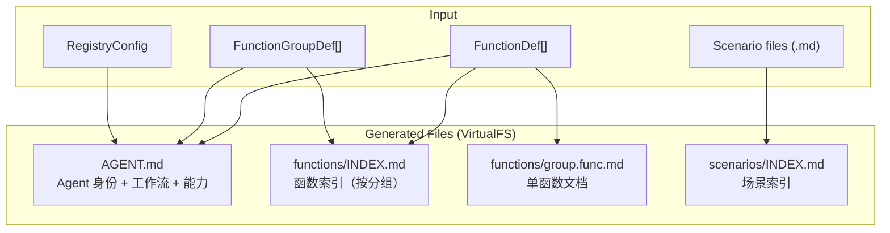
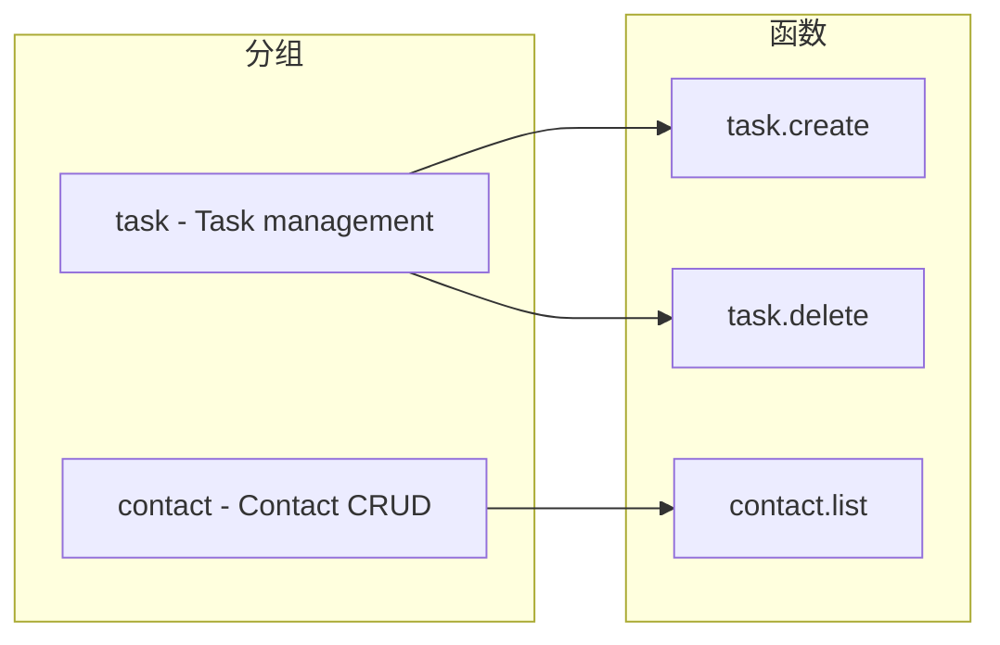
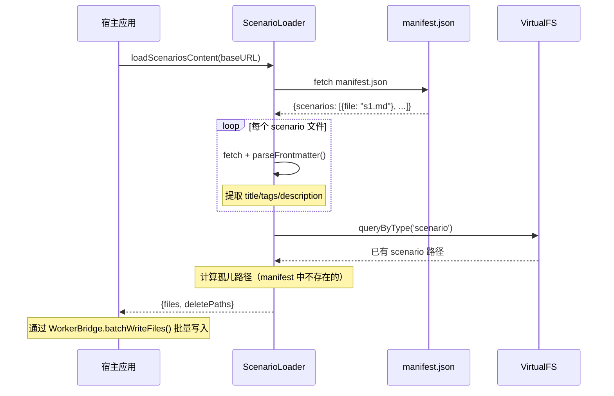
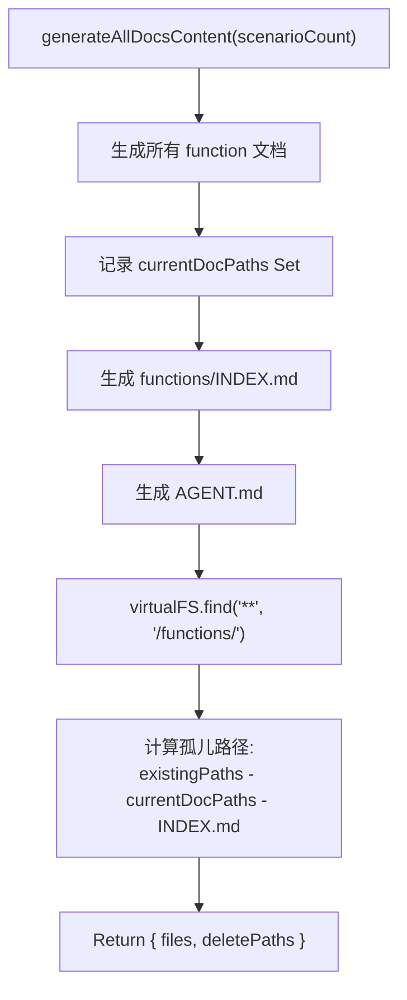

# MarkdownGenerator

从 FunctionDef / ScenarioManifest 生成 Markdown 文档：自动构建 AI Agent 可阅读的工具手册。

**所属 package**: `component`

## 关键代码文件

- [core/markdown-generator.ts](~/Workspaces/rtc-agent/web-components/packages/component/src/core/markdown-generator.ts) — 生成函数文档、索引、AGENT.md
- [core/scenario-loader.ts](~/Workspaces/rtc-agent/web-components/packages/component/src/core/scenario-loader.ts) — Scenario 加载与索引生成
- [validation/zod-to-openapi.ts](~/Workspaces/rtc-agent/web-components/packages/component/src/validation/zod-to-openapi.ts) — Zod Schema -> OpenAPI Schema 转换
- [validation/openapi-to-zod.ts](~/Workspaces/rtc-agent/web-components/packages/component/src/validation/openapi-to-zod.ts) — OpenAPI Schema -> Zod Schema 转换
- [types/skill.ts](~/Workspaces/rtc-agent/web-components/packages/component/src/types/skill.ts) — FunctionDef / ScenarioManifest / RegistryConfig 类型定义

## 生成产物



## generateFunctionMd — 单函数文档

从 `FunctionDef` 生成 Markdown，包含参数表、返回值描述、调用示例。生成的文档结构：

| Section    | 内容                         |
| ---------- | ---------------------------- |
| Header     | 函数名 + 描述                |
| Parameters | 参数表                       |
| Returns    | 返回值描述 (可选)            |
| Example    | 强制引导语 + JS 代码块       |

Example 段落会插入引导语 `**You must use the \`script\` tool to execute the script below.**`，确保 Agent 使用 `script` 工具执行代码。

参数来源优先级：`funcDef.zodSchema`（通过 `zodToParams()` 转换）> `funcDef.parameters`。

> **Example 引导语** — [markdown-generator.ts:192](~/Workspaces/rtc-agent/web-components/packages/component/src/core/markdown-generator.ts#L192)
> _You must use the `script` tool to execute the script below._
> 强制 Agent 使用 `script` 工具而非直接调用，确保函数在沙箱中执行。

## generateFunctionsIndex — 函数索引

按分组组织函数列表：



## generateAgentMd — Agent Prompt

生成 AI Agent 的系统提示，包含：

| Section | 内容 |
| ------- | ---- |
| Header | Agent 名称 + 描述 |
| Persona | 可选，Agent 角色定义 |
| Environment | 运行上下文 (浏览器沙箱、IndexedDB、全局对象) |
| Available Tools | ls / read / write / edit / find / grep / script 等 |
| Available Functions | 按分组列出所有函数 |
| Business Scenarios | Scenario 数量 + 索引链接 |
| How to Call | 谨慎操作指引 + 参数传递规范 |

> **How to Call 更新** — [markdown-generator.ts:479-482](~/Workspaces/rtc-agent/web-components/packages/component/src/core/markdown-generator.ts#L479-L482)
> _You are extremely cautious. You always read the `/Function/INDEX.md` document first and write the `script` based on it._
> 引导 Agent 先查阅函数索引再编写脚本，减少幻觉调用。

## ScenarioLoader — 场景加载

从 URL 加载 Scenario Markdown 文件到 VirtualFS：



### parseFrontmatter

轻量 YAML frontmatter 解析（无外部依赖）：

```
---
title: "标题"
tags: [tag1, tag2]
---
正文内容...
```

支持字段：`id`, `title`, `name`, `description`, `tags`, `author`, `createdAt`。

## generateAllDocsContent — 异步文档生成 + 孤儿清理

`FunctionRegistry.generateAllDocsContent()` 是异步方法，同时生成文档内容和计算孤儿路径：



```typescript
// [function-registry.ts:275-322](~/Workspaces/rtc-agent/web-components/packages/component/src/core/function-registry.ts#L275-L322)
async generateAllDocsContent(scenarioCount = 0): Promise<{
  files: Array<{path: string; content: string}>;
  deletePaths: string[];
}>
```

孤儿路径与 `deletePaths` 一起传递给 `WorkerBridge.batchWriteFiles(files, deletePaths)`，在同一个事务中完成写入和删除，确保 VFS 中的函数文档与当前注册表保持同步。

## 关键注释摘录

> **AGENT.md 调用规范** — [markdown-generator.ts:486-495](~/Workspaces/rtc-agent/web-components/packages/component/src/core/markdown-generator.ts#L486-L495)
> _Always pass parameters as an object with named properties matching the function's parameter names._

<!-- separator -->

> **孤儿路径清理** — [scenario-loader.ts:301-313](~/Workspaces/rtc-agent/web-components/packages/component/src/core/scenario-loader.ts#L301-L313)
> _计算孤儿路径：VFS 中已有的 scenario 文件，但不在当前 manifest 中_

## 跨维度关联

- [[FunctionRegistry]] — FunctionDef 和 FunctionGroupDef 的来源
- [[ToolRegistry]] — script 工具执行时调用函数
- [[ScriptEngine]] — Agent 通过 script 工具执行生成的代码
- [[VirtualFS]] — 生成的 Markdown 文件写入 VirtualFS
- [[SkillSystem]] — ScenarioLoader 是 Skill 系统的数据加载层
- [[SchemaValidation]] — Zod <-> OpenAPI 双向转换为参数文档提供类型信息
