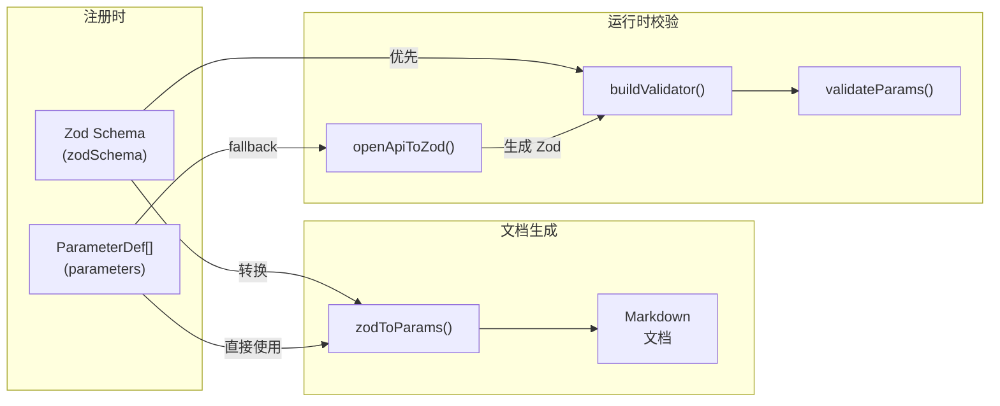
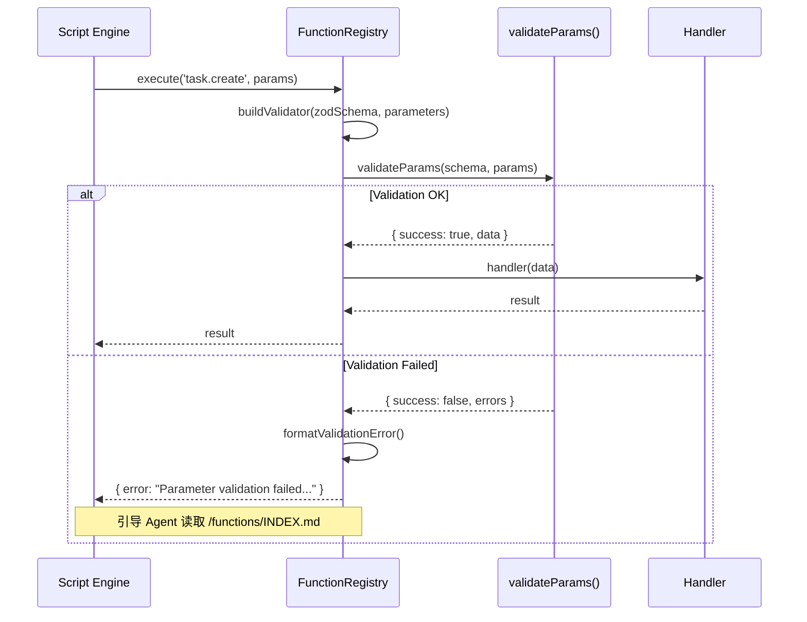

# SchemaValidation

Zod/OpenAPI 双向 Schema 转换与运行时参数校验管线。

**所属 package**: `component`

## 关键代码文件

- [validation/index.ts](~/Workspaces/rtc-agent/web-components/packages/component/src/validation/index.ts) — 统一校验入口：`validateParams` / `buildValidator` / `withValidation`
- [validation/zod-to-openapi.ts](~/Workspaces/rtc-agent/web-components/packages/component/src/validation/zod-to-openapi.ts) — Zod Schema -> OpenAPI Schema 转换（文档生成用）
- [validation/openapi-to-zod.ts](~/Workspaces/rtc-agent/web-components/packages/component/src/validation/openapi-to-zod.ts) — OpenAPI Schema -> Zod Schema 转换（兼容旧注册方式）
- [types/skill.ts](~/Workspaces/rtc-agent/web-components/packages/component/src/types/skill.ts) — `OpenAPISchema` / `ParameterDef` / `FunctionDef` 类型定义

## 转换管线



## 双向转换支持

### Zod -> OpenAPI（文档生成方向）

| Zod 特性 | OpenAPI 输出 |
| ---------- | ----------- |
| `z.string()` | `{ type: 'string' }` |
| `.min(n)` / `.max(n)` | `minimum` / `maximum` |
| `.minLength(n)` / `.maxLength(n)` | `minLength` / `maxLength` |
| `.regex(pattern)` | `pattern` |
| `z.number().int()` | `{ type: 'integer' }` |
| `z.enum([...])` | `{ type: 'string', enum: [...] }` |
| `.optional()` | `required: false` |
| `.default(val)` | `default: val, required: false` |
| `.describe(text)` | `description` |
| `.meta({ example })` | `example`（通过 `withMeta` 扩展） |

### OpenAPI -> Zod（兼容旧注册方式）

| OpenAPI 类型 | Zod 输出 |
| ------------ | --------- |
| `{ type: 'string' }` | `z.string()` |
| `{ type: 'number' }` | `z.number()` |
| `{ type: 'integer' }` | `z.number().int()` |
| `{ type: 'boolean' }` | `z.boolean()` |
| `{ type: 'array', items }` | `z.array(items)` |
| `{ type: 'object', properties }` | `z.object({...})` |
| `enum: [...]` | `z.enum([...])` |
| `minLength` / `maxLength` | `.min()` / `.max()` |
| `pattern` | `.regex()` |
| `minimum` / `maximum` | `.min()` / `.max()` |

## Zod v3/v4 兼容

`zod-to-openapi.ts` 兼容 Zod v3 和 v4 的结构差异：

```text
v3: _def.typeName === 'ZodObject', _def.shape 是函数
v4: _def.typeName 是 undefined, _def.shape 是对象

v3: _def.meta 存储 metadata
v4: _zod.bag 存储 metadata
```

解包逻辑处理 `ZodOptional` / `ZodDefault` 包装层，递归提取内部的 ZodObject。

## withMeta 扩展

Zod 原生不支持 `example` 字段。通过 `withMeta()` 在 `_def.meta` 上注入扩展属性：

```typescript
const schema = withMeta(z.string(), { example: 'John Doe' });
// _def.meta = { example: 'John Doe' }
// 导出到 OpenAPI 时: { example: 'John Doe' }
```

## 运行时校验流程



## 校验错误格式

校验失败时，错误消息被格式化为 Agent 友好的文本，引导 LLM 查阅文档：

```text
Parameter validation failed: task.create

Error details:
  - title: Required
  - priority: Invalid enum value. Expected 'low' | 'medium' | 'high'

Please refer to `/functions/INDEX.md` for the correct parameter format and instructions.
```

## 关键注释摘录

> **双 Schema 兼容策略** — [validation/index.ts:79-93](~/Workspaces/rtc-agent/web-components/packages/component/src/validation/index.ts#L79-L93)
>
> ```text
> 构建校验器：优先使用 zodSchema，否则从 parameters 生成。
> buildValidator(zodSchema, parameters) → Zod schema 用于校验
> ```
>
> 优先 Zod（类型安全），fallback OpenAPI（向后兼容）。

> **Zod v3/v4 兼容** — [validation/zod-to-openapi.ts:62-67](~/Workspaces/rtc-agent/web-components/packages/component/src/validation/zod-to-openapi.ts#L62-L67)
>
> ```text
> 兼容 Zod v3 和 v4 的结构差异
> Zod v3: _def.typeName === 'ZodObject', _def.shape 是函数
> Zod v4: _def.typeName 是 undefined, _def.shape 是对象
> ```

## 跨维度关联

- [[FunctionRegistry]] — 调用 `buildValidator` 进行运行时校验
- [[ToolRegistry]] — ToolRegistry 中的脚本执行也使用校验
- [[SkillSystem]] — `zodToParams` 被 `generateFunctionMd()` 使用生成 Agent 文档
- [[ScriptEngine]] — 脚本执行时参数经由此管线校验
