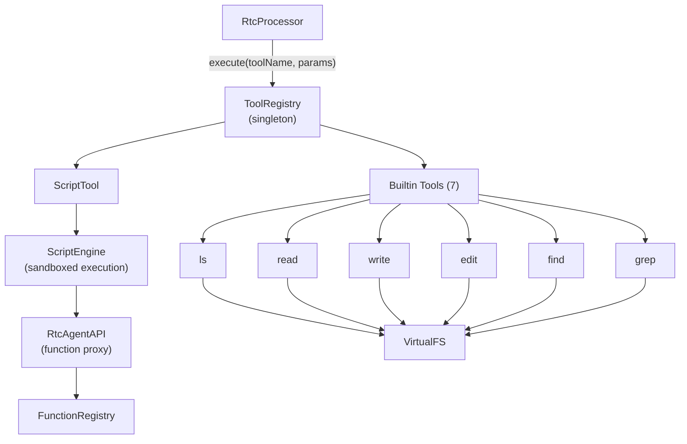
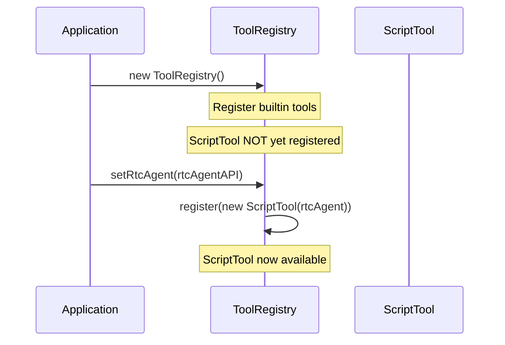

# ToolRegistry

Tool 注册/执行（内置工具 + 脚本引擎），供 RTC 处理器使用。

**所属 package**: `persistence`

## 关键代码文件

- [tools/registry.ts](~/Workspaces/rtc-agent/web-components/packages/persistence/src/tools/registry.ts) — `ToolRegistry` 类 + `toolRegistry` 全局单例
- [tools/builtin.ts](~/Workspaces/rtc-agent/web-components/packages/persistence/src/tools/builtin.ts) — 7 个内置工具实现
- [tools/types.ts](~/Workspaces/rtc-agent/web-components/packages/persistence/src/tools/types.ts) — `Tool` / `ToolName` / `ToolParams` / `ToolResult` 类型
- [script-engine.ts](~/Workspaces/rtc-agent/web-components/packages/persistence/src/script-engine.ts) — 脚本引擎（ScriptTool 的底层实现）

## Tool vs Function

| 概念 | 层级 | 用途 |
| ------ | ------ | ------ |
| `ToolRegistry` | persistence 层 | AI 工具调用（RTC 处理） |
| `FunctionRegistry` | component 层 | 用户定义的业务函数 |

Tool 是 AI 可调用的原子操作（ls, read, write, edit, find, grep, script），Function 是宿主应用注册的业务逻辑。

## 内置工具清单

| Tool | 功能 | 底层接口 |
| --- | --- | --- |
| `ls` | 列出目录内容 | `virtualFS.ls()` |
| `read` | 读取文件内容（带行号） | `virtualFS.read()` |
| `write` | 写入/追加/新建文件 | `virtualFS.write()` |
| `edit` | 字符串替换精确编辑 | `virtualFS.edit()` |
| `find` | 文件名模式搜索 | `virtualFS.find()` |
| `grep` | 文件内容正则搜索 | `virtualFS.grep()` |
| `script` | 执行 LLM 生成的脚本 | `ScriptEngine` |

`askUser` 虽然在 `ToolName` 类型中定义（[tools/types.ts:6](~/Workspaces/rtc-agent/web-components/packages/persistence/src/tools/types.ts#L6)），但不通过 ToolRegistry 执行。RtcProcessor 在 `processOne()` 中识别 `tool_name === 'askUser'` 后直接路由到 `processAskUser()`，使用注入的 `askUserDialog` 回调收集用户输入（详见 [[RtcProcessor]]）。

## 架构

## 延迟注入

`ScriptTool` 需要 `RtcAgentAPI` 来代理函数调用到 `FunctionRegistry`。由于初始化时序问题，采用延迟注入模式。

## 错误处理

所有文件系统操作通过 `executeFS()` 包装函数统一错误处理：

- `PathError` → 返回 `{ success: false, error: message }`
- `SyntaxError` → 返回 `{ success: false, error: message }`
- 其他错误 → 返回 `{ success: false, error: message }`（不再抛出）

## 跨维度关联

- [[FunctionRegistry]] — ScriptTool 通过 RtcAgentAPI 调用 FunctionRegistry
- [[ScriptEngine]] — ScriptTool 的底层沙箱执行引擎
- [[RtcProcessor]] — RTC 处理管线调用 ToolRegistry
- [[Permission]] — RtcProcessor 在执行工具前检查权限矩阵
- [[VirtualFS]] — 文件操作工具通过 VirtualFS 接口
- [[OverlaySystem]] — 工具确认 UI（rtc-tool-confirm）由 ToolCallController 管理
