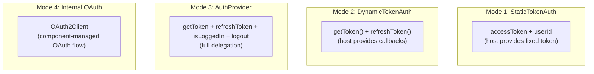
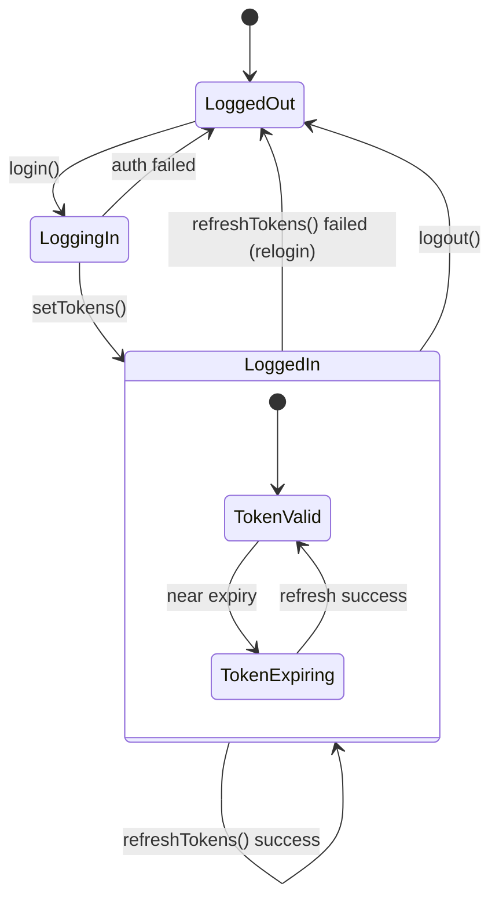
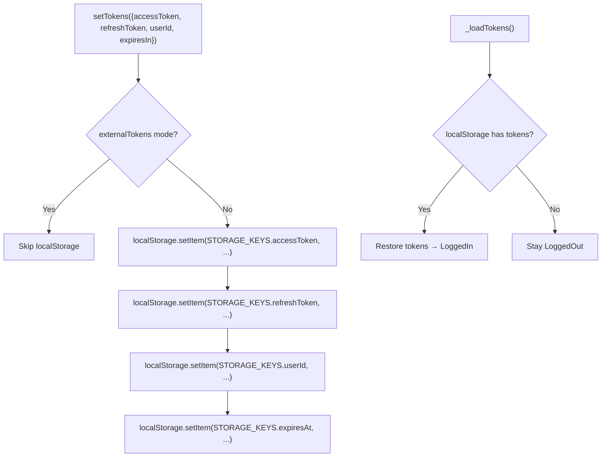
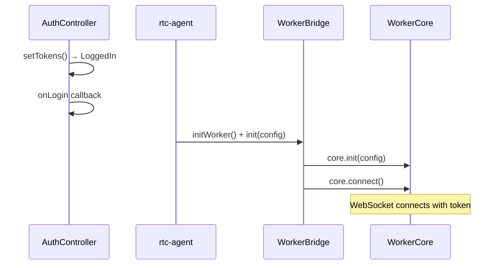

# AuthController

Auth 状态管理：四种认证模式、token 持久化、自动刷新。

**所属 package**: `component`

## 关键代码文件

- [controllers/auth.controller.ts](~/Workspaces/rtc-agent/web-components/packages/component/src/controllers/auth.controller.ts) — `AuthController` 类
- [contexts/auth.ts](~/Workspaces/rtc-agent/web-components/packages/component/src/contexts/auth.ts) — `AuthContextValue` + `AuthState`
- [config/auth.ts](~/Workspaces/rtc-agent/web-components/packages/component/src/config/auth.ts) — `AUTH_CONFIG` + `STORAGE_KEYS`

## 四种认证模式



## 状态机



## Token 持久化



## onLogin 回调



> **Auth onLogin race condition fix** — AuthController 的 `onLogin` 回调解决了一个竞态条件：`connectedCallback()` 先于异步 token 刷新完成执行。通过 `onLogin` 触发连接，确保 token 就绪后再建立 WebSocket。

## 关键注释摘录

> **onLogin 设计动机** — [auth.controller.ts:66-76](~/Workspaces/rtc-agent/web-components/packages/component/src/controllers/auth.controller.ts#L66-L76)
>
> ```text
> Callback fired when auth state transitions to logged-in.
>
> Covers all login paths:
> - Initial token load (valid tokens in localStorage)
> - Token refresh success (expired tokens refreshed on page load)
> - Login dialog completion (user explicitly logs in)
>
> Used by rtc-agent.ts to trigger WebSocket connection after auth is ready,
> fixing the race condition where connectedCallback() runs before async
> token refresh completes.
> ```

## 跨维度关联

- [[OAuth2]] — 内部 OAuth 模式的实现
- [[Connection]] — token 就绪后触发 WebSocket 连接
- [[MasterLock]] — 锁名包含 userId
- [[ComponentEvents]] — 触发 `rtc-auth-login` / `rtc-auth-logout` 事件
- [[Factory]] — 外部认证配置通过 factory 传入
- [[ControllerPattern]] — AuthController 是 ReactiveController 之一
- [[ContextSystem]] — 提供 AuthContext 给 UI 组件
- [[SharedWorker]] — WorkerBridge 的 requestToken 回调通过 AuthController 获取 token
- [[DeviceIdentity]] — deviceId 参与 OAuth2 认证流程
