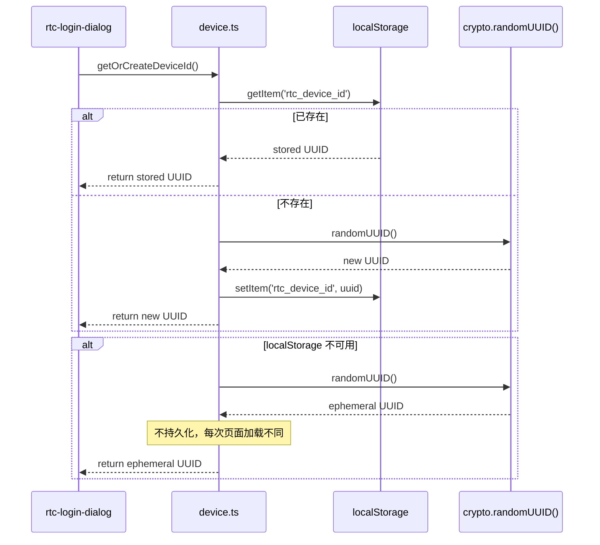
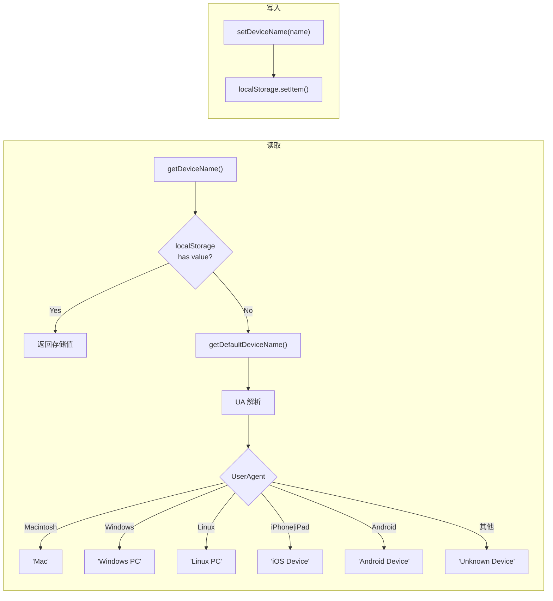
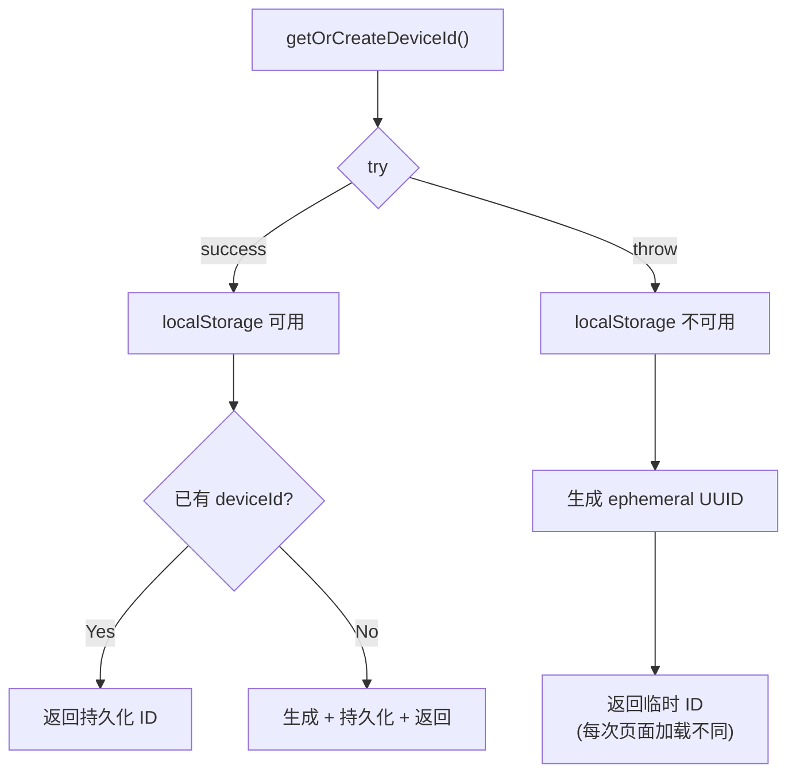
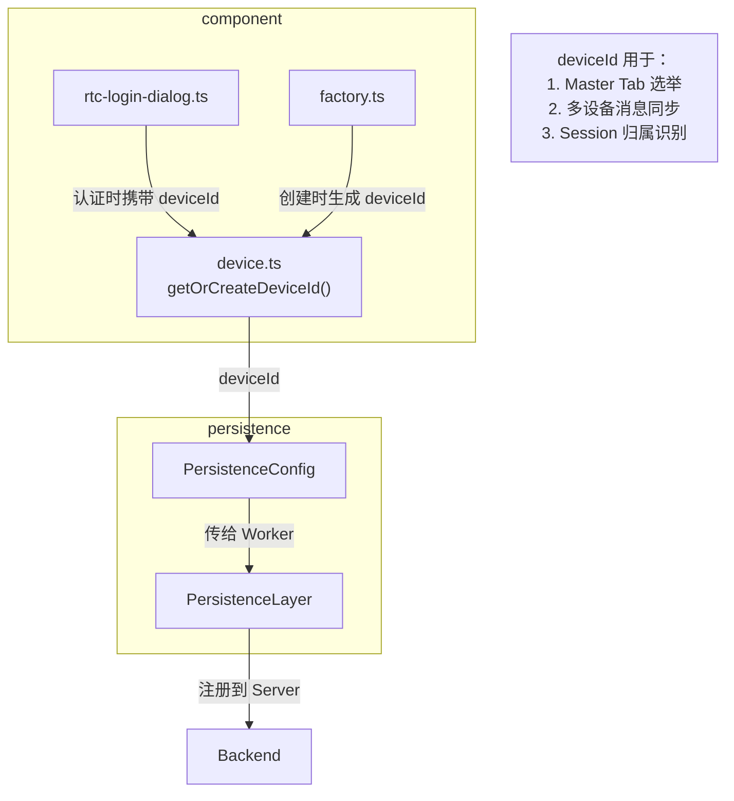

# DeviceIdentity

设备身份管理：Device ID 的生成、持久化、降级策略。跨认证、持久化配置、多 Tab 协调使用。

**所属 package**: `component`（实现）, 被 `persistence` 消费

## 关键代码文件

- [utils/device.ts](~/Workspaces/rtc-agent/web-components/packages/component/src/utils/device.ts) — Device ID/Name 生成与持久化
- [config/auth.ts](~/Workspaces/rtc-agent/web-components/packages/component/src/config/auth.ts) — `STORAGE_KEYS` 定义
- [components/login/rtc-login-dialog.ts](~/Workspaces/rtc-agent/web-components/packages/component/src/components/login/rtc-login-dialog.ts) — 登录时使用 device ID

## Device ID 生命周期



## Device Name 管理



## Storage Keys

定义在 [config/auth.ts](~/Workspaces/rtc-agent/web-components/packages/component/src/config/auth.ts)：

| Key | 值 | 用途 |
| --- | -- | ---- |
| `deviceId` | `'rtc_device_id'` | 设备唯一标识 |
| `deviceName` | `'rtc_device_name'` | 设备显示名称 |

## 降级策略



localStorage 不可用的场景：

- 隐私浏览模式
- 存储配额已满
- iframe 沙箱限制

## 跨 Package 使用



## 设计要点

1. **首次生成，后续复用** — Device ID 只在第一次调用时生成，之后从 localStorage 读取
2. **隐私模式兼容** — localStorage 不可用时降级为 ephemeral UUID，组件仍可工作但每次刷新会生成新 ID
3. **与认证解耦** — Device ID 独立于 OAuth2 token，不需要认证即可生成
4. **UA 推断设备名** — 默认设备名从 UserAgent 推断，用户可在设置中修改

## 关键注释摘录

> **Ephemeral 降级** — [device.ts:16-20](~/Workspaces/rtc-agent/web-components/packages/component/src/utils/device.ts#L16-L20)
>
> ```text
> Get or create a Device ID.
>
> Generates a UUID on first call and persists it to localStorage.
> Subsequent calls return the stored ID.
>
> Falls back to an ephemeral UUID if localStorage is unavailable
> (e.g. private browsing, quota exceeded) — the ID will differ across
> page loads but the component remains functional.
> ```

## 跨维度关联

- [[OAuth2]] — 认证流程中 Device ID 用于标识设备
- [[PersistenceConfig]] — Device ID 是持久化层配置的必需参数
- [[MasterLock]] — Master Tab 选举依赖 Device ID
- [[AuthController]] — AuthController 使用 getDeviceId() 获取设备标识
- [[LocalStorage]] — Device ID 存储在 localStorage 中
- [[EntityRepository]] — Device ID 用于 RTC 过滤（仅处理本设备的 RTC）
