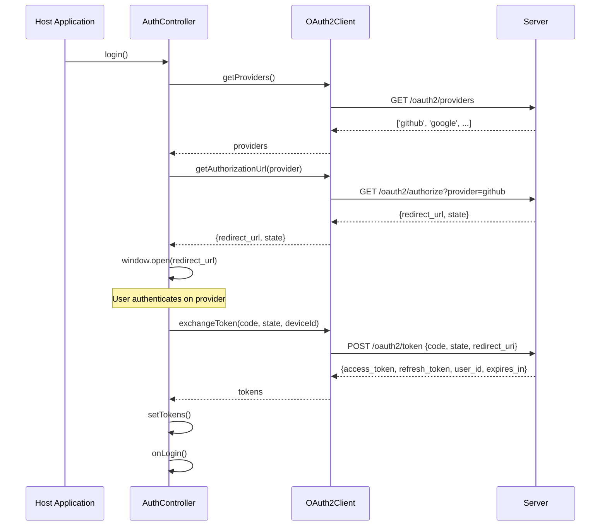
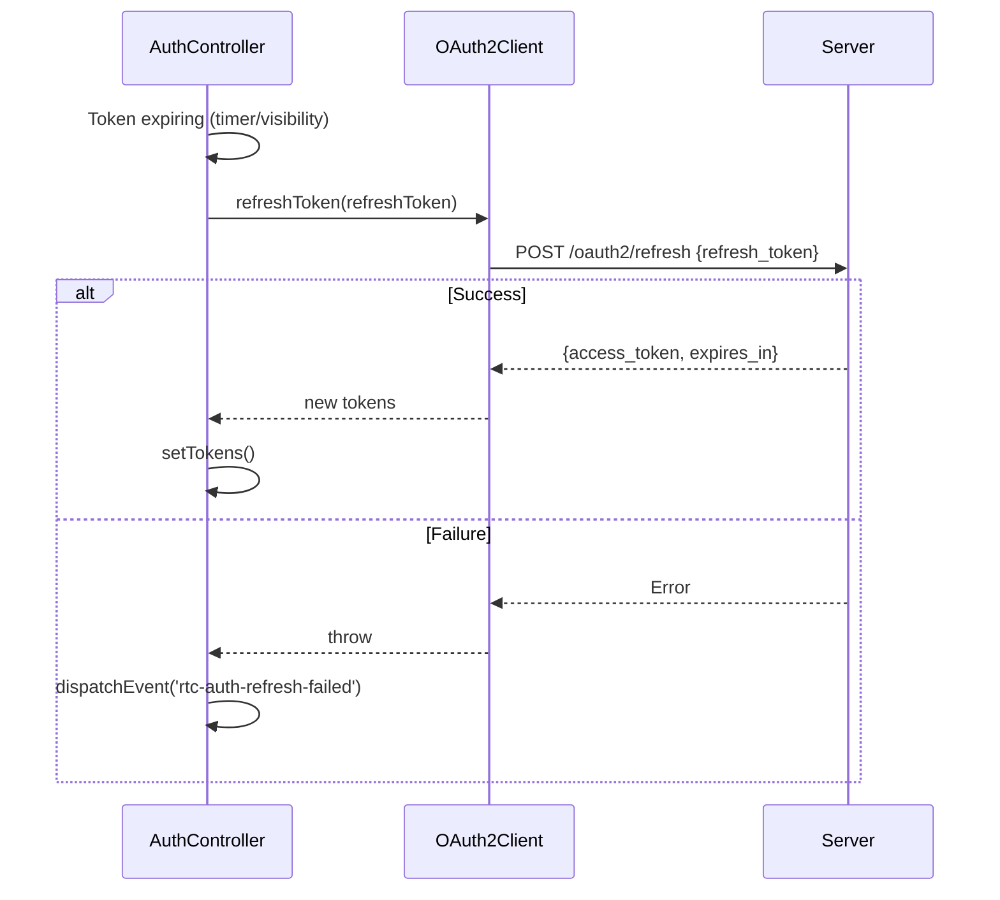

# OAuth2

OAuth2 认证流程：providers / authorize / exchange / refresh。

**所属 package**: `client`

## 关键代码文件

- [oauth2-client.ts](~/Workspaces/rtc-agent/web-components/packages/client/src/oauth2-client.ts) — `OAuth2Client` 类（148 行）
- [protocol/index.ts:140-146](~/Workspaces/rtc-agent/web-components/packages/protocol/index.ts#L140-L146) — OAuth2 协议类型

## 认证流程

## Token 刷新

## API 端点

| Method | Path | Description |
| -------- | ------ | ------------- |
| GET | `/oauth2/providers` | 获取可用认证提供商列表 |
| GET | `/oauth2/authorize` | 获取授权 URL |
| POST | `/oauth2/token` | 用授权码换取 token |
| POST | `/oauth2/refresh` | 刷新 access token |

## 超时处理

所有 HTTP 请求使用 `AbortController` 实现超时，默认 10 秒。

## 跨维度关联

- [[AuthController]] — OAuth2Client 的消费者
- [[Connection]] — token 用于 WebSocket 连接认证
- [[RtcAgentConfig]] — `server.url` 和 `server.redirectUri` 配置 OAuth2Client
