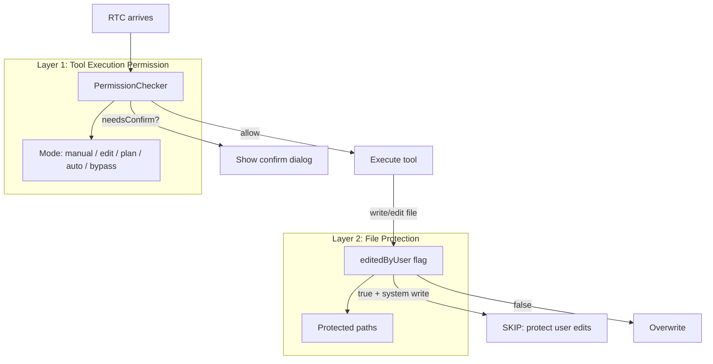
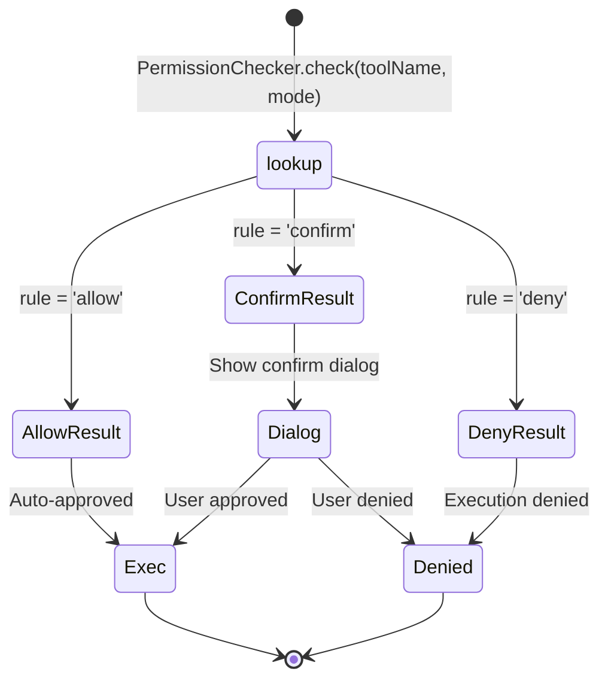
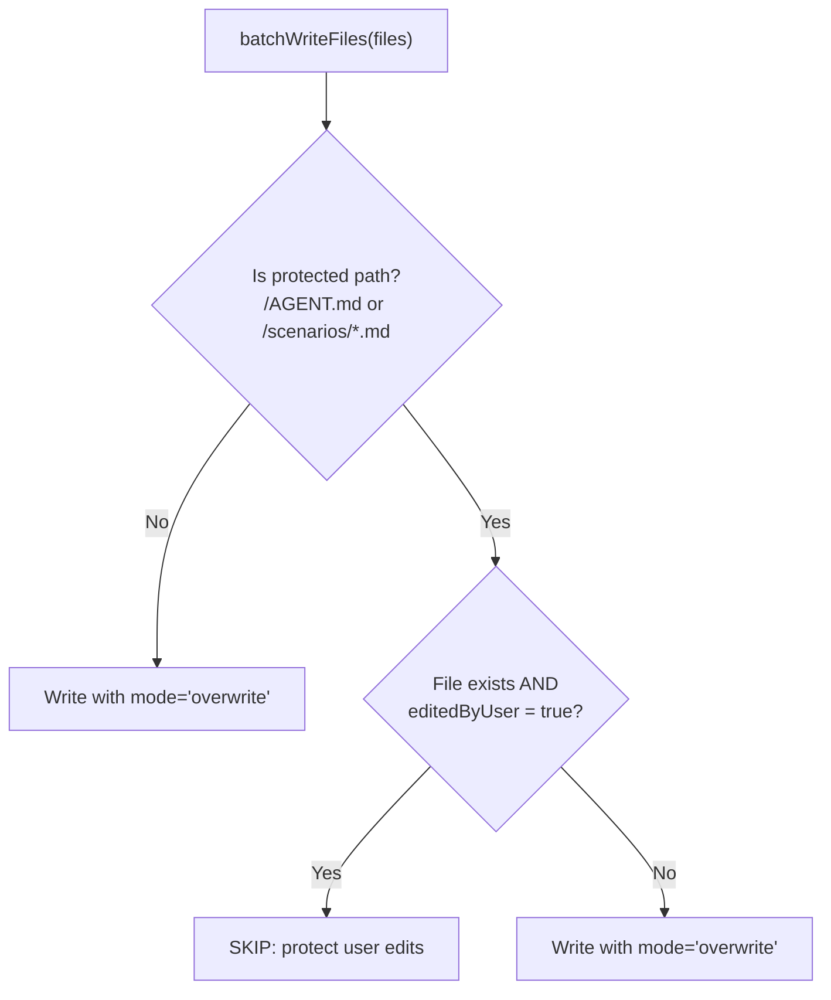
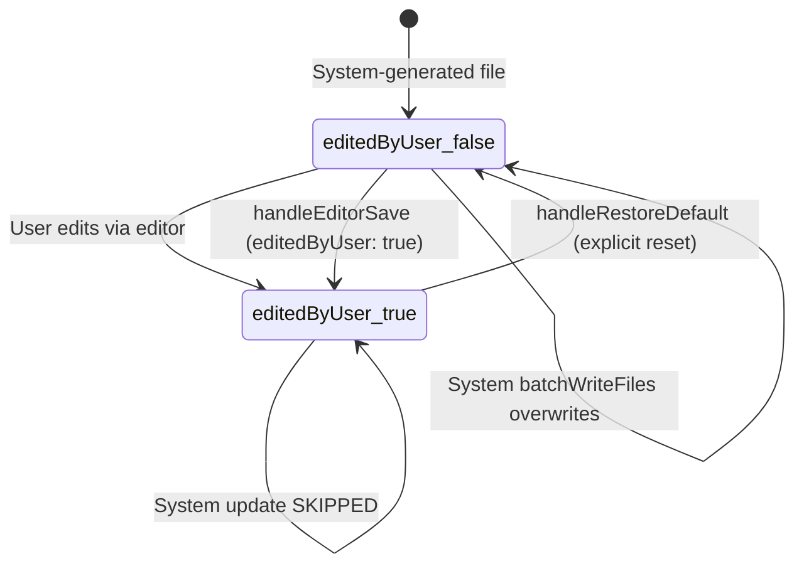
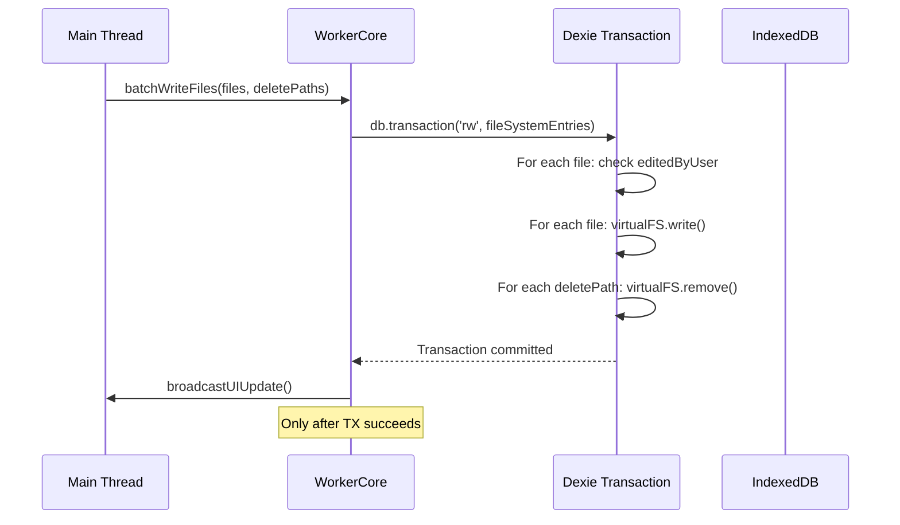
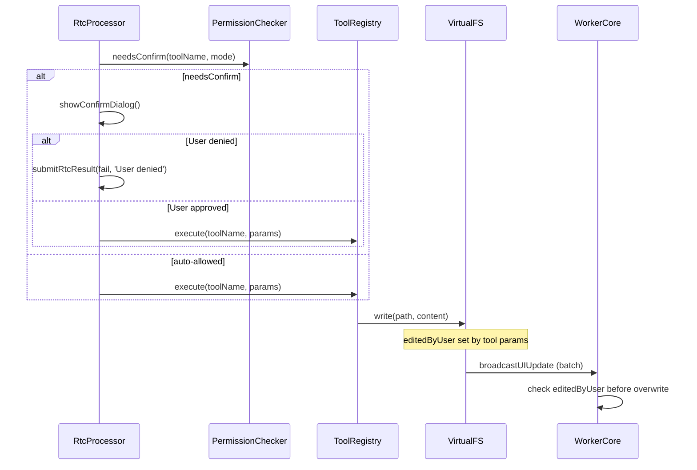
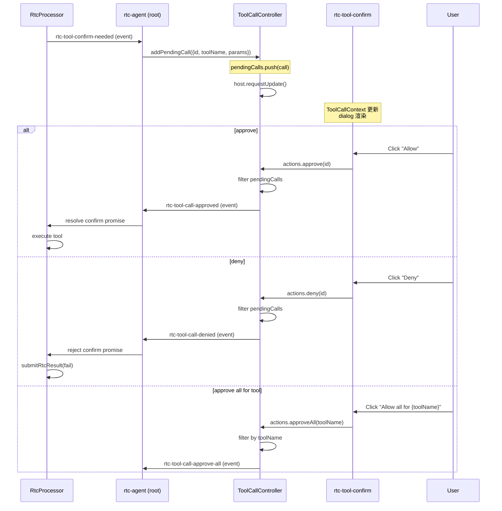

# Permission

权限控制：工具执行权限矩阵（mode-based） + 文件保护机制（editedByUser）。

**所属 package**: `persistence`

## 关键代码文件

- [permission.ts](~/Workspaces/rtc-agent/web-components/packages/persistence/src/permission.ts) — `PermissionChecker` 类 + `PERMISSION_RULES` 权限矩阵
- [rtc-processor.ts:324-362](~/Workspaces/rtc-agent/web-components/packages/persistence/src/rtc-processor.ts#L324-L362) — `processOne()` 中调用 `permissionChecker.needsConfirm()`
- [database.ts:91](~/Workspaces/rtc-agent/web-components/packages/persistence/src/database.ts#L91) — `FileSystemEntryMetadata.editedByUser` 字段
- [worker-core.ts:269-351](~/Workspaces/rtc-agent/web-components/packages/worker/src/worker-core.ts#L269-L351) — `batchWriteFiles()` + `_isProtectedPath()` 保护逻辑

## 两大权限机制



## Layer 1: 工具执行权限矩阵

### Working Mode

| Mode | 含义 |
| ---- | ---- |
| `manual` | 手动模式：所有写操作和脚本需确认 |
| `edit` | 编辑模式：文件写允许，脚本需确认 |
| `plan` | 计划模式：同 edit（暂未启用） |
| `auto` | 自动模式：同 edit（暂未启用） |
| `bypass` | 绕过模式：所有操作自动允许 |

### 权限规则表

`PERMISSION_RULES` 定义每个工具在每个模式下的行为：

| Tool | manual | edit | plan | auto | bypass |
| ---- | ------ | ---- | ---- | ---- | ------ |
| `ls` | allow | allow | allow | allow | allow |
| `read` | allow | allow | allow | allow | allow |
| `find` | allow | allow | allow | allow | allow |
| `grep` | allow | allow | allow | allow | allow |
| `write` | **confirm** | allow | allow | allow | allow |
| `edit` | **confirm** | allow | allow | allow | allow |
| `script` | **confirm** | **confirm** | **confirm** | **confirm** | allow |
| `askUser` | **confirm** | **confirm** | **confirm** | **confirm** | allow |



### askUser 特殊处理

`askUser` 不是传统工具调用——其"执行"本身就是收集用户输入。无论模式如何，都需要 `askUserDialog` 交互：

```typescript
// rtc-processor.ts processOne():
if (toolName === 'askUser') {
    await this.processAskUser(rtc); // Routes to dedicated ask-user dialog
    return;
}
```

### 未知工具默认策略

未注册的工具默认返回 `'confirm'`，需用户确认后才能执行。

```typescript
// permission.ts:
if (!rule) {
    log.warn(`Unknown tool: ${toolName}, requiring confirm`);
    return 'confirm';
}
```

## Layer 2: 文件保护（editedByUser）

### 保护机制



### 受保护路径

| Path Pattern | Description |
|-------------|-------------|
| `/AGENT.md` | Agent 系统提示词文档 |
| `/scenarios/*.md` | 场景文档（排除 `INDEX.md`） |

`/scenarios/INDEX.md` 不受保护，因为它总是由系统自动生成。

### editedByUser 状态机



当用户通过编辑器修改文件时，`editedByUser` 设为 `true`。此后系统的 `batchWriteFiles` 跳过该文件，防止覆盖用户手动修改。

`handleRestoreDefault()` 可将 `editedByUser` 重置为 `false`，恢复系统对该文件的管理权。

### 事务保证 (Fix 55)

`batchWriteFiles` 将整个批次的写操作包裹在单个 Dexie 事务中：



任何一个写入失败，整个批次回滚，防止部分更新。

## 两层权限的交互



1. **RtcProcessor** 调用 `PermissionChecker` 判断是否需要确认
2. 用户确认后，调用 **ToolRegistry** 执行工具
3. 工具调用 **VirtualFS** 写入文件（设置 `editedByUser: true` 表示用户操作）
4. 系统文档更新时，**WorkerCore.batchWriteFiles** 检查 `editedByUser` 标志

## 工具确认 UI 流程 (ToolCallController)

当 `PermissionChecker` 返回 `'confirm'` 时，RtcProcessor 暂停处理并通过 DOM 事件将确认请求传递到 UI 层。`ToolCallController` 管理待确认队列：



关键设计（[tool-call.controller.ts](~/Workspaces/rtc-agent/web-components/packages/component/src/controllers/tool-call.controller.ts)）：

- **队列管理** — `pendingCalls: ToolCall[]` 支持多个并发确认请求
- **三种操作** — `approve(id)` 单个批准、`approveAll(toolName)` 按工具名批量批准、`deny(id)` 拒绝
- **addPendingCall 不通过 Context** — 该方法不在 `ToolCallActions` 接口中，仅由 root 组件直接调用，防止 UI 层绕过权限系统注入工具调用
- **DOM 事件反馈** — 每次操作派发 `rtc-tool-call-approved` / `rtc-tool-call-denied` / `rtc-tool-call-approve-all` 事件，root 组件监听后 resolve/reject RtcProcessor 的 confirm promise

## 关键注释摘录

> **Plan/Auto 模式** — [permission.ts:27-28](~/Workspaces/rtc-agent/web-components/packages/persistence/src/permission.ts#L27-L28)
> _Plan and auto modes are not yet enabled; they temporarily use the same rules as edit mode._

<!-- separator -->

> **askUser 交互本质** — [permission.ts:37-39](~/Workspaces/rtc-agent/web-components/packages/persistence/src/permission.ts#L37-L39)
> _askUser is inherently interactive: the "execution" IS the user's selection, so it always requires the ask-user dialog regardless of mode._

<!-- separator -->

> **未知工具默认策略** — [permission.ts:53-56](~/Workspaces/rtc-agent/web-components/packages/persistence/src/permission.ts#L53-L56)
> _Unknown tools default to requiring confirmation_

## 跨维度关联

- [[RtcProcessor]] — 调用 `permissionChecker.needsConfirm()` 判断是否需要用户确认
- [[ToolRegistry]] — 工具执行的实际入口
- [[VirtualFS]] — editedByUser 存储在 fileSystemEntries 表的 metadata 中
- [[FunctionRegistry]] — 文档生成时检查 editedByUser 标志
- [[ControllerPattern]] — ModeController 管理当前工作模式；ToolCallController 管理待确认队列
- [[DialogState]] — Tool Confirm / Ask User / Restore Confirm 对话框状态
- [[SharedWorker]] — batchWriteFiles 在 Worker 内执行事务
- [[OverlaySystem]] — rtc-tool-confirm 组件渲染待确认的工具调用
