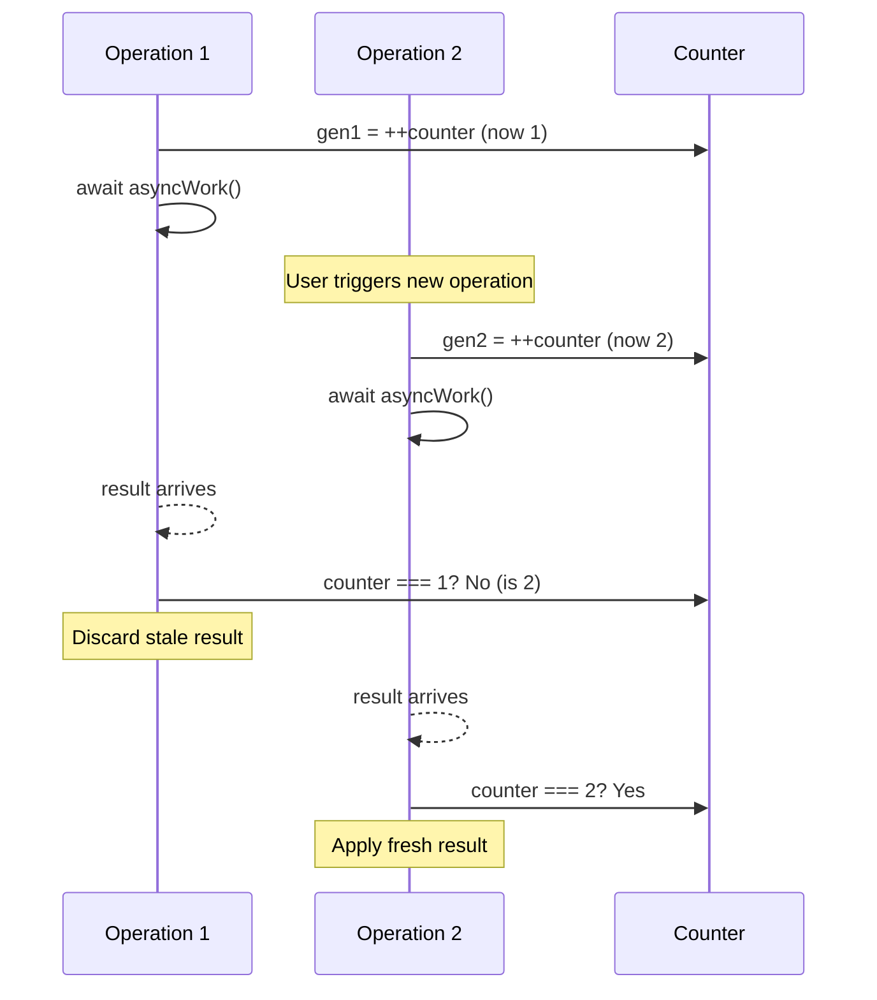
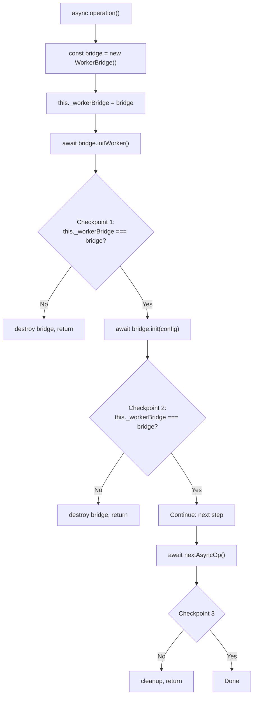
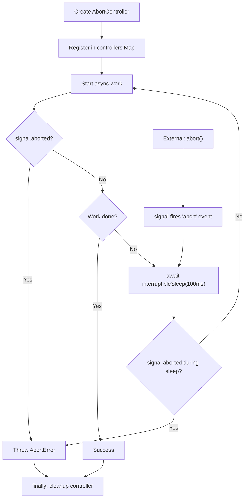
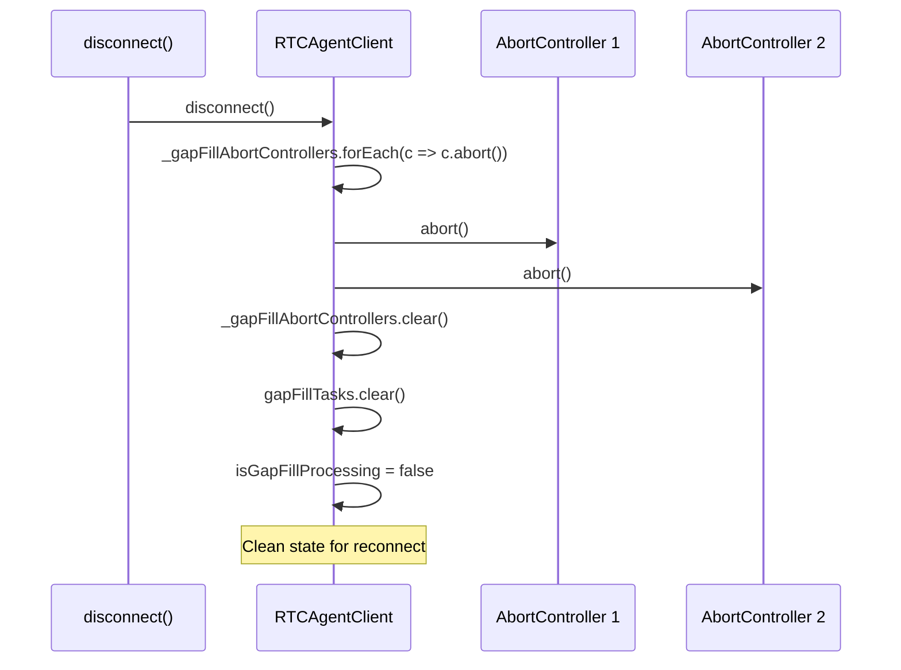
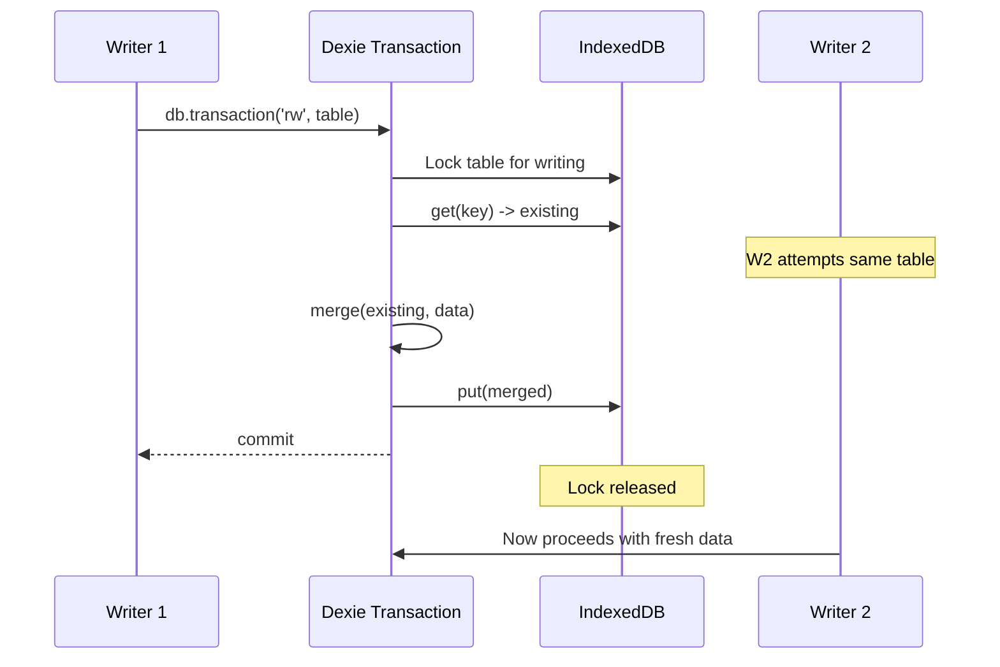
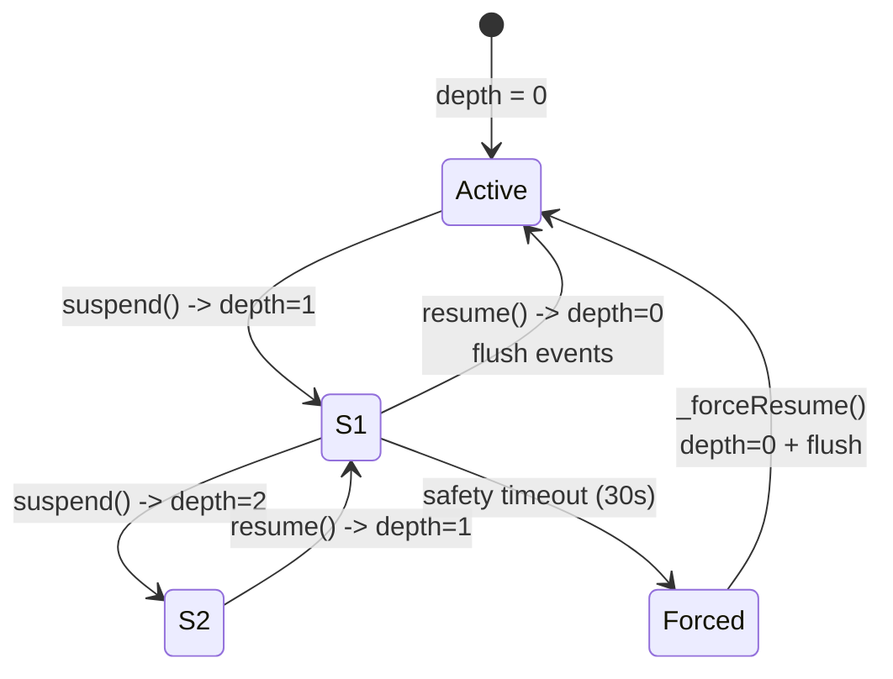
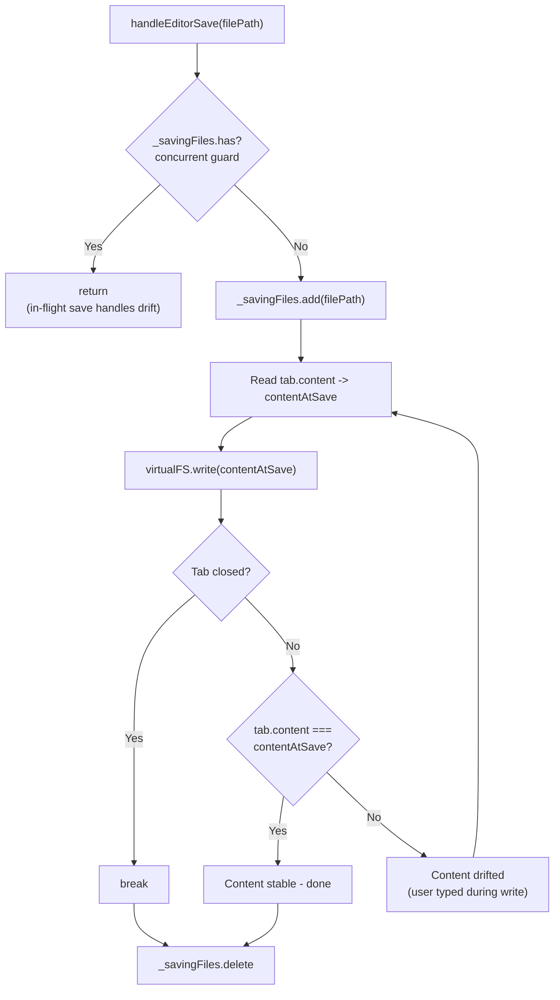
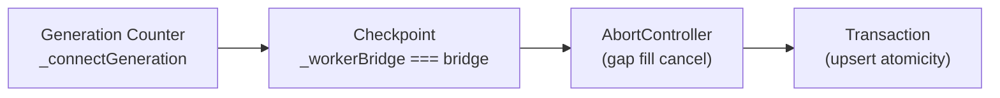
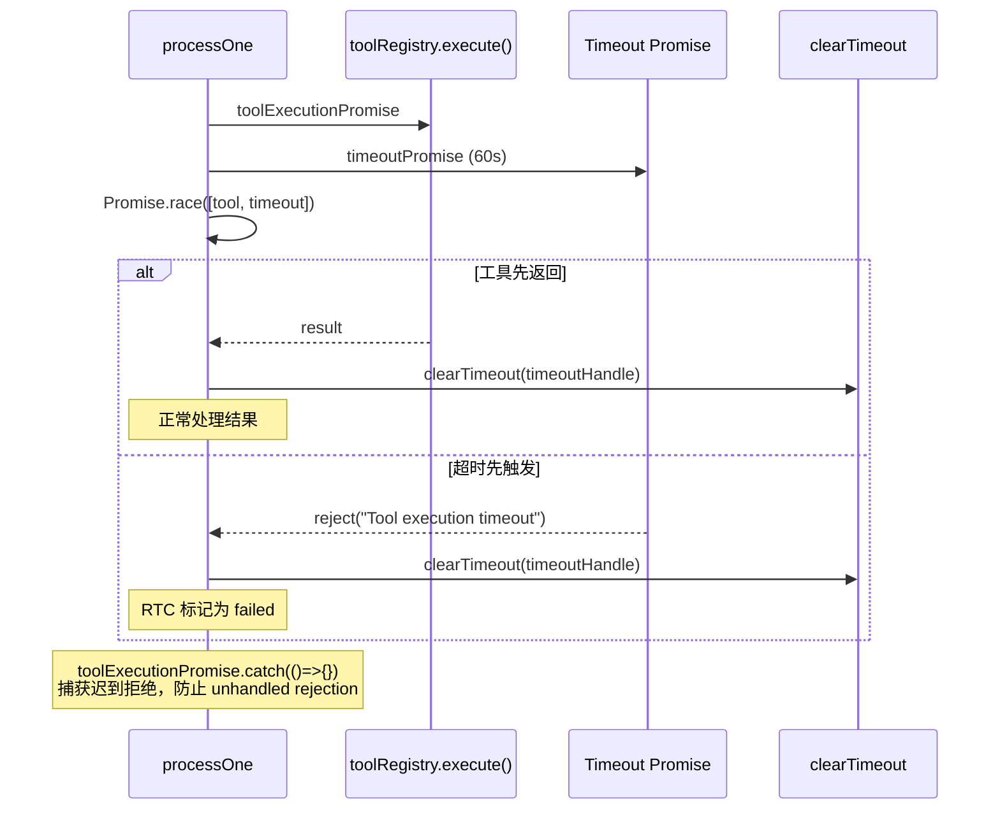
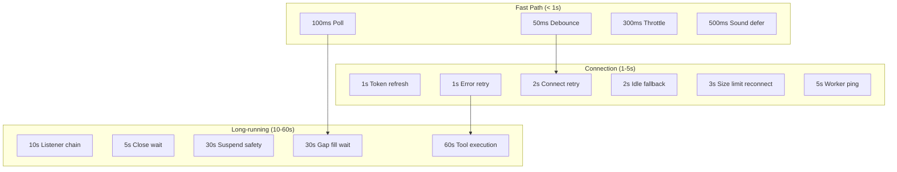

# ConcurrencyPatterns

跨模块竞态防护模式：Generation Counter、Checkpoint、AbortController、事务保护、引用计数 Suspend、超时保护。

**所属 package**: 跨 package（`client` / `persistence` / `component` / `worker`）

## 概述

Web Components 运行在多线程（Main Thread + SharedWorker）、多 Tab、异步 IO 的环境中。以下 6 种模式在不同模块中反复出现，构成了一套统一的竞态防护工具箱。

| # | 模式 | 解决的问题 | 典型位置 |
| --- | ---- | ---------- | -------- |
| 1 | Generation Counter | await 后状态已被外部修改 | PersistenceController, vfs-operations, rtc-message |
| 2 | Checkpoint | 多步 await 间验证实例有效性 | PersistenceController, vfs-operations |
| 3 | AbortController | 长时间操作的可中断取消 | RTCAgentClient, RtcProcessor, MasterLock, NotificationController |
| 4 | 事务保护 (Transaction) | read-modify-write 原子性 | EntityRepository, VirtualFS, WorkerCore |
| 5 | 引用计数 Suspend | 嵌套批量操作的生命周期管理 | UIUpdateBus |
| 6 | Loop-Until-Stable | 写入瞬间内容已过时 | vfs-operations (handleEditorSave) |

此外，本文档末尾包含 **超时/延迟常量目录**，汇总了跨 package 的所有关键 timing 常量。

## 1. Generation Counter

**问题**：`await` 前捕获的状态，在 `await` 返回后可能已被外部操作覆盖。后续代码若基于过期状态做决策，会导致数据不一致。

**解法**：每次操作前递增一个整数计数器。`await` 后检查计数器是否仍然匹配；不匹配则丢弃结果。



### 使用位置

| 位置 | 计数器 | 用途 |
|------|--------|------|
| [persistence.controller.ts:266](~/Workspaces/rtc-agent/web-components/packages/component/src/controllers/persistence.controller.ts#L266) | `_connectGeneration` | 连接 attempt 失效检测：`disconnect()` 递增计数器，使旧 `_connecting` promise 的 `finally` 块失效 |
| [vfs-operations.ts:56](~/Workspaces/rtc-agent/web-components/packages/component/src/components/rtc-agent/helpers/vfs-operations.ts#L56) | `_folderLoadGenerations` (Map) | 文件夹加载：快速展开/折叠同一目录时，只接受最新一次的结果 |
| [rtc-message.ts:93](~/Workspaces/rtc-agent/web-components/packages/component/src/components/content-area/rtc-message.ts#L93) | `_parseGeneration` | Markdown 解析：流式输出期间多次触发解析，丢弃过期解析结果 |
| [rtc-markdown-editor.ts:99](~/Workspaces/rtc-agent/web-components/packages/component/src/components/markdown-editor/rtc-markdown-editor.ts#L99) | `_parseGeneration` | 编辑器 Markdown 解析：同上 |

### 清理策略

[vfs-operations.ts:167-168](~/Workspaces/rtc-agent/web-components/packages/component/src/components/rtc-agent/helpers/vfs-operations.ts#L167-L168)

Generation counter 在 `finally` 块中清理（`_folderLoadGenerations.delete(path)`），防止长时间运行的 Session 中内存泄漏：

```typescript
finally {
    // Clean up the generation entry to prevent memory leak
    if (_folderLoadGenerations.get(path) === myGeneration) {
        _folderLoadGenerations.delete(path);
    }
}
```

## 2. Checkpoint 验证

**问题**：长链 `await` 中间，宿主组件可能已卸载、Tab 可能已关闭、Worker 桥接可能已断开。

**解法**：在每个 `await` 后插入"检查点"——验证当前实例是否仍然有效。无效则优雅退出并清理。



### 使用位置

| 位置 | 检查内容 | 用途 |
|------|----------|------|
| [persistence.controller.ts:465-496](~/Workspaces/rtc-agent/web-components/packages/component/src/controllers/persistence.controller.ts#L465-L496) | `this._workerBridge === bridge` | Worker 初始化：React StrictMode 双挂载时，旧 mount 的 bridge 被新 mount 替换 |
| [vfs-operations.ts:138-155](~/Workspaces/rtc-agent/web-components/packages/component/src/components/rtc-agent/helpers/vfs-operations.ts#L138-L155) | `_folderLoadGenerations.get(path) === myGeneration` | 文件夹加载：await 期间新 load 已启动 |
| [vfs-operations.ts:218](~/Workspaces/rtc-agent/web-components/packages/component/src/components/rtc-agent/helpers/vfs-operations.ts#L218) | Tab 是否仍存在 | 从 VFS 读取文件内容后，Tab 可能已被用户关闭 |

## 3. AbortController 取消

**问题**：长时间运行的异步操作（gap fill 等待、processLoop、Markdown 渲染）无法被及时取消，导致资源浪费或竞态。

**解法**：每个可取消操作创建独立的 `AbortController`。`signal` 在 `await` 前后检查，外部通过 `abort()` 中断等待。



### 使用位置

| 位置 | 控制器 | 触发取消 | 用途 |
|------|--------|----------|------|
| [client.ts:82-83](~/Workspaces/rtc-agent/web-components/packages/client/src/client.ts#L82-L83) | `_gapFillAbortControllers` (Map) | `disconnect()` | Gap fill 等待：防止 zombie 定时器 |
| [rtc-processor.ts:105-111](~/Workspaces/rtc-agent/web-components/packages/persistence/src/rtc-processor.ts#L105-L111) | `_abortController` | `cancel()` | 处理循环：组件卸载或登出时优雅退出 |
| [master-lock.ts:39](~/Workspaces/rtc-agent/web-components/packages/component/src/master-lock.ts#L39) | `_abortController` | `destroy()` | Web Lock 获取：释放锁时中断等待 |
| [notification.controller.ts:77-78](~/Workspaces/rtc-agent/web-components/packages/component/src/controllers/notification.controller.ts#L77-L78) | `_abortController` | `hostDisconnected()` | 通知处理：组件卸载后防止 stale 操作 |
| [scenario-loader.ts:114](~/Workspaces/rtc-agent/web-components/packages/component/src/core/scenario-loader.ts#L114) | 局部 controller | fetch timeout | Scenario 加载：超时取消 |

### disconnect 批量取消



## 4. 事务保护 (Transaction)

**问题**：IndexedDB 是并发数据库，多个 Tab 或多个异步操作可能同时读写同一条记录，导致 lost update。

**解法**：使用 Dexie 的 `db.transaction('rw', tables, fn)` 将 read-modify-write 包裹为原子操作。



### 使用位置

| 位置 | 保护的操作 | 锁定的表 |
|------|-----------|----------|
| [entity-repository.ts:201-203](~/Workspaces/rtc-agent/web-components/packages/persistence/src/entity-repository.ts#L201-L203) | upsert (session/message/rtc/turn) | `sessions` / `messages` / `rtcs` / `turns` |
| [virtual-fs.ts:192](~/Workspaces/rtc-agent/web-components/packages/persistence/src/virtual-fs.ts#L192) | write (read existing -> append -> write) | `fileSystemEntries` |
| [virtual-fs.ts:542](~/Workspaces/rtc-agent/web-components/packages/persistence/src/virtual-fs.ts#L542) | edit (read -> string replace -> write) | `fileSystemEntries` |
| [worker-core.ts:282](~/Workspaces/rtc-agent/web-components/packages/worker/src/worker-core.ts#L282) | batchWriteFiles (multi-write + delete) | `fileSystemEntries` |
| [entity-repository.ts:1434-1476](~/Workspaces/rtc-agent/web-components/packages/persistence/src/entity-repository.ts#L1434-L1476) | writebackTurnCounts (per-session sub-tx) | `sessions`, `turns` |

### 事务嵌套

Dexie 支持事务嵌套：如果已在事务中，复用父事务。这意味着 `upsertSession()` 可以在 `applyUpdates()` 的大事务内安全调用，不会创建独立的事务边界。

## 5. 引用计数 Suspend

**问题**：批量操作（如 gap fill）需要暂停 UI 事件分发，但多个调用方可能嵌套调用 `suspend()` / `resume()`。简单的 boolean 标志会导致内层 `resume()` 过早恢复。

**解法**：使用 `_suspendDepth` 计数器。`suspend()` 递增，`resume()` 递减。仅当 depth 回到 0 时才真正恢复。



### 安全超时

[ui-update-bus.ts:95](~/Workspaces/rtc-agent/web-components/packages/persistence/src/ui-update-bus.ts#L95)

`MAX_SUSPEND_MS = 30_000` — depth 从 0 变为 1 时启动安全计时器。超时后 `_forceResume()` 强制恢复，防止 `suspend()` 被调用但 `resume()` 永远不执行的场景（如异常中断）。

### Listener Chain 超时

[ui-update-bus.ts:97](~/Workspaces/rtc-agent/web-components/packages/persistence/src/ui-update-bus.ts#L97)

`CHAIN_TIMEOUT_MS = 10_000` — 每个 listener 的 Promise 链有 10 秒超时。如果 listener 的 Promise 永远不 resolve，链自动断裂，后续事件正常处理。

## 6. Loop-Until-Stable

**问题**：用户正在编辑文件时按 Ctrl+S，`write()` 是异步的。写入期间用户继续输入，写入完成后 VFS 中的内容已过时。

**解法**：写入前捕获快照 `contentAtSave`，写入后比较当前内容。如果不一致（drift），循环重新写入。



### 关键设计

- **Per-file lock** — `_savingFiles: Set<string>` 防止同一文件的重叠保存
- **快照比较** — 写入前捕获 `contentAtSave`，写入后比较当前 `tab.content`
- **自然收敛** — 用户停止输入后，最多再循环 1 次即稳定
- **UI 合并** — 整个循环只触发一次 `saveFile()` + 一次 Toast

## 模式组合

这些模式经常组合使用。典型案例：

### PersistenceController 连接



1. **Generation Counter** 确保旧 `connect()` promise 的 `finally` 不影响新连接
2. **Checkpoint** 确保 `await initWorker()` 后 bridge 实例仍有效
3. **AbortController** 允许 `disconnect()` 中断进行中的 gap fill
4. **Transaction** 确保数据写入的原子性

### RtcProcessor 处理循环

1. **AbortController** 允许 `cancel()` 在迭代边界中断循环
2. **Master 检查** 每次迭代验证 Master 状态（类似 Checkpoint）
3. **Transaction** 确保 RTC 状态更新的原子性
4. **Promise.race Timeout** 工具执行 60 秒超时防止永久阻塞

### Promise.race Timeout 模式

工具执行可能因网络或 LLM 原因永不返回。使用 `Promise.race` 与超时 Promise 竞争，确保 processOne 不会永久挂起：



关键设计（Fix 76）：

- **finally 清理** — `clearTimeout(timeoutHandle)` 在 `finally` 块中执行，无论哪方胜出都清理定时器
- **迟到拒绝捕获** — `toolExecutionPromise.catch(() => {})` 在 timeout 胜出后静默捕获工具可能的迟到拒绝，防止 unhandled rejection

## 超时/延迟常量目录

跨 package 的所有关键 timing 常量汇总，便于排查延迟相关问题和评估响应性：

### 连接层（client）

| 常量 | 值 | 位置 | 用途 |
| --- | --- | --- | --- |
| `MAX_WAIT_MS` | 30,000 | [client.ts:488](~/Workspaces/rtc-agent/web-components/packages/client/src/client.ts#L488) | Gap fill 等待超时 |
| `POLL_INTERVAL_MS` | 100 | [client.ts:489](~/Workspaces/rtc-agent/web-components/packages/client/src/client.ts#L489) | Gap fill 轮询间隔 |
| `RECONNECT_AFTER_SIZE_LIMIT_DELAY_MS` | 3,000 | [client.ts:102](~/Workspaces/rtc-agent/web-components/packages/client/src/client.ts#L102) | Message size limit 后延迟重连 |
| `RECONNECT_AFTER_TOKEN_REFRESH_DELAY_MS` | 1,000 | [client.ts:104](~/Workspaces/rtc-agent/web-components/packages/client/src/client.ts#L104) | Token 刷新后延迟重连 |

### 持久化层（persistence）

| 常量 | 值 | 位置 | 用途 |
| --- | --- | --- | --- |
| `PROCESS_TIMEOUT_MS` | 60,000 | [rtc-processor.ts:20](~/Workspaces/rtc-agent/web-components/packages/persistence/src/rtc-processor.ts#L20) | 工具执行超时（Fix 76） |
| `ERROR_RETRY_DELAY_MS` | 1,000 | [rtc-processor.ts:12](~/Workspaces/rtc-agent/web-components/packages/persistence/src/rtc-processor.ts#L12) | RTC 处理循环非连接错误重试延迟 |
| `SYNC_BASE_DELAY_MS` | 1,000 | [index.ts:606](~/Workspaces/rtc-agent/web-components/packages/persistence/src/index.ts#L606) | 同步重试基础延迟（指数退避 1s→2s→4s） |
| `MAX_SUSPEND_MS` | 30,000 | [ui-update-bus.ts:95](~/Workspaces/rtc-agent/web-components/packages/persistence/src/ui-update-bus.ts#L95) | UIUpdateBus suspend 安全超时 |
| `CHAIN_TIMEOUT_MS` | 10,000 | [ui-update-bus.ts:97](~/Workspaces/rtc-agent/web-components/packages/persistence/src/ui-update-bus.ts#L97) | Listener Promise 链超时 |
| Close timeout | 5,000 | [index.ts:218](~/Workspaces/rtc-agent/web-components/packages/persistence/src/index.ts#L218) | 优雅关闭等待活跃同步任务超时 |

### 组件层（component）

| 常量 | 值 | 位置 | 用途 |
| --- | --- | --- | --- |
| `CONNECT_RETRY_DELAY_MS` | 2,000 | [persistence.controller.ts:269](~/Workspaces/rtc-agent/web-components/packages/component/src/controllers/persistence.controller.ts#L269) | PersistenceController 连接重试间隔 |
| `INIT_RETRY_DELAY_MS` | 1,000 | [worker-bridge.ts:121](~/Workspaces/rtc-agent/web-components/packages/component/src/worker-bridge.ts#L121) | WorkerBridge 初始化重试间隔（线性退避） |
| `VERIFICATION_TIMEOUT_MS` | 5,000 | [worker-bridge.ts:123](~/Workspaces/rtc-agent/web-components/packages/component/src/worker-bridge.ts#L123) | Worker 健康检查（ping）超时 |
| `NOTIFY_THROTTLE_MS` | 300 | [notification.controller.ts:72](~/Workspaces/rtc-agent/web-components/packages/component/src/controllers/notification.controller.ts#L72) | 通知节流间隔 |
| `IDLE_FALLBACK_DELAY_MS` | 2,000 | [notification.controller.ts:74](~/Workspaces/rtc-agent/web-components/packages/component/src/controllers/notification.controller.ts#L74) | requestIdleCallback 兜底延迟 |
| `DEFERRED_SOUND_DELAY_MS` | 500 | [notification.controller.ts:76](~/Workspaces/rtc-agent/web-components/packages/component/src/controllers/notification.controller.ts#L76) | 非关键音效加载延迟 |
| Debounce | 50 | [bus-handler.ts:68](~/Workspaces/rtc-agent/web-components/packages/component/src/components/rtc-agent/helpers/bus-handler.ts#L68) | DebouncedSessionLoader 防抖间隔 |

### 超时层级关系



## 关键注释摘录

> **Generation Counter 设计** — [persistence.controller.ts:253-266](~/Workspaces/rtc-agent/web-components/packages/component/src/controllers/persistence.controller.ts#L253-L266)
> _Connection generation counter for race-condition prevention. When disconnect() clears `_connecting` while the underlying Promise is still in-flight, a subsequent connect() can set a new `_connecting`. When the OLD Promise finally resolves, its `finally` block would wrongly clear the NEW `_connecting`, leaving the new connection attempt invisible to the concurrency guard._

<!-- separator -->

> **Parse Generation** — [rtc-message.ts:84-92](~/Workspaces/rtc-agent/web-components/packages/component/src/components/content-area/rtc-message.ts#L84-L92)
> _Generation counter — ensures stale parse results (from earlier content versions during streaming) never overwrite newer ones. Each call to `_parseMarkdown()` bumps the counter; if the result arrives when the counter has moved on, it is discarded._

<!-- separator -->

> **Loop-Until-Stable** — [vfs-operations.ts:206-216](~/Workspaces/rtc-agent/web-components/packages/component/src/components/rtc-agent/helpers/vfs-operations.ts#L206-L216)
> _Race-condition safety (loop-until-stable + per-file lock): Concurrency guard: if a save is already in-flight for this file, returns immediately. The in-flight save's loop will detect content drift and re-write. Snapshot comparison: captures content before each write; after write completes, re-reads current tab content. If they differ, the user typed during the write -- loop writes again with latest content._

## 跨维度关联

- [[PersistenceController]] — Generation Counter + Checkpoint 的主要使用场景
- [[Connection]] — Gap Fill AbortController 机制
- [[RtcProcessor]] — AbortController + Master 迭代检查 + 超时保护
- [[NotificationController]] — AbortController 保护 await 后的 stale 操作检查
- [[UIUpdateBus]] — 引用计数 Suspend + Listener Chain 超时
- [[VirtualFS]] — 事务保护 write/edit
- [[EntityRepository]] — 事务保护 upsert
- [[SharedWorker]] — WorkerCore batchWriteFiles 事务
- [[RootComponentHelpers]] — handleEditorSave Loop-Until-Stable + Generation Counter
- [[MessageRepository]] — Per-Session Update Chain 容错
- [[SyncPattern]] — PersistenceLayer 的 _closing 守卫 + _activeSyncTasks 跟踪
- [[WorkerBridge]] — Worker 初始化重试 + 健康检查超时
- [[Publication]] — Gap Fill AbortController + Offset 延迟推进
