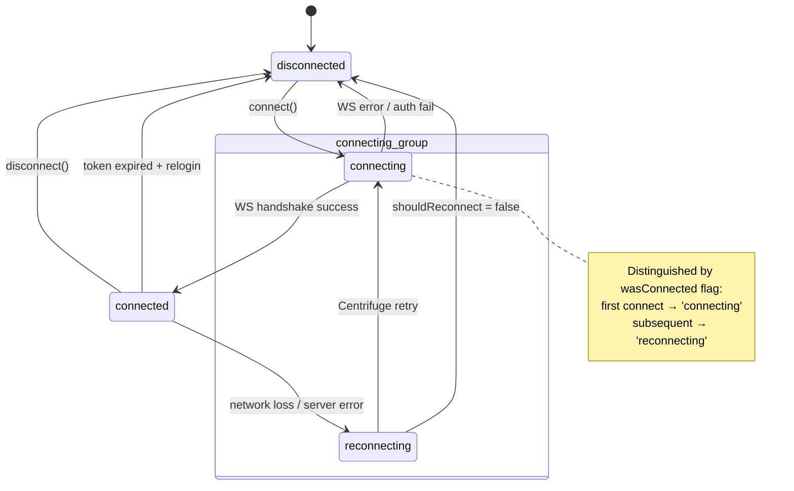
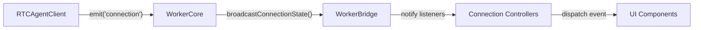

# ConnectionState

连接状态机：disconnected / connecting / connected / reconnecting。

**所属 package**: `client`（定义）/ `worker`（广播）/ `component`（消费）

## 关键代码文件

- [types.ts:27-32](~/Workspaces/rtc-agent/web-components/packages/client/src/types.ts#L27-L32) — `ConnectionState` 类型 + `ConnectionStateEvent` 接口
- [client.ts:965-976](~/Workspaces/rtc-agent/web-components/packages/client/src/client.ts#L965-L976) — `setConnectionState()` 实现

## 状态定义

```typescript
type ConnectionState = 'disconnected' | 'connecting' | 'connected' | 'reconnecting';

interface ConnectionStateEvent {
  state: ConnectionState;
  reason?: string;
}
```

## 状态机



## 状态转换触发点

| From | To | Trigger | Code Location |
|------|-----|---------|---------------|
| `*` | `connecting` | `connect()` called | [client.ts:119](~/Workspaces/rtc-agent/web-components/packages/client/src/client.ts#L119) |
| `connecting` | `reconnecting` | `wasConnected=true` + reconnecting | [client.ts:151](~/Workspaces/rtc-agent/web-components/packages/client/src/client.ts#L151) |
| `*` | `connected` | Centrifuge `'connected'` event | [client.ts:154-158](~/Workspaces/rtc-agent/web-components/packages/client/src/client.ts#L154-L158) |
| `*` | `disconnected` | `disconnect()` called | [client.ts:234](~/Workspaces/rtc-agent/web-components/packages/client/src/client.ts#L234) |
| `*` | `disconnected` | Centrifuge `'disconnected'` event | [client.ts:197](~/Workspaces/rtc-agent/web-components/packages/client/src/client.ts#L197) |

## 广播路径



1. **RTCAgentClient** — `setConnectionState()` 触发 `emit('connection', event)` 和 `onConnectionStateChange?.(event)`
2. **WorkerCore** — `_subscribeConnectionState()` 订阅 client 的 `'connection'` 事件，广播到所有 Tab 回调
3. **WorkerBridge** — `onConnectionStateChange` 回调通知主线程 `_connectionListeners`
4. **组件层** — 通过 `onConnectionStateChange` 监听器或 DOM 事件 `rtc-connection-state-change` 传递给 UI

## 关键注释摘录

> **setConnectionState 去重** — [client.ts:971](~/Workspaces/rtc-agent/web-components/packages/client/src/client.ts#L971)
>
> ```typescript
> if (this.connectionState === state) return;
> ```
>
> 防止重复状态转换触发多余事件。

## 跨维度关联

- [[Connection]] — 驱动状态转换的 WebSocket 生命周期
- [[UIUpdateBus]] — 连接断开时 UI 更新的处理策略
- [[AuthController]] — token 过期触发状态转换到 `disconnected`
- [[ControllerPattern]] — PersistenceController 监听连接状态变化
