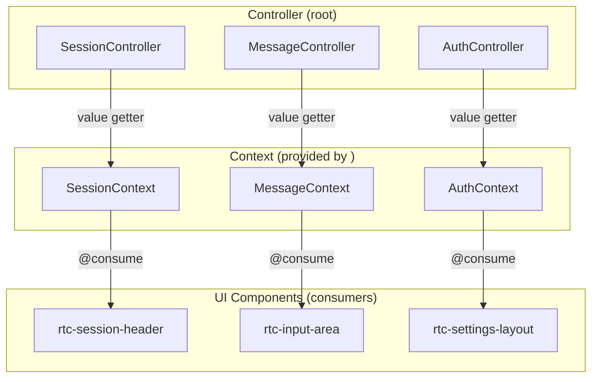
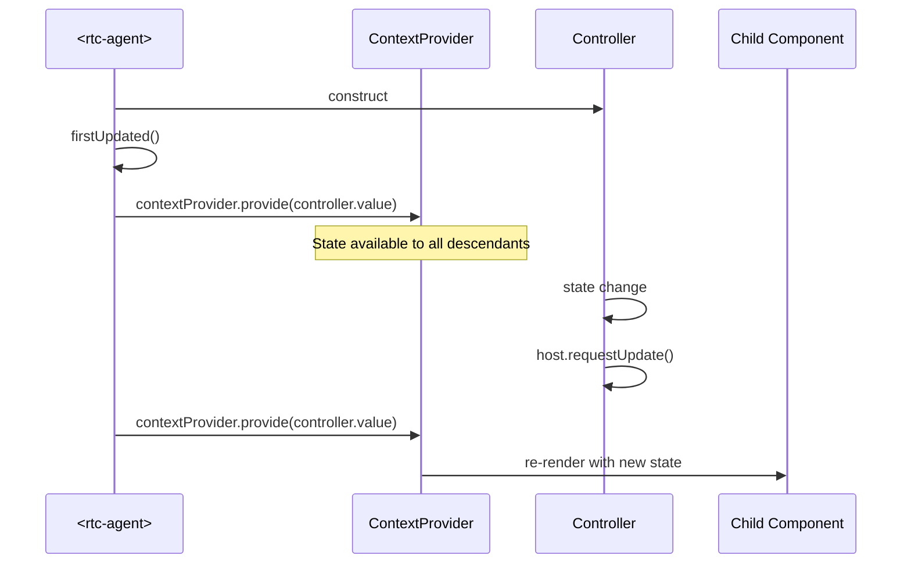
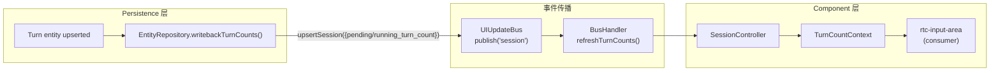

# ContextSystem

@lit/context 响应式状态分发：Controller 提供，UI 组件消费。

**所属 package**: `component`

## 关键代码文件

- `contexts/` 目录 — 16 个 context 定义文件（另有 `localeContext` 定义在 [core/i18n.ts](~/Workspaces/rtc-agent/web-components/packages/component/src/core/i18n.ts)）
- [contexts/auth.ts](~/Workspaces/rtc-agent/web-components/packages/component/src/contexts/auth.ts) — AuthContext
- [contexts/session.ts](~/Workspaces/rtc-agent/web-components/packages/component/src/contexts/session.ts) — SessionContext
- [contexts/message.ts](~/Workspaces/rtc-agent/web-components/packages/component/src/contexts/message.ts) — MessageContext
- [contexts/window-state.ts](~/Workspaces/rtc-agent/web-components/packages/component/src/contexts/window-state.ts) — WindowStateContext
- [contexts/logo.ts](~/Workspaces/rtc-agent/web-components/packages/component/src/contexts/logo.ts) — LogoContext（自定义 Logo 支持）

## Context 清单

| Context | 提供者 | 消费者（@consume） |
| --------- | -------- | -------- |
| `AuthContext` | `<rtc-agent>` | `<rtc-settings-layout>` |
| `SessionContext` | `<rtc-agent>` | `<rtc-session-header>`, `<rtc-chat-layout>`, `<rtc-input-area>` |
| `MessageContext` | `<rtc-agent>` | `<rtc-input-area>` |
| `ToolCallContext` | `<rtc-agent>` | `<rtc-overlay-manager>` |
| `SessionTabContext` | `<rtc-agent>` | `<rtc-session-tab-bar>`, `<rtc-chat-layout>` |
| `SessionTreeContext` | `<rtc-agent>` | `<rtc-session-tree>` |
| `ActivityContext` | `<rtc-agent>` | — （`<rtc-activity-bar>` 通过 root 直接传属性） |
| `EditorContext` | `EditorController`（未实例化） | 当前无消费者（EditorAreaController 管理编辑器，不通过 Context 分发） |
| `FileExplorerContext` | `<rtc-agent>` | `<rtc-file-explorer>`, `<rtc-file-tree-item>` |
| `ModeContext` | `<rtc-agent>` | `<rtc-input-area>` |
| `NotificationContext` | `<rtc-agent>` | — （`<rtc-notice-bar>` 和 `<rtc-toast>` 通过 root 直接传属性） |
| `SettingsContext` | `<rtc-agent>` | `<rtc-settings-layout>`, `<rtc-message-list>`, `<rtc-input-area>` |
| `SkillContext` | `<rtc-agent>` | — （通过 SkillController actions 直接引用） |
| `TurnCountContext` | `<rtc-agent>` | `<rtc-input-area>` |
| `WindowStateContext` | `<rtc-agent>` | — （`<rtc-title-bar>` 和 `<rtc-content-wrapper>` 通过 root 直接传属性） |
| `LogoContext` | `<rtc-agent>` | `<rtc-logo>` |
| `localeContext` | `<rtc-agent>` | — （由 `LocaleController` 通过 `ContextConsumer` 消费，驱动 i18n 语言切换） |

## 标准模式：{state, actions}

大部分 Context 遵循 `{state, actions}` 结构：

```typescript
interface SessionContextValue {
    state: SessionState;       // 只读状态
    actions: SessionActions;   // 操作方法
}

export const SessionContext = createContext<SessionContextValue>(
    Symbol('session-context')
);
```

## AuthContext 设计例外

AuthContext 将 `login`/`logout` 直接放在顶层，不使用 `actions` 子对象：

```typescript
interface AuthContextValue {
    state: AuthState;
    login(): void;    // 直接在顶层
    logout(): void;   // 直接在顶层
}
```

> **设计理由** — [contexts/auth.ts:13-16](~/Workspaces/rtc-agent/web-components/packages/component/src/contexts/auth.ts#L13-L16)
>
> ```text
> 设计例外：与其他 context 的 {state, actions} 模式不同，
> AuthContext 将 login/logout 直接放在顶层（与 state 并列）。
> 理由：Auth 只有两个动作，包装成 actions 子对象徒增冗余，
> 且 el.login() 比 el.actions.login() 更符合语义直觉。
> ```

## 数据流



## Context 提供时机



## LogoContext 设计

LogoContext 与其他 Context 不同，它只携带数据（无 actions）：

```typescript
interface LogoContextValue {
    light: string;  // 浅色主题 Logo SVG/HTML
    dark: string;   // 深色主题 Logo SVG/HTML
}

export const DEFAULT_LOGO: LogoContextValue = {
    light: '',  // 空字符串触发 <rtc-logo> 使用默认 Logo
    dark: '',
};
```

`<rtc-logo>` 组件通过 `prefers-color-scheme` 媒体查询自动切换主题。详见 [[LogoSystem]]。

## TurnCountContext — 写时聚合数据流

TurnCountContext 是唯一数据来源于"写时聚合"（Write-Time Aggregation）管线的 Context。不同于其他 Context 直接从 Controller 状态派生，TurnCount 的数据经过多个模块的逐层传递：



关键设计：

- **被动数据源** — TurnCountContext 不主动查询数据，而是由 UIUpdateBus 事件驱动更新
- **写时聚合** — Turn 实体写入时，EntityRepository 同步计算该 session 的活跃 turn 数并回写到 session 行
- **UI 消费** — `<rtc-input-area>` 根据 `runningTurnCount > 0` 切换发送按钮图标（发送 → 停止）

## 跨维度关联

- [[ControllerPattern]] — Controller 是 Context 的提供者
- [[AuthController]] — AuthContext 的控制器
- [[ComponentEvents]] — Context 变化触发 UI 更新，Controller 派发 DOM 事件
- [[LogoSystem]] — LogoContext 的品牌 Logo 定制机制
- [[ComponentHierarchy]] — 组件树中 Context 的消费关系详解
