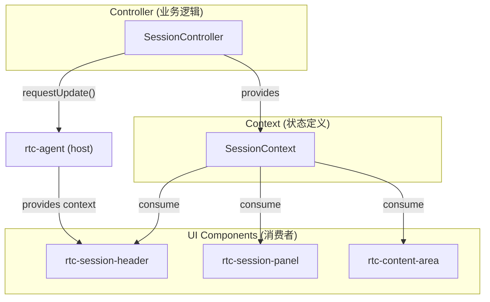
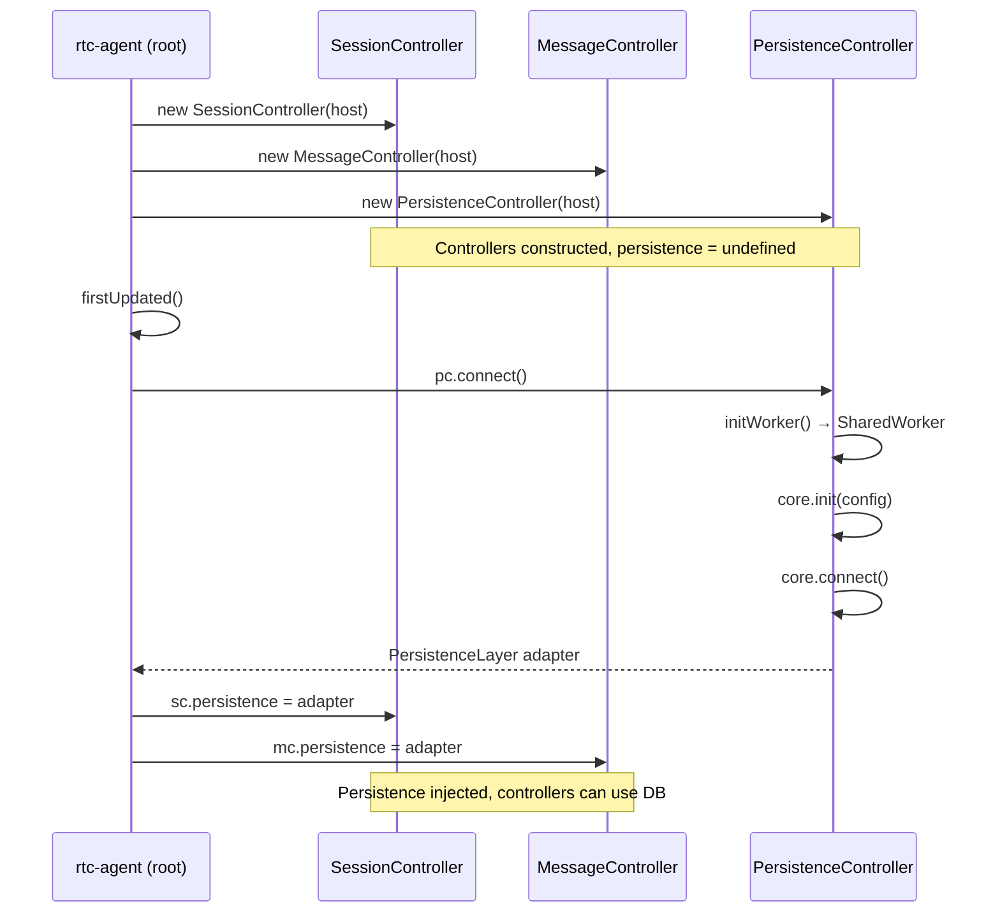
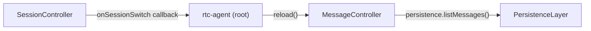
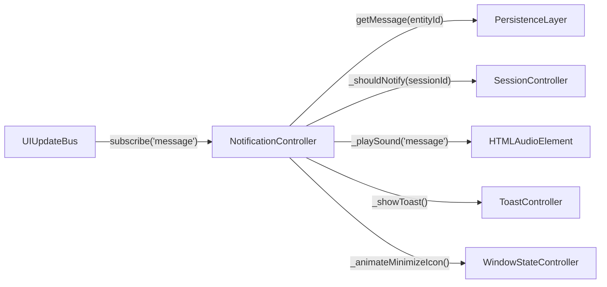
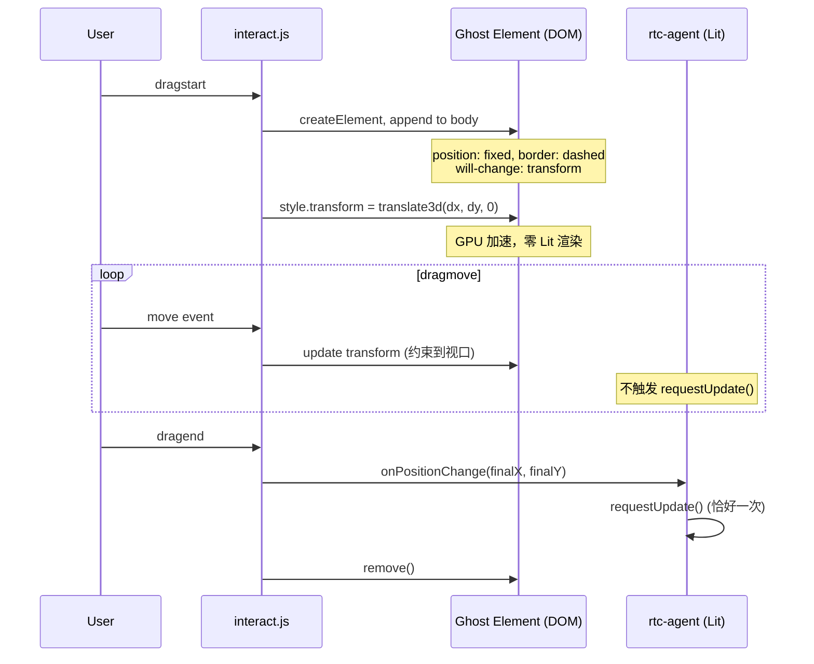
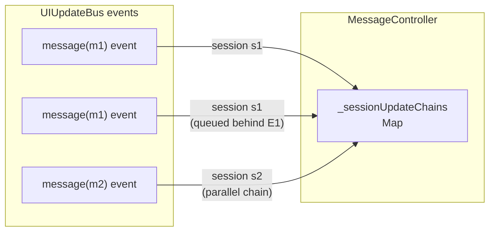
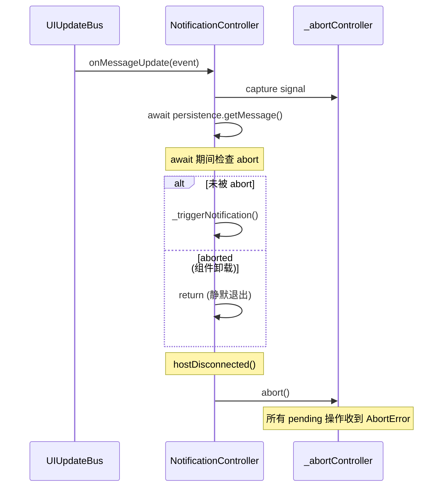
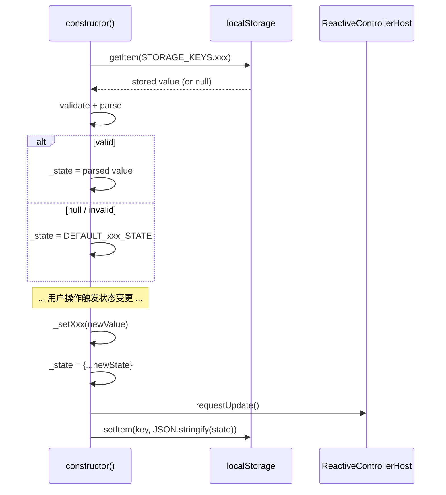
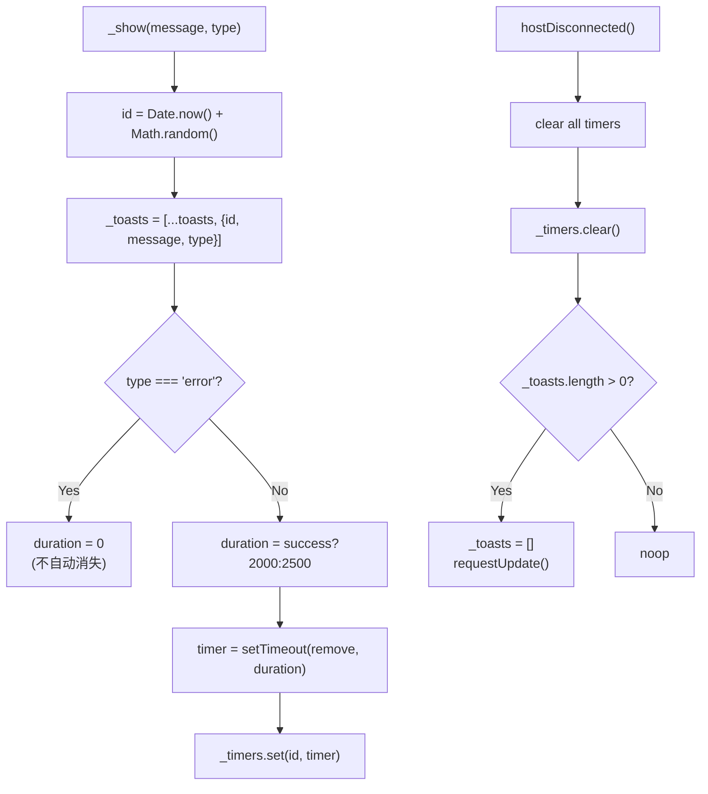

# ControllerPattern

Lit ReactiveController 模式：状态管理 + 生命周期 + Context 提供。

**所属 package**: `component`

## 关键代码文件

- `controllers/` 目录 — 20 个控制器实现
- [core/locale-controller.ts](~/Workspaces/rtc-agent/web-components/packages/component/src/core/locale-controller.ts) — `LocaleController`（i18n 语言切换）
- [utils/floating-panel-controller.ts](~/Workspaces/rtc-agent/web-components/packages/component/src/utils/floating-panel-controller.ts) — `FloatingPanelController`（@floating-ui/dom 封装）
- [controllers/session.controller.ts](~/Workspaces/rtc-agent/web-components/packages/component/src/controllers/session.controller.ts) — SessionController
- [controllers/message.controller.ts](~/Workspaces/rtc-agent/web-components/packages/component/src/controllers/message.controller.ts) — MessageController
- [controllers/auth.controller.ts](~/Workspaces/rtc-agent/web-components/packages/component/src/controllers/auth.controller.ts) — AuthController
- [controllers/persistence.controller.ts](~/Workspaces/rtc-agent/web-components/packages/component/src/controllers/persistence.controller.ts) — PersistenceController
- [controllers/tool-call.controller.ts](~/Workspaces/rtc-agent/web-components/packages/component/src/controllers/tool-call.controller.ts) — ToolCallController
- [controllers/window-state.controller.ts](~/Workspaces/rtc-agent/web-components/packages/component/src/controllers/window-state.controller.ts) — WindowStateController
- [controllers/window-interaction.controller.ts](~/Workspaces/rtc-agent/web-components/packages/component/src/controllers/window-interaction.controller.ts) — WindowInteractionController

## 控制器清单

| Controller | Context | 职责 |
| ------------ | --------- | ------ |
| `AuthController` | `AuthContext` | 认证状态、login/logout、token 持久化 |
| `SessionController` | `SessionContext` | 会话 CRUD、切换、事件派发 |
| `MessageController` | `MessageContext` | 消息列表管理、发送、流式追加 |
| `ToolCallController` | `ToolCallContext` | 工具调用状态跟踪 |
| `PersistenceController` | — (基础设施) | PersistenceLayer 生命周期、WorkerBridge |
| `SessionTabController` | `SessionTabContext` | 会话标签页管理 |
| `SessionTreeController` | `SessionTreeContext` | 会话树展开/折叠 |
| `ActivityController` | `ActivityContext` | 活动状态 |
| `EditorController` | `EditorContext` | 编辑器状态（定义存在但 rtc-agent.ts 未实例化） |
| `EditorAreaController` | — (无 Context) | 编辑区域管理（根组件直接引用 actions） |
| `FileExplorerController` | `FileExplorerContext` | 文件浏览器 |
| `ModeController` | `ModeContext` | AI 工作模式 (manual/edit/plan/auto/bypass) |
| `NotificationController` | `NotificationContext` | 通知管理 |
| `SettingsController` | `SettingsContext` | 设置面板状态 |
| `SkillController` | `SkillContext` | 技能管理 |
| `StatusBarController` | — | 状态栏 |
| `ToastController` | — | Toast 通知 |
| `WindowStateController` | `WindowStateContext` | 窗口位置/尺寸 |
| `WindowInteractionController` | — | 拖拽/缩放交互 |
| `ForkController` | — | 会话分叉 |
| `LocaleController` | — | i18n 语言切换（消费 `localeContext`） |
| `FloatingPanelController` | — | Overlay 面板定位（@floating-ui/dom 封装） |

## Controller-Context 对应模式



## value getter 模式

每个 Controller 暴露 `value` getter，返回 `{state, actions}`：

```typescript
class SessionController implements ReactiveController {
    private _state: SessionState = {...DEFAULT_SESSION_STATE};
    readonly actions: SessionActions;

    get value(): SessionContextValue {
        return {state: this._state, actions: this.actions};
    }
}
```

Host 组件通过 `contextProvider.provide(controller.value)` 将状态分发给子组件。

## 依赖注入时序



## 跨 Controller 通信

Controller 之间不直接引用，通过 host 组件协调：



SessionController 的 `onSessionSwitch` 回调由 root 组件设置，触发 MessageController 重新加载消息。

## 关键设计原则

1. **Controller 不直接互相引用** — 通过 host 组件的回调链协调
2. **persistence 延迟注入** — Controller 构造时 persistence 为 undefined，连接成功后由 root 注入
3. **actions 只读** — `readonly actions` 在构造函数中绑定，外部只能通过 actions 操作
4. **事件向上派发** — Controller 通过 `host.dispatchEvent()` 发出 DOM 事件供外部消费

## 特殊 Controller 模式

### NotificationController — UIUpdateBus 订阅者

`NotificationController` 是唯一直接订阅 `UIUpdateBus` 的 Controller（其他 Controller 通过 `BusHandler` 间接处理）。



关键设计：

- 音效延迟加载：`requestIdleCallback` 优先，`setTimeout(2000ms)` 作为 fallback
- 节流：300ms 内仅触发一次通知
- `AbortController`：`hostDisconnected()` 时 abort 所有异步操作，`await` 后检查 `signal.aborted` 提前退出
- 链式安全：消息获取失败不中断订阅流，继续处理后续消息

### ForkController — 延迟依赖注入

`ForkController` 使用 `setDeps()` 延迟注入依赖，避免构造函数循环引用：

```typescript
// 构造时
const fork = new ForkController(host);
// 之后由 root 组件设置依赖
fork.setDeps({ clearMessages, clearTransientParams, executeFork });
```

状态机：`null` → `ForkState`（requestFork）→ `null`（submitFork/clearFork）

### WindowInteractionController — Ghost Preview 模式

`WindowInteractionController` 使用 ghost 预览元素避免拖动/缩放期间的 Lit 重渲染：



关键设计（Fix 53/54）：

| 技术             | 用途                                                                |
| ---------------- | ------------------------------------------------------------------- |
| Ghost element    | 虚线边框 div，transform3d GPU 加速，替代 Lit 重渲染                 |
| `_cachedMargin`  | 缓存 `getComputedStyle` 结果，避免 move 期间重复计算                |
| Deferred config  | 交互进行中的 `setConfig()` 延迟到 `dragend`/`resizeend` 后执行      |
| Idempotent enable| `_isEnabled` 标志防止重复创建 interact 实例                         |
| Keyboard mode    | Enter/Space 进入 move 模式，方向键 10px/20px 步进，Escape 退出      |

### MessageController — Per-Session Bus 更新串行化

`MessageController` 使用 `_sessionUpdateChains` Map 对同一 session 的 `updateMessageFromBus()` 调用串行化：



```typescript
// Per-session promise chain to serialize updateMessageFromBus calls.
// Prevents race condition when multiple messages arrive concurrently from UIUpdateBus.
private _sessionUpdateChains = new Map<string, Promise<void>>();
```

这确保同一 session 的 DB 读取不会交叉：event 2 等待 event 1 的 DB 读取完成后再执行，避免旧数据覆盖新数据。不同 session 的更新可并行处理。

**链错误恢复** (Fix 77): Promise 链末尾有 `.catch()` 兜底，防止 `_applyBusUpdate` 抛出的异常导致链断裂。链中的错误被记录但不中断后续事件处理。

**Session 缓存清理** (`evictSession`): 当 session 被关闭时，`BusHandler` 调用 `evictSession(sessionId)` 清除该 session 的本地消息缓存，防止内存泄漏。

### NotificationController — AbortController 生命周期绑定

`NotificationController` 使用 `_abortController` 将异步操作与组件生命周期绑定：



- `hostDisconnected()` 时调用 `abort()` 并重建新的 `AbortController`
- `await` 后检查 `signal.aborted`，提前退出防止在已卸载的组件上操作

### PersistenceController — Generation Counter

`PersistenceController` 使用 `_connectGeneration` 计数器防止 `disconnect()` 打断 `connect()` 时的竞态条件。详见 [[Connection]]。

### 多 Controller 共享 — localStorage 持久化模式

多个 Controller 在构造函数中恢复 localStorage 状态，在状态变更时同步持久化。这一模式适用于"小量、同步、跨刷新恢复"的 UI 偏好：



使用该模式的 Controller：

| Controller | Storage Key | 数据 |
| ---------- | ----------- | ---- |
| `ActivityController` | `rtc_activity_bar` | `{active, sidebarVisible}` |
| `ModeController` | `rtc_mode` | `'manual' \| 'edit' \| 'plan' \| 'auto' \| 'bypass'` |
| `SessionTreeController` | `rtc_session_tree_expanded` | `Map<sessionId, boolean>` |
| `SessionTabController` | `rtc:active-tab` | `sessionId` (string) |
| `WindowStateController` | `rtc_window_state` | `{mode, position, size}` |
| `SettingsController` | `rtc_settings` | JSON (全局设置) |
| `EditorAreaController` | `rtc_editor_area` | JSON (tabs + activeFilePath) |

关键设计：

- **全部 `try/catch`** — localStorage 可能不可用（隐私模式、配额超限），读取和写入均包裹在 try/catch 中
- **读取时验证** — 使用类型守卫（如 `isValidMode(value)` / `isValidActivity(v)`）防止损坏数据
- **写入不节流** — 状态变更频率低（用户主动操作），无需防抖

### ToastController — 定时器生命周期清理

`ToastController` 管理多个 auto-dismiss 定时器，在 `hostDisconnected()` 时统一清理，防止内存泄漏和孤立 Toast：



关键设计（[toast.controller.ts:42-54](~/Workspaces/rtc-agent/web-components/packages/component/src/controllers/toast.controller.ts#L42-L54)）：

- **error 不自动消失** — 只有用户手动关闭或代码调用 `remove()` 才能移除错误 Toast
- **定时器 Map** — `_timers: Map<number, Timer>` 按 Toast ID 跟踪活跃定时器
- **断开清理** — `hostDisconnected()` 清除所有定时器 + 清空 Toast 列表，防止组件卸载后定时器触发对已卸载 host 的 `requestUpdate()`

## 关键注释摘录

> **Persistence 延迟注入** — [session.controller.ts:37-39](~/Workspaces/rtc-agent/web-components/packages/component/src/controllers/session.controller.ts#L37-L39)
>
> ```text
> Persistence layer reference (injected by root after connect).
> When set, rename/delete operations are persisted to IndexedDB + synced to server.
> When unset, rename/delete operate in-memory only (offline / pre-connect fallback).
> ```

<!-- separator -->

> **跨 Controller 通信** — [message.controller.ts:7-8](~/Workspaces/rtc-agent/web-components/packages/component/src/controllers/message.controller.ts#L7-L8)
>
> ```text
> Cross-controller note: When the session switches, the root component calls
> reload() on this controller to load the message history for the new session.
> ```

## 跨维度关联

- [[ContextSystem]] — Controller 通过 Context 向 UI 提供状态
- [[AuthController]] — 认证控制器详解
- [[SharedWorker]] — PersistenceController 管理 SharedWorker 生命周期
- [[ComponentEvents]] — Controller 通过 host 派发 DOM 事件
- [[MessageRepository]] — MessageController 使用 per-session 仓库管理消息数据
- [[SessionManagement]] — SessionTreeController 和 SessionTabController 详解
- [[EditorSystem]] — EditorController 和 EditorAreaController 双 Controller 协作
- [[ChatLayout]] — ChatLayout 消费 Controller actions 编排 Tab 生命周期
- [[WindowSystem]] — WindowStateController + WindowInteractionController 浮动窗口状态机
- [[SettingsSystem]] — SettingsController 全局设置 + DOM 副作用 + 多 Tab 同步
- [[OverlaySystem]] — ToastController 驱动 Toast 通知，ToolCallController 驱动工具确认
