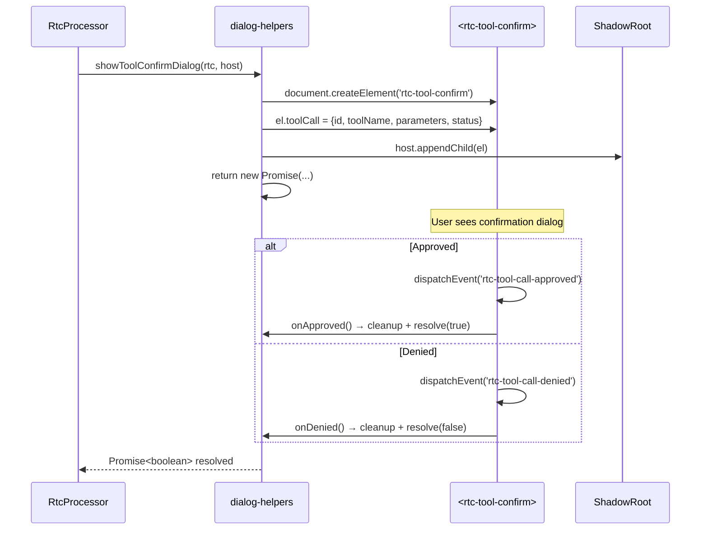
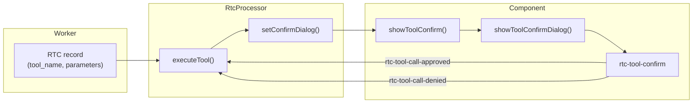

# DialogState

Promise-based dialog overlay system: tool confirmation, ask-user input, restore-default confirmation, and floating panel management.

**所属 package**: `component`

## 关键代码文件

- [components/overlay/rtc-overlay-manager.ts](~/Workspaces/rtc-agent/web-components/packages/component/src/components/overlay/rtc-overlay-manager.ts) — Overlay Manager: manages floating panels (tool confirm)
- [components/rtc-agent/helpers/dialog-helpers.ts](~/Workspaces/rtc-agent/web-components/packages/component/src/components/rtc-agent/helpers/dialog-helpers.ts) — Promise-based dialog factories: `showToolConfirmDialog` / `showAskUserDialog` / `showRestoreConfirmDialog`
- [components/overlay/rtc-tool-confirm.ts](~/Workspaces/rtc-agent/web-components/packages/component/src/components/overlay/rtc-tool-confirm.ts) — Tool confirmation dialog component
- [components/overlay/rtc-ask-user.ts](~/Workspaces/rtc-agent/web-components/packages/component/src/components/overlay/rtc-ask-user.ts) — Ask-user multi-question dialog component
- [components/overlay/rtc-restore-confirm.ts](~/Workspaces/rtc-agent/web-components/packages/component/src/components/overlay/rtc-restore-confirm.ts) — Restore-to-default confirmation dialog
- [components/overlay/rtc-command-panel.ts](~/Workspaces/rtc-agent/web-components/packages/component/src/components/overlay/rtc-command-panel.ts) — Command panel (floating)
- [components/overlay/rtc-mode-panel.ts](~/Workspaces/rtc-agent/web-components/packages/component/src/components/overlay/rtc-mode-panel.ts) — Mode selection panel (floating)
- [components/overlay/rtc-session-panel.ts](~/Workspaces/rtc-agent/web-components/packages/component/src/components/overlay/rtc-session-panel.ts) — Session selection panel (floating)

## Dialog 类型

| Dialog | 触发场景 | 返回值 | 定位方式 |
| -------- | --------- | -------- | --------- |
| Tool Confirm | RTC 工具调用需要用户确认 | `boolean` (approved/denied) | Overlay Manager 管理 |
| Ask User | Agent 向用户提问 | `AskUserAnswer \| null` (answers/dismissed) | Overlay Manager 管理 |
| Restore Confirm | 用户确认恢复默认文件内容 | `boolean` (confirmed/cancelled) | 动态创建 + appendChild |
| Command Panel | 用户输入 `/` 命令 | — | Floating (@floating-ui/dom) |
| Mode Panel | 用户切换窗口模式 | — | Floating (@floating-ui/dom) |
| Session Panel | 用户选择/管理会话 | — | Floating (@floating-ui/dom) |
| Scenario Panel | 用户选择场景 | — | Floating (@floating-ui/dom) |
| Todo Panel | 显示任务列表 | — | Floating (@floating-ui/dom) |

## Promise-based Dialog 模式

Dialog 使用 Promise 封装，调用方可以 `await` 用户响应：



## Overlay Manager 架构

`rtc-overlay-manager` 是 floating panel 的统一管理器：

```mermaid
flowchart TD
    subgraph "Overlay Manager"
        OM["rtc-overlay-manager"]
    end

    subgraph "Context Consumption"
        TCC["ToolCallContext<br/>(@consume)"]
    end

    subgraph "Managed Panels"
        TC["rtc-tool-confirm"]
    end

    subgraph "Floating Panels (external positioning)"
        SP["rtc-session-panel<br/>(rtc-session-header)"]
        MP["rtc-mode-panel<br/>(rtc-input-area)"]
        CP["rtc-command-panel<br/>(rtc-input-area)"]
    end

    OM -->|"consume"| TCC
    OM -->|"renders if<br/>pendingCalls.length > 0"| TC

    Note over SP,CP: Positioned by @floating-ui/dom,<br/>not managed by Overlay Manager
```

## Tool Confirm 流程（完整链路）



## Ask User 流程

`showAskUserDialog()` 与 Tool Confirm 类似，但支持多问题输入：

- 输入类型：文本、选择、多选项
- 返回值：`{ answers, annotations?, metadata? }` 或 `null`（dismissed）
- 支持附件预览和笔记

## CancelledError

Dialog 取消操作使用 `CancelledError` 区分"用户取消"和"真正的错误"：

```typescript
class CancelledError extends Error {
    readonly isCancelled = true;  // brand property

    static isCancelledError(error: unknown): error is CancelledError {
        return (error instanceof CancelledError) ||
               (error instanceof Error && (error as CancelledError).isCancelled === true);
    }
}
```

使用 brand 属性而非 `instanceof`，解决跨 realm（iframe、Worker、不同 bundle）场景下的类型判断问题。

## 关键注释摘录

> **Overlay Manager 职责** — [rtc-overlay-manager.ts:1-8](~/Workspaces/rtc-agent/web-components/packages/component/src/components/overlay/rtc-overlay-manager.ts#L1-L8)
>
> ```text
> Manages floating panels: tool confirm.
>
> Panel positioning:
> - Tool confirm: centered (via its own CSS)
> - Session panel: managed by rtc-session-header with @floating-ui/dom
> - Mode panel: managed by rtc-input-area with @floating-ui/dom
> ```

> **ShadowRoot append** — [dialog-helpers.ts:53-54](~/Workspaces/rtc-agent/web-components/packages/component/src/components/rtc-agent/helpers/dialog-helpers.ts#L53-L54)
>
> ```text
> // Append to shadowRoot to maintain style inheritance.
> host.appendChild(el);
> ```
> Dialog 元素 append 到 ShadowRoot（而非 document.body），确保 CSS 样式继承正确。

## 跨维度关联

- [[ControllerPattern]] — ToolCallController 管理 pending tool calls 状态，Overlay Manager 消费其 Context
- [[RtcProcessor]] — 调用 `setConfirmDialog()` / `setAskUserDialog()` 设置回调
- [[ComponentEvents]] — Dialog 通过 CustomEvent (`rtc-tool-call-approved` 等) 通信
- [[ContextSystem]] — Overlay Manager 通过 `@consume` 获取 ToolCallContext
- [[Permission]] — Tool Confirm 可能涉及文件权限检查
