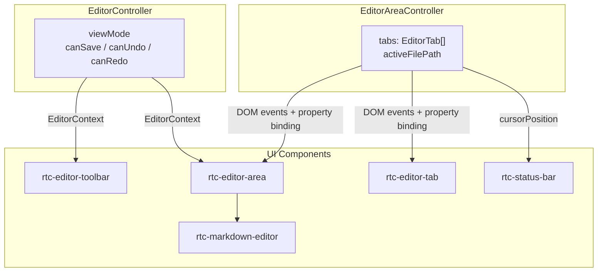
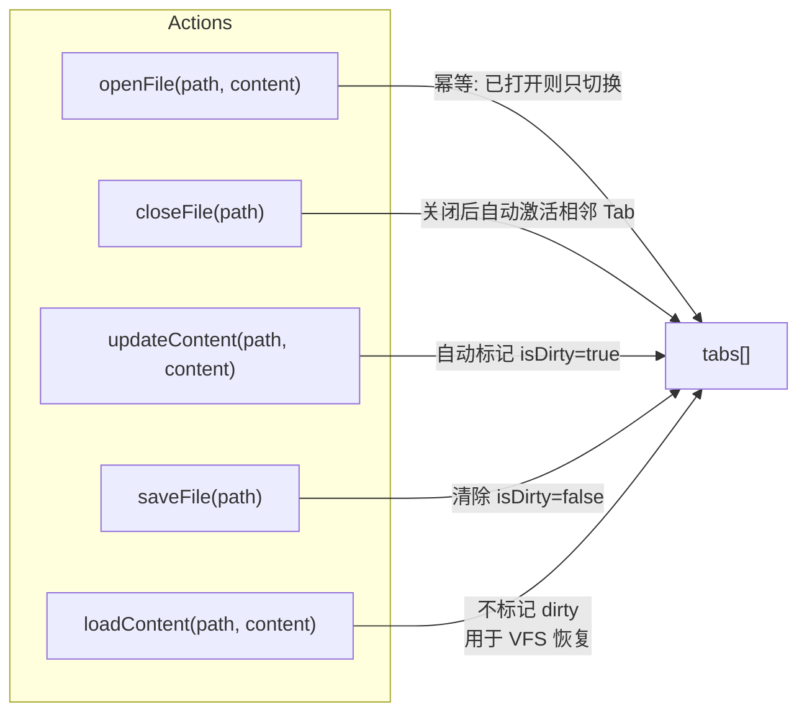
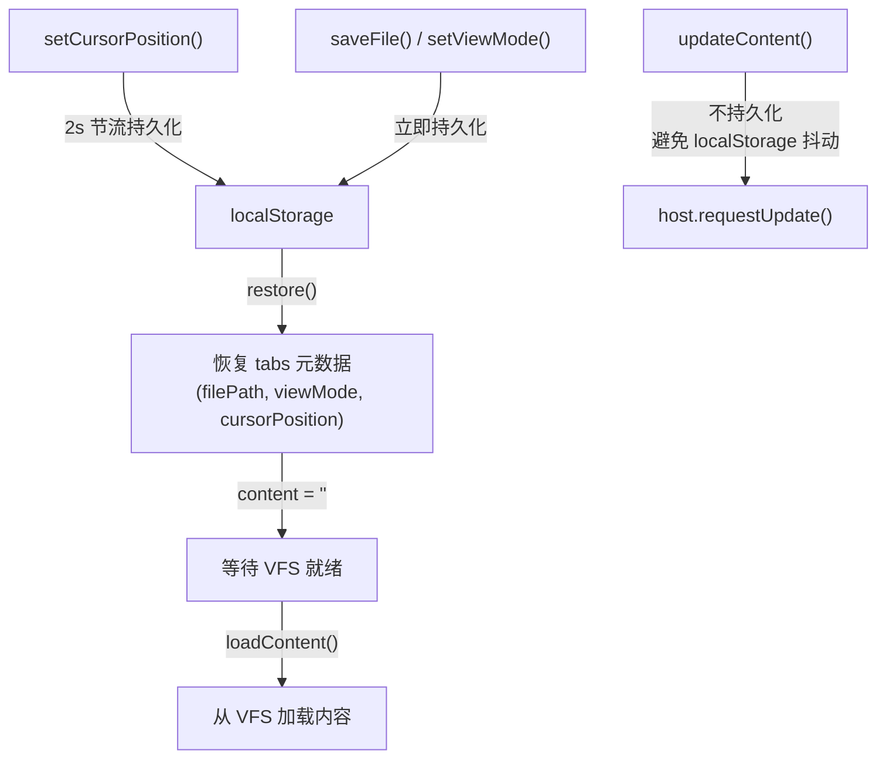
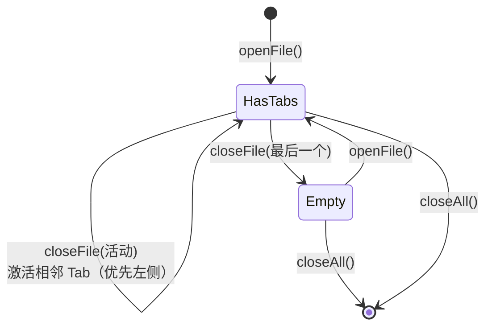
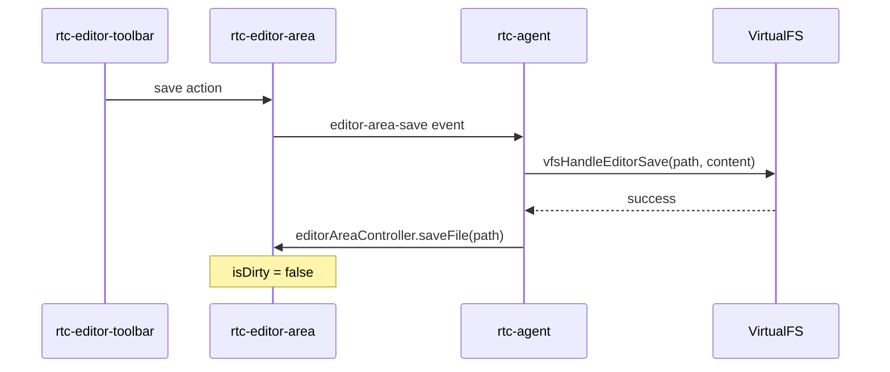
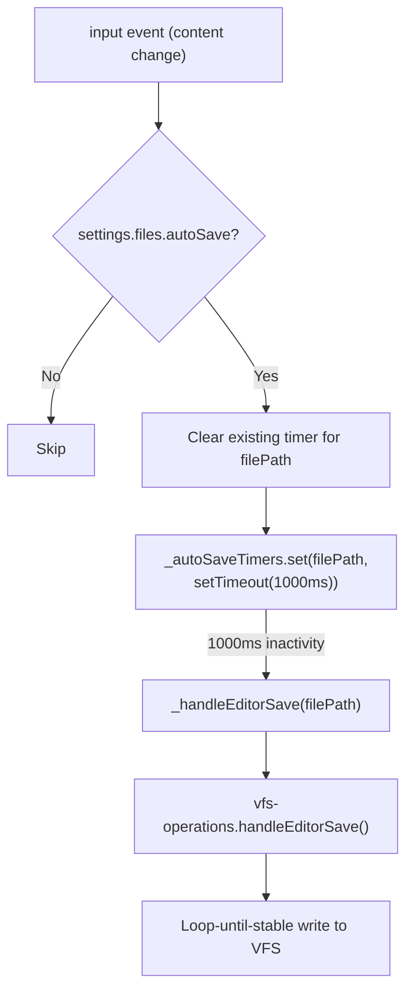

# EditorSystem

文件编辑器系统的状态管理：视图模式、标签页管理、内容脏跟踪、光标位置持久化。

**所属 package**: `component`

## 关键代码文件

- [controllers/editor.controller.ts](~/Workspaces/rtc-agent/web-components/packages/component/src/controllers/editor.controller.ts) — EditorController：视图模式 + 工具栏按钮状态
- [controllers/editor-area.controller.ts](~/Workspaces/rtc-agent/web-components/packages/component/src/controllers/editor-area.controller.ts) — EditorAreaController：文件标签页管理 + 内容状态
- [components/editor-area/rtc-editor-area.ts](~/Workspaces/rtc-agent/web-components/packages/component/src/components/editor-area/rtc-editor-area.ts) — 编辑器区域组件
- [components/editor-area/rtc-editor-tab.ts](~/Workspaces/rtc-agent/web-components/packages/component/src/components/editor-area/rtc-editor-tab.ts) — 编辑器标签组件
- [components/editor-area/rtc-editor-toolbar.ts](~/Workspaces/rtc-agent/web-components/packages/component/src/components/editor-area/rtc-editor-toolbar.ts) — 编辑器工具栏
- [components/markdown-editor/rtc-markdown-editor.ts](~/Workspaces/rtc-agent/web-components/packages/component/src/components/markdown-editor/rtc-markdown-editor.ts) — Markdown 编辑器（支持 edit/preview/split 三种视图）
- [contexts/editor.ts](~/Workspaces/rtc-agent/web-components/packages/component/src/contexts/editor.ts) — EditorContext 定义

## 双 Controller 架构

编辑器系统由两个 Controller 协作管理：



| Controller | 职责 | 状态分发方式 | 消费者 |
| ---------- | ---- | ------------ | ------ |
| `EditorController` | 视图模式、工具栏按钮可用性 | `EditorContext` | `<rtc-editor-toolbar>`, `<rtc-editor-area>`（注：当前 rtc-agent.ts 未实例化此 Controller） |
| `EditorAreaController` | 标签页列表、当前文件、内容、脏状态 | DOM events (`rtc-editor-area-*`) | `<rtc-editor-area>`, `<rtc-editor-tab>`, `<rtc-status-bar>` |

## EditorAreaController：Tab 管理

### 状态模型

```typescript
interface EditorTab {
    filePath: string;
    content: string;
    isDirty: boolean;          // 内容已修改未保存
    cursorPosition: {line: number; column: number};
    viewMode: EditorViewMode;  // 'edit' | 'preview' | 'split'
}
```

### 核心操作



### 持久化策略



关键设计：

| 场景 | 持久化行为 |
| ---- | ---------- |
| 打开/关闭/切换 Tab | 立即写 localStorage |
| 内容变更 | 不持久化（避免 IO 抖动），脏状态由 VFS 作为权威来源 |
| 光标位置 | 2 秒节流写 localStorage |
| 保存/切换视图模式 | 立即写 localStorage |

### 关闭 Tab 的激活策略



## EditorController：工具栏状态

EditorController 管理工具栏按钮的可用性状态，独立于 EditorAreaController 的 Tab 管理：

```mermaid
stateDiagram-v2
    [*] --> Default: viewMode=edit, canSave=false, canUndo=false, canRedo=false
    Default --> CanSave: setCanSave(true)
    CanSave --> Default: saveFile() + setCanSave(false)
    Default --> CanUndo: setCanUndo(true)
    CanUndo --> Default: setUndo(false)
```

## 保存流程

实际写入 VFS 由外部监听 `editor-area-save` 事件处理：



## 自动保存（Auto-save）

内容变更时，根组件启动 per-file 防抖定时器自动触发保存：



关键设计（[rtc-agent.ts:199](~/Workspaces/rtc-agent/web-components/packages/component/src/components/rtc-agent/rtc-agent.ts#L199), [rtc-agent.ts:2079-2108](~/Workspaces/rtc-agent/web-components/packages/component/src/components/rtc-agent/rtc-agent.ts#L2079-L2108)）：

| 特性 | 说明 |
| --- | --- |
| 防抖间隔 | `AUTO_SAVE_DEBOUNCE_MS = 1000`（1 秒无输入后触发） |
| Per-file 定时器 | `_autoSaveTimers: Map<string, Timer>` — 每个文件独立定时器，互不干扰 |
| 清理时机 | `logout()` 和 `disconnectedCallback` 中 `forEach(clearTimeout)` + `clear()`，防止定时器在组件卸载后触发 |
| 用户输入优先 | 每次 input 事件重置定时器，只有停止输入 1 秒后才真正写入 |

自动保存与手动保存（Ctrl+S）共享同一个 `handleEditorSave()` 入口，均使用 Loop-until-stable 并发保护。

## 关键注释摘录

> **内容持久化策略** — [editor-area.controller.ts:276-278](~/Workspaces/rtc-agent/web-components/packages/component/src/controllers/editor-area.controller.ts#L276-L278)
>
> ```text
> 内容变更频繁，不持久化（避免 localStorage 抖动）；
> 脏状态和内容由 VFS 作为权威来源，刷新后从 VFS 重新加载。
> ```

<!-- separator -->

> **loadContent 用途** — [editor-area.controller.ts:332-334](~/Workspaces/rtc-agent/web-components/packages/component/src/controllers/editor-area.controller.ts#L332-L334)
>
> ```text
> 静默设置文件内容（不标记 dirty）
> 用于刷新后从 VFS 重新加载内容到已恢复的 tab。
> ```

## 跨维度关联

- [[ControllerPattern]] — 双 Controller 协作模式
- [[ContextSystem]] — EditorContext 分发状态（EditorAreaController 通过 DOM events 分发）
- [[VirtualFS]] — 文件内容从 VFS 加载，保存到 VFS
- [[LocalStorage]] — Tab 元数据和光标位置持久化
- [[ComponentEvents]] — editor-area-save 事件驱动 VFS 写入
- [[ComponentHierarchy]] — 编辑器区域在 VS Code 风格布局中的位置
- [[RootComponentHelpers]] — 自动保存定时器和 `handleEditorSave` Loop-until-stable 并发保护
- [[ConcurrencyPatterns]] — Loop-Until-Stable 模式在文件保存中的应用
