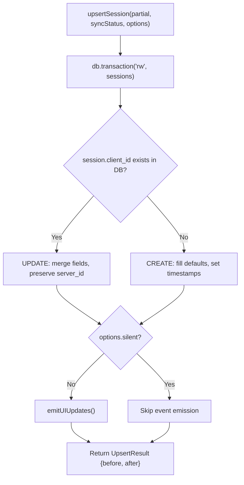
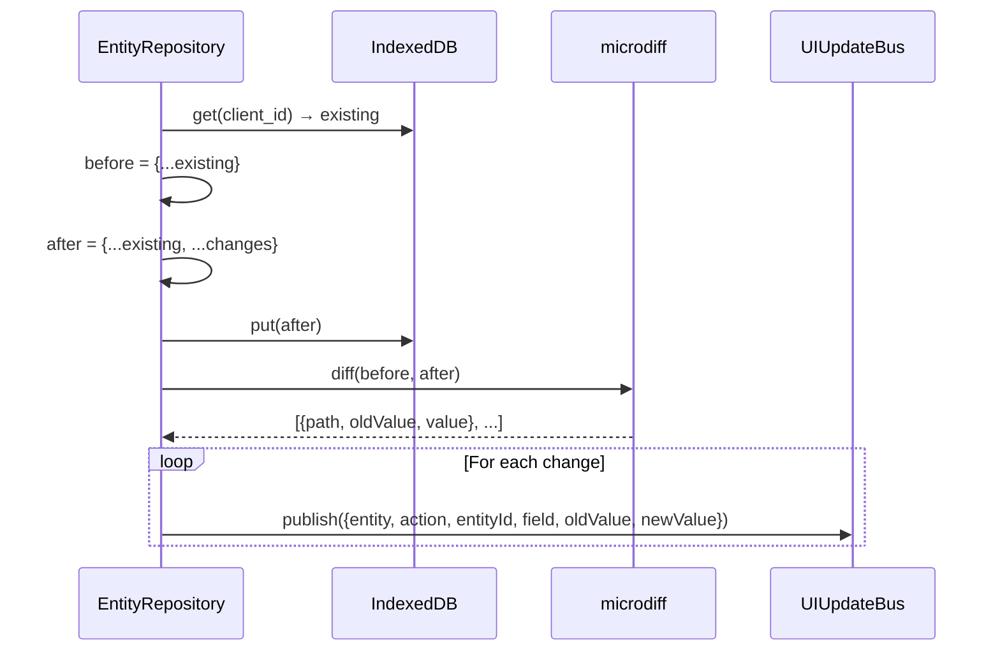
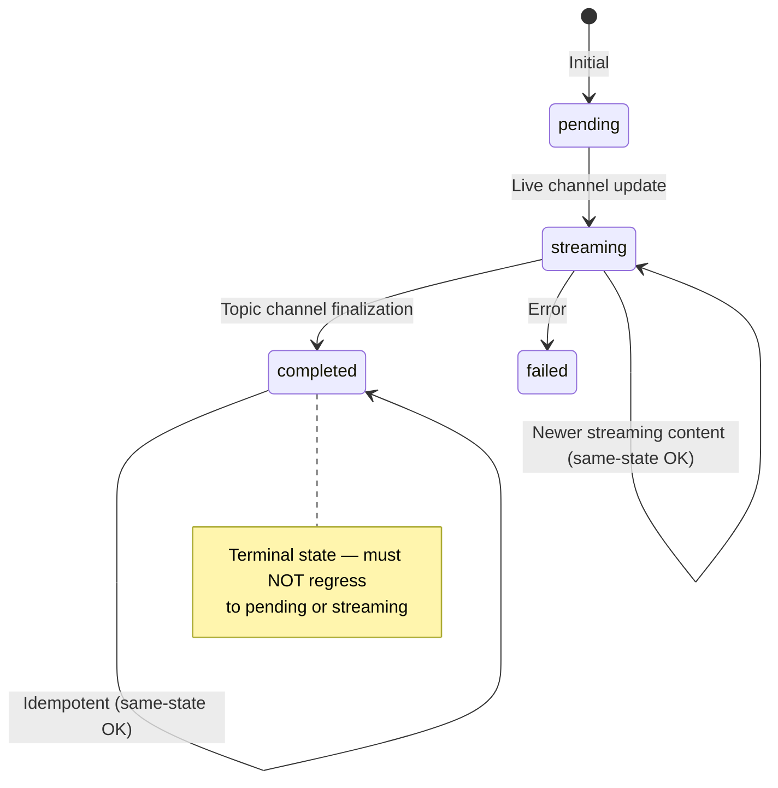
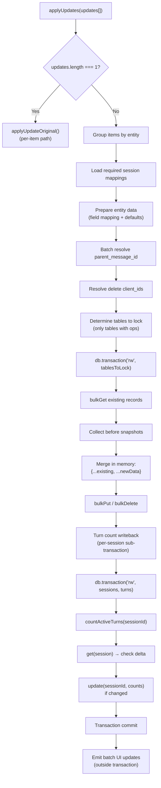
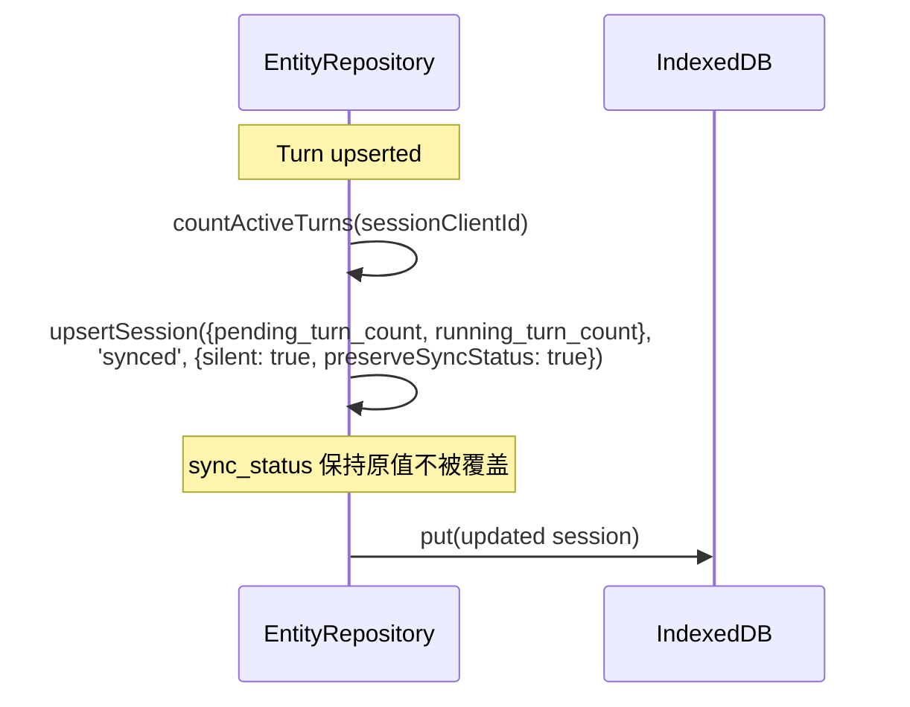
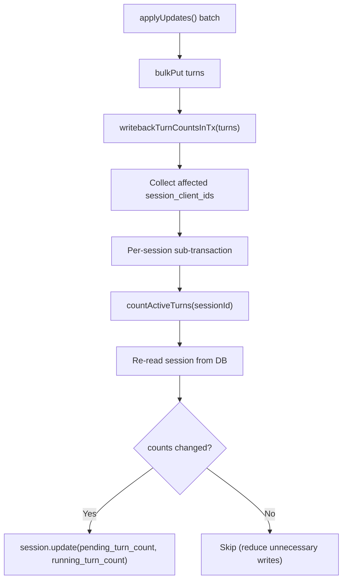
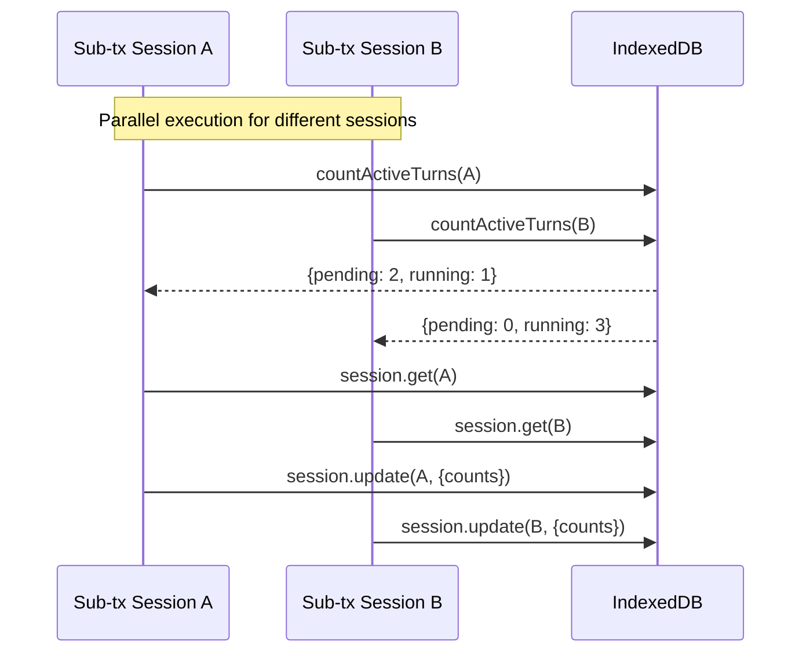
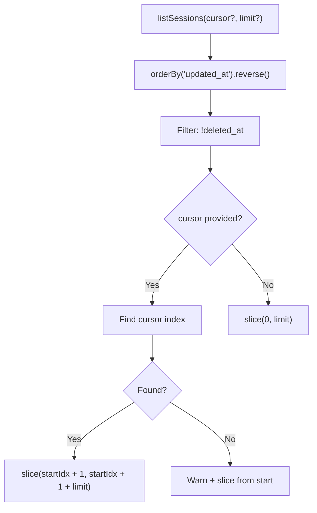

# EntityRepository

实体 CRUD 层：事务性 upsert、字段级 diff、UIUpdateBus 集成。

**所属 package**: `persistence`

## 关键代码文件

- [entity-repository.ts](~/Workspaces/rtc-agent/web-components/packages/persistence/src/entity-repository.ts) — `EntityRepository` 类 + `initEntityRepository()` / `getEntityRepository()` 单例管理

## 职责

| 职责 | 方法示例 | 说明 |
| ------ | ---------- | ------ |
| 实体 Upsert | `upsertSession()` / `upsertMessage()` / `upsertRtc()` / `upsertTurn()` | 事务性 read-modify-write |
| 批量 Upsert | `applyUpdates()` / `applyUpdates()` | Gap fill 后批量写入 |
| 查询 | `getClientSession()` / `listMessagesBySession()` / `listRtcBySession()` | 按 client_id / server_id 查询 |
| 软删除 | `softDeleteSession()` | 设置 deleted_at，不物理删除 |
| UI 事件发出 | `emitUIUpdates()` | microdiff 计算字段级差异 |
| 设备过滤 | `getNextRtcToProcess()` | 仅返回当前 deviceId 的 RTC |

## Upsert 流程



## UpsertResult 与字段级 Diff



`emitUIUpdates()` 使用 `microdiff` 计算字段级差异，只发出变化的字段事件。例如 `title` 变更只发出 `{field: 'title', oldValue: 'old', newValue: 'new'}`，而不是整个 session 对象。

## 字段路径格式

```typescript
// microdiff path: ['content', 0, 'text']
// → field: 'content.0.text'
```

数组索引作为路径段，UI 层可精确定位到嵌套字段的变更。

## Streaming Status 状态保护



`isStreamingStatusRegression()` 防止 live channel 的 streaming 更新覆盖 topic channel 已到达的 completed 状态。

```typescript
// Terminal states must not regress to non-terminal states
if (existingStatus === 'completed' || existingStatus === 'failed') {
    return incomingStatus === 'streaming' || incomingStatus === 'pending';
}
```

**应用范围**：该检查同时应用于单条 upsert（`upsertMessage()`）和批量 merge（`applyUpdates()` → `mergeMessages()`）。批量操作中每条 message 独立检查，确保不会因为批量写入导致已 terminal 的消息回退。

## 事务保证

所有 upsert 操作使用 Dexie 事务：

```typescript
return db.transaction('rw', db.sessions, async () => {
    // Read-modify-write inside transaction
    let existing = await db.sessions.where('client_id').equals(clientId).first();
    // ...
    await db.sessions.put(updated);
});
```

Dexie 支持事务嵌套：如果已在事务中，复用父事务。

## 批量操作事务 (applyUpdates)

`applyUpdates()` 将多个 Update 事件合并为单个 Dexie 事务，预期减少 50-400 倍 DB 操作：



关键设计：

- **动态表锁定** — 仅锁定有实际操作的表，减少事务冲突
- **事务内 bulkGet** — 确保读到一致的现有记录
- **Turn 计数写回（per-session 事务）** — 每个 session 独立事务：事务内重新 countActiveTurns → 读取当前 session → update。防止并发 writebackTurnCountsInTx 调用交错导致丢失更新（Fix: 隔离 turn count 更新）。Dexie 事务嵌套支持：如果已在父事务中，复用父事务。
- **UI 更新在事务外** — 避免在事务内执行 UI 回调导致阻塞

## UpsertOptions

| Option | Type | Description |
| -------- | ------ | ------------- |
| `silent` | `boolean` | 不发出 UIUpdateBus 事件 |
| `preserveSyncStatus` | `boolean` | 不修改 sync_status（用于聚合更新如 turn 计数） |

### preserveSyncStatus 用途

写入时聚合（write-time aggregation）场景：当 turn 数据 upsert 后，需要将 `pending_turn_count` / `running_turn_count` 回写到 session 行。此时不应覆盖 session 的 `sync_status`（可能已被其他更新设为最新值）。



## Structured Clone 安全

`emitUIUpdates()` 使用 `safeClone()` 确保数据可通过 Comlink postMessage 传输：

```typescript
function safeClone<T>(obj: T): T {
    return JSON.parse(JSON.stringify(obj));
}
```

JSON 序列化剥离不可 clone 的对象（函数、DOM 元素、循环引用）。

## 单例管理

```typescript
let entityRepositoryInstance: EntityRepository | null = null;

export function initEntityRepository(deviceId: string): EntityRepository {
    entityRepositoryInstance = new EntityRepository(deviceId);
    return entityRepositoryInstance;
}

export function getEntityRepository(): EntityRepository {
    if (!entityRepositoryInstance) {
        throw new Error('EntityRepository not initialized');
    }
    return entityRepositoryInstance;
}
```

`initEntityRepository()` 在 `PersistenceLayer` 构造时调用。

## Turn 计数写回 (Write-Time Aggregation)

当 Turn 实体被 upsert 后，需要将 `pending_turn_count` / `running_turn_count` 回写到对应的 Session 行。这避免了在 Session 表中手动维护计数器，保证计数与 Turn 表一致。



### countActiveTurns

[entity-repository.ts:404-413](~/Workspaces/rtc-agent/web-components/packages/persistence/src/entity-repository.ts#L404-L413)

按 `session_client_id` 统计 pending 和 running 状态的 turn 数量。由于 Dexie 不支持同一 query chain 的多个 `where()` 调用，使用 `Promise.all()` 并行查询两种状态：

```typescript
const [pending, running] = await Promise.all([
    base.filter(t => t.status === 'pending').count(),
    db.turns.where('session_client_id').equals(sessionId)
            .filter(t => t.status === 'running').count(),
]);
```

### writebackTurnCountsInTx 隔离保证

[entity-repository.ts:1434-1476](~/Workspaces/rtc-agent/web-components/packages/persistence/src/entity-repository.ts#L1434-L1476)

每个 session 的 read-update 包裹在独立事务中，防止并发 `writebackTurnCountsInTx` 调用在同一 session 上交錯导致丢失更新：



### preserveSyncStatus 选项

回写 turn 计数时使用 `preserveSyncStatus: true`，防止覆盖 session 的 `sync_status`（可能已被其他更新设为最新值）：

```typescript
await this.upsertSession({
    pending_turn_count: pending,
    running_turn_count: running,
}, 'synced', { silent: true, preserveSyncStatus: true });
```

## 查询方法与默认行为

### listSessions 分页

```typescript
async listSessions(cursor?: string, limit: number = 10000): Promise<LocalSession[]>
```

**默认行为变更**（Fix #120）：默认 `limit` 从 50 改为 10000（实际无限制）。之前的 50 条限制导致用户超过 50 个 session 时，部分 session 在 UI 中"消失"。

**性能警告**：当活跃 session 超过 1000 时，日志输出警告，提示考虑在 UI 层实现虚拟滚动。

**分页 API**：保留 `cursor` 参数用于未来分布式数据库场景的游标分页。cursor 是上一页最后一条记录的 `client_id`。



## 关键注释摘录

> **事务性 Upsert** — [entity-repository.ts:201-203](~/Workspaces/rtc-agent/web-components/packages/persistence/src/entity-repository.ts#L201-L203)
> _Wrap read-modify-write in transaction for atomicity. Dexie supports transaction nesting: if already inside a transaction, reuses parent._

<!-- separator -->

> **Streaming Status 保护** — [entity-repository.ts:89-102](~/Workspaces/rtc-agent/web-components/packages/persistence/src/entity-repository.ts#L89-L102)
> _Once a message reaches a terminal state (completed / failed), it must not revert to an earlier state (streaming / pending). This prevents live-channel streaming updates from overwriting the final completed content received via the topic channel._

<!-- separator -->

> **listSessions 默认限制** — [entity-repository.ts:271-312](~/Workspaces/rtc-agent/web-components/packages/persistence/src/entity-repository.ts#L271-L312)
> _Default limit changed from 50 to 10000 (effectively unlimited). The previous 50-session limit caused sessions to "disappear" from UI for users with more than 50 sessions. Performance warning logged when active sessions exceed 1000._

## 跨维度关联

- [[Database]] — 操作的底层 IndexedDB 表
- [[UIUpdateBus]] — 每字段差异事件发出到 UIUpdateBus
- [[PersistenceLayer]] — EntityRepository 的持有者
- [[SyncStatus]] — upsert 管理 sync_status 状态
- [[Publication]] — applyUpdates 处理 Centrifuge publication
- [[ProtocolTypes]] — `Session` / `Message` / `Turn` / `Rtc` 等域模型类型定义
- [[MessageRepository]] — MessageController 从 EntityRepository 读取数据后在 MessageRepository 中管理 UI 状态
- [[ConcurrencyPatterns]] — 事务保护 upsert + per-session 子事务隔离
- [[StreamingEvents]] — `isStreamingStatusRegression()` 保护 streaming_status 单调性
