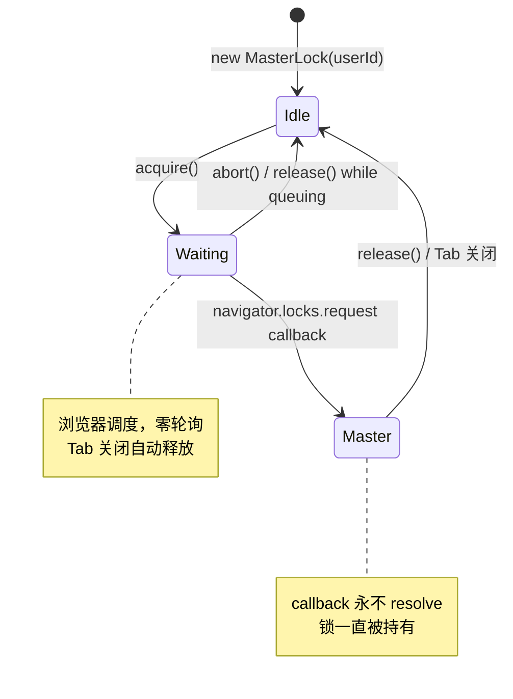
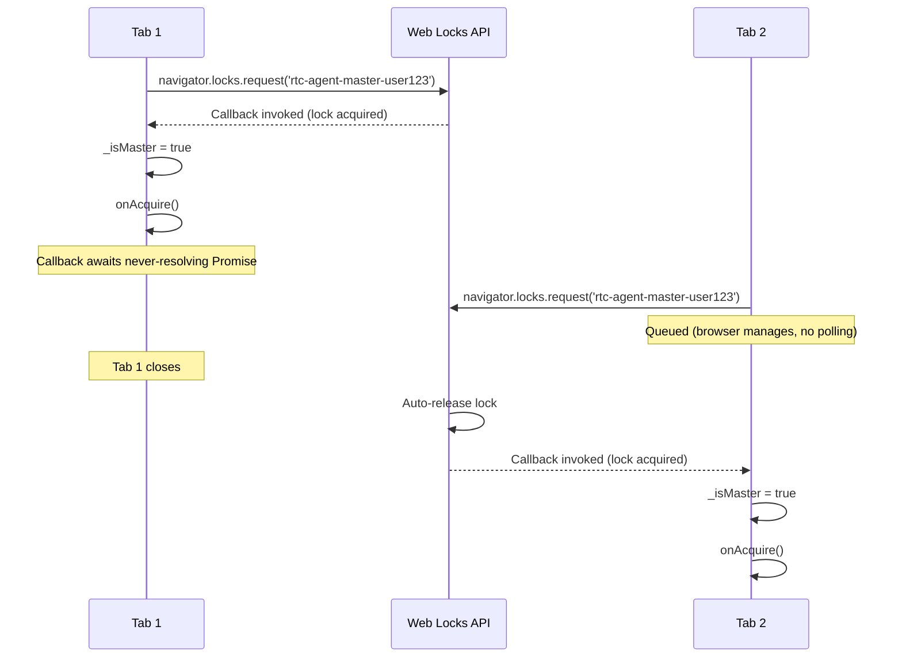
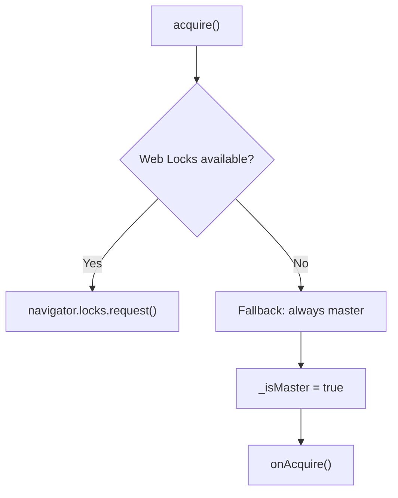
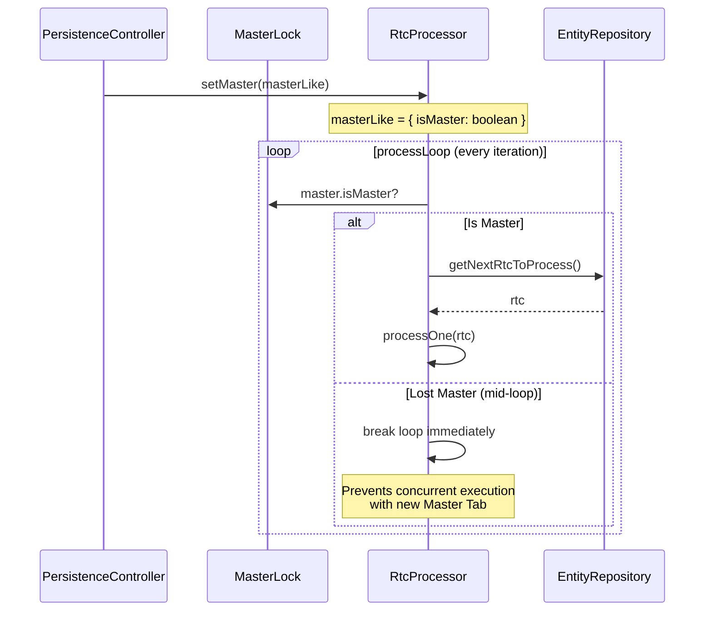

# MasterLock

Web Locks API 驱动的 Master Tab 选举。

**所属 package**: `component`

## 关键代码文件

- [master-lock.ts](~/Workspaces/rtc-agent/web-components/packages/component/src/master-lock.ts) — `MasterLock` 类（162 行）

## 设计原则

> **每个 Tab 各自持有 MasterLock，自己判断是否为 Master** — [master-lock.ts:3-10](~/Workspaces/rtc-agent/web-components/packages/component/src/master-lock.ts#L3-L10)
>
> ```text
> 设计原则：
> - 每个 Tab 各自持有一个 MasterLock，自己判断是否为 Master
> - Worker 不参与选举，不知道也不关心谁是 Master
> - Tab 关闭 → 浏览器自动释放锁 → 其他 Tab 排队获得 → 自动升级
> - 锁名含 userId，多用户隔离
> ```

## 状态机



## 核心实现原理



## Web Locks 不可用降级



## 关键方法

| Method | Description |
|--------|-------------|
| `acquire()` | 开始尝试获取锁（幂等） |
| `release()` | 主动释放锁 / 取消排队 |
| `isMaster` | 当前是否为 Master |
| `isControlled` | 是否已开始选举流程 |

## 锁名格式

```typescript
this._lockName = `rtc-agent-master-${userId}`;
```

多用户隔离：不同用户的 Tab 不会竞争同一把锁。

## RtcProcessor 集成

`RtcProcessor` 通过 `MasterLike` 接口注入 MasterLock，在每次循环迭代中检查 Master 状态：



关键设计（Fix 60）：Master 状态在**每次循环迭代**检查，而不是仅在循环开始时检查。这确保当 Tab 在循环执行期间失去 Master 状态时，能立即退出，防止与新 Master Tab 并发执行 RTC。

```typescript
// FIX #60: Check master status on every iteration.
// If this Tab lost Master status during the loop, exit immediately
// to prevent concurrent RTC execution with the new Master Tab.
if (!this._isMasterAllowed()) {
    log.debug('processLoop: lost master status during loop, exiting');
    break;
}
```

— [rtc-processor.ts:212-218](~/Workspaces/rtc-agent/web-components/packages/persistence/src/rtc-processor.ts#L212-L218)

## BusHandler Master 门控

`BusHandler` 在处理 RTC 事件时也检查 Master 状态，非 Master Tab 不触发 `RtcProcessor.onRtcUpdate()`：

```typescript
if (event.entity === 'rtc') {
    if (persistence.masterLock?.isMaster === false) {
        return;  // Skip non-master tabs
    }
    getRtcProcessor()?.onRtcUpdate();
}
```

这确保多 Tab 场景下，只有 Master Tab 的 RtcProcessor 被唤醒处理 RTC。

## 关键注释摘录

> **永不 resolve 策略** — [master-lock.ts:96-111](~/Workspaces/rtc-agent/web-components/packages/component/src/master-lock.ts#L96-L111)
>
> ```typescript
> // navigator.locks.request 的 callback 在获得锁时调用
> // callback 返回的 Promise resolve 时释放锁
> // 我们让 callback 永不 resolve → 锁一直被持有直到 Tab 关闭
> await new Promise<void>((resolve) => {
>     // 存储 resolve 以便 release() 可以主动释放
>     this._releaseResolve = resolve;
> });
> ```

## 跨维度关联

- [[SharedWorker]] — Master Tab 负责启动 SharedWorker 的连接
- [[AuthController]] — 锁名包含 userId，依赖认证状态
- [[RtcProcessor]] — 通过 MasterLike 接口注入，每次迭代检查 Master 状态
- [[BusHandler]] — RTC 事件仅由 Master Tab 处理
- [[PersistenceController]] — MasterLock 在 connect 后创建并开始选举
