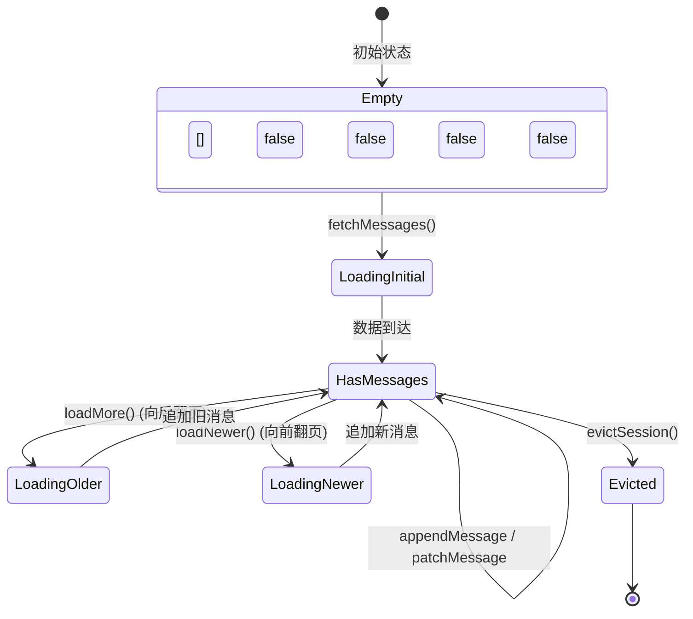
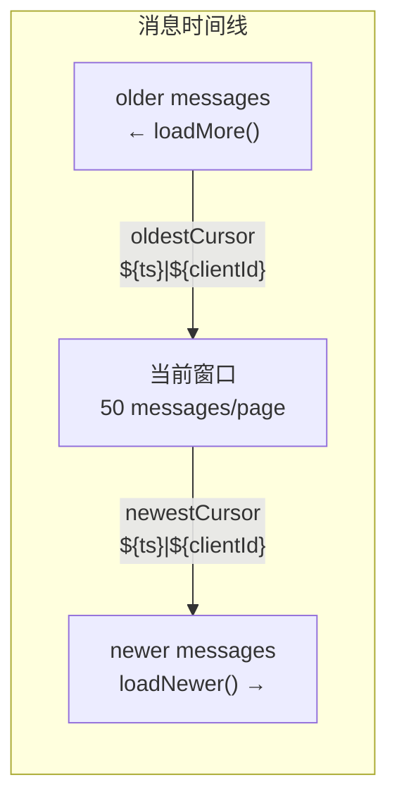
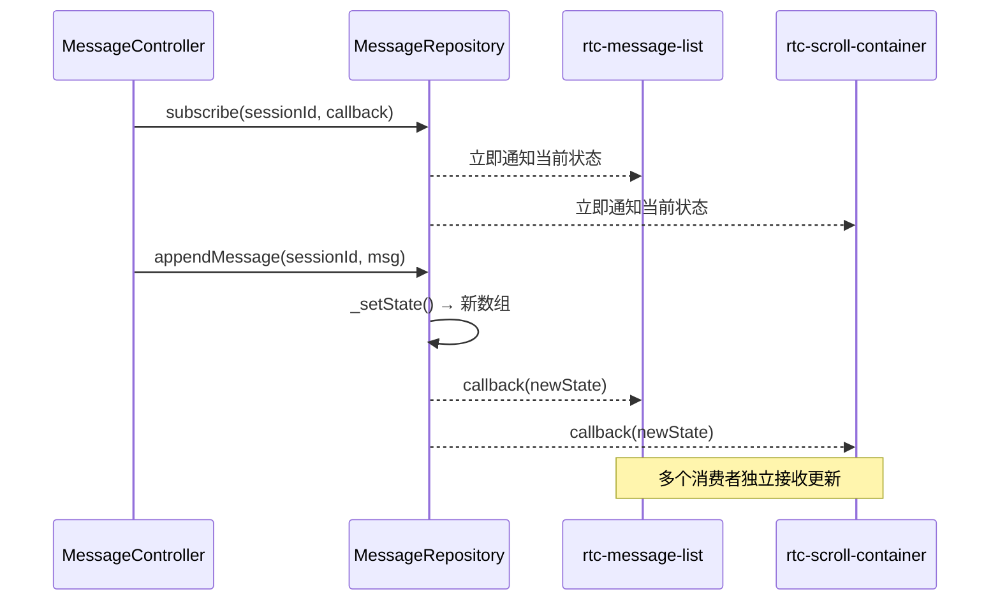
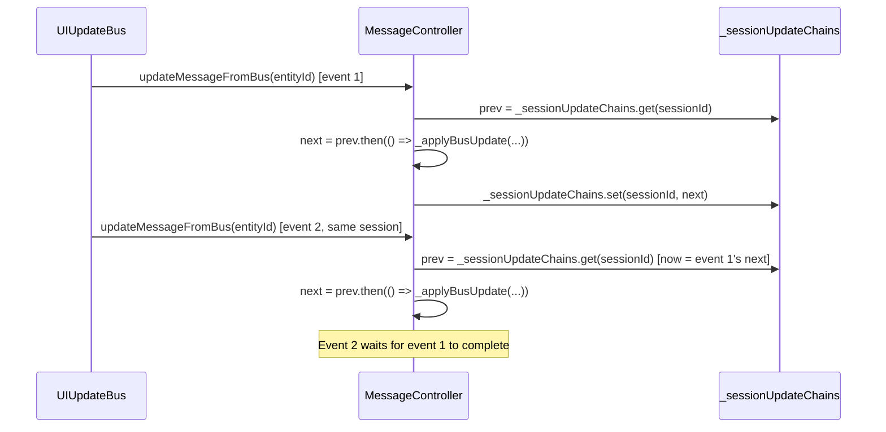

# MessageRepository

Per-session 消息状态管理：发布-订阅模式、双向游标分页、并发去重、不可变更新。

**所属 package**: `component`

## 关键代码文件

- [repositories/message.repository.ts](~/Workspaces/rtc-agent/web-components/packages/component/src/repositories/message.repository.ts) — `MessageRepository` 类
- [repositories/index.ts](~/Workspaces/rtc-agent/web-components/packages/component/src/repositories/index.ts) — 导出入口
- [controllers/message.controller.ts](~/Workspaces/rtc-agent/web-components/packages/component/src/controllers/message.controller.ts) — 消费 `MessageRepository` 的 Controller

## 核心职责

| 职责 | 实现方式 |
|------|----------|
| Per-session 隔离 | `Map<string, MessageState>` — 每个 session 独立状态 |
| 发布-订阅 | `Map<string, Set<SessionDataCallback>>` — 按 session 分组的订阅者集合 |
| 双向分页 | 向后（`loadMore`）+ 向前（`loadNewer`），游标格式 `${timestamp}\|${clientId}` |
| 并发去重 | `_loadingSessions` / `_loadingNewerSessions` Set 防止同一 session 重复请求 |
| 不可变更新 | 所有变更产生新数组/对象，不修改原状态 |
| 内存管理 | `evictSession()` 释放已关闭标签页的消息缓存 |

## 状态结构



## 分页游标



游标格式 `${timestamp}|${clientId}` 对应 `(created_at, client_id)` 复合排序键。`MessageController._buildCursor()` 从 `LocalMessage` 构建游标，`_buildCursorFromUI()` 从 UI `Message` 构建相同格式的游标。

## 发布-订阅流程



## 并发控制

### 向后翻页去重

```typescript
// _loadingSessions: Set<string>
if (this._loadingSessions.has(sessionId)) {
    return current.messages; // 已有请求在进行，直接返回
}
this._loadingSessions.add(sessionId);
// ... fetch ...
this._loadingSessions.delete(sessionId); // finally 中清理
```

### 向前翻页去重

```typescript
// _loadingNewerSessions: Set<string>
// 同样的去重逻辑
```

### Per-Session Update Chain (Fix 77)

`updateMessageFromBus()` 使用 per-session Promise chain 串行化同一 session 的 bus 更新，防止竞态：



链的容错设计：

```typescript
// Fix 77: catch handler prevents chain breaking when _applyBusUpdate throws.
// Without this, an error in one update would break the chain for all subsequent updates.
const next = prev.then(
    () => { this._applyBusUpdate(messageSessionId, entityId, localMsg); },
    (err) => {
        log.error('bus update chain error, continuing chain for future events:', err);
        this._applyBusUpdate(messageSessionId, entityId, localMsg);
    }
).catch((err) => {
    // Catch synchronous errors from _applyBusUpdate itself
    log.error('bus update apply error, chain continues:', err);
    // Don't re-throw: allow chain to continue for next event
});
```

关键设计：

- **双层 catch** — `.then(onfulfilled, onrejected)` 捕获前一个 Promise 的错误；`.catch()` 捕获当前 `_applyBusUpdate` 的同步错误
- **不 re-throw** — 确保链永远不断裂，后续事件正常处理
- **Chain 清理** — `next.finally()` 在链 settled 后从 Map 中删除，防止内存泄漏

### hasMore 判定

向后翻页：`olderMessages.length >= MESSAGE_PAGE_SIZE` — 返回数量达到页大小则认为还有更多。
向前翻页：同理。

## MessageApi 接口

`MessageRepository` 不直接访问网络或数据库，通过 `MessageApi` 接口解耦：

```typescript
interface MessageApi {
    fetchMessages(sessionId: string): Promise<Message[]>;
    fetchOlderMessages(sessionId: string, beforeCursor?: string): Promise<Message[]>;
    fetchNewerMessages(sessionId: string, afterCursor?: string): Promise<Message[]>;
}
```

`MessageController` 在 `persistence` setter 中实现此接口，将调用委托给 `PersistenceLayer.listMessages()`。

## 关键设计原则

1. **不可变状态** — 所有更新产生新数组，不修改原 `messages` 引用
2. **单一数据源** — `MessageController.value` 从 `MessageRepository.getSessionState()` 派生，不维护独立副本
3. **错误容错** — `loadMore` 失败时重置 `isLoadingMore`，不阻塞后续请求
4. **浅拷贝通知** — `getSessionState()` 返回浅拷贝，防止外部突变

## 关键注释摘录

> **Per-session 隔离** — [message.repository.ts:8-11](~/Workspaces/rtc-agent/web-components/packages/component/src/repositories/message.repository.ts#L8-L11)
>
> ```text
> Manages per-session message data with a publish-subscribe pattern.
> Each session maintains its own `messages`, `hasMore`, and `isLoadingMore` state.
> ```

> **游标格式** — [message.repository.ts:28](~/Workspaces/rtc-agent/web-components/packages/component/src/repositories/message.repository.ts#L28)
>
> ```text
> Cursor format: "${timestamp}|${clientId}" for (created_at, client_id) composite pagination.
> ```

> **并发去重** — [message.repository.ts:14-15](~/Workspaces/rtc-agent/web-components/packages/component/src/repositories/message.repository.ts#L14-L15)
>
> ```text
> Concurrency note: concurrent `loadMore` calls for the same session are
> de-duplicated via the `isLoadingMore` flag
> ```

## 跨维度关联

- [[MessageVirtualScroll]] — 虚拟滚动消费 `MessageRepository` 的分页数据
- [[ControllerPattern]] — `MessageController` 是 `MessageRepository` 的直接消费者，将状态通过 Context 提供给 UI
- [[EntityRepository]] — 底层持久化，`MessageController` 通过 `PersistenceLayer` 访问
- [[UIUpdateBus]] — `updateMessageFromBus()` 将实时事件应用到 Repository
- [[ContextSystem]] — Repository 状态通过 Controller -> Context 路径分发到 UI
