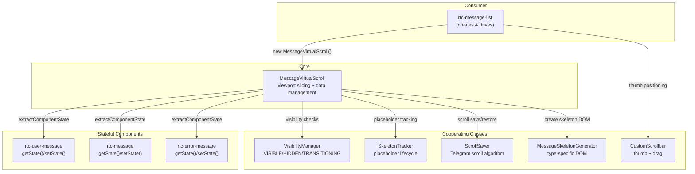
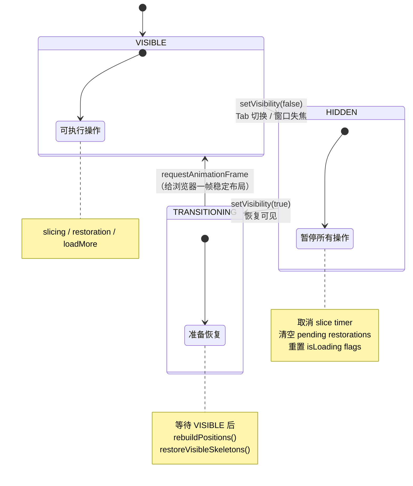
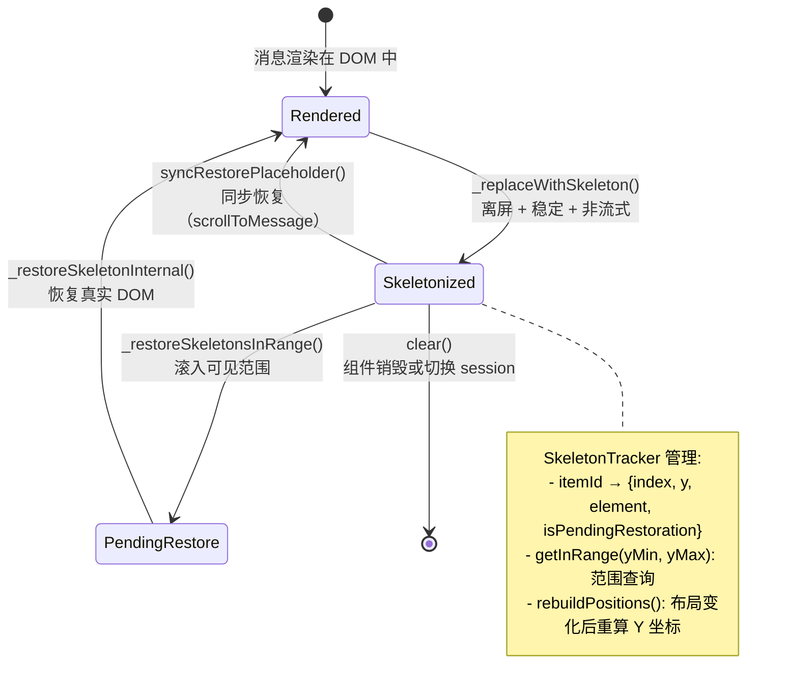
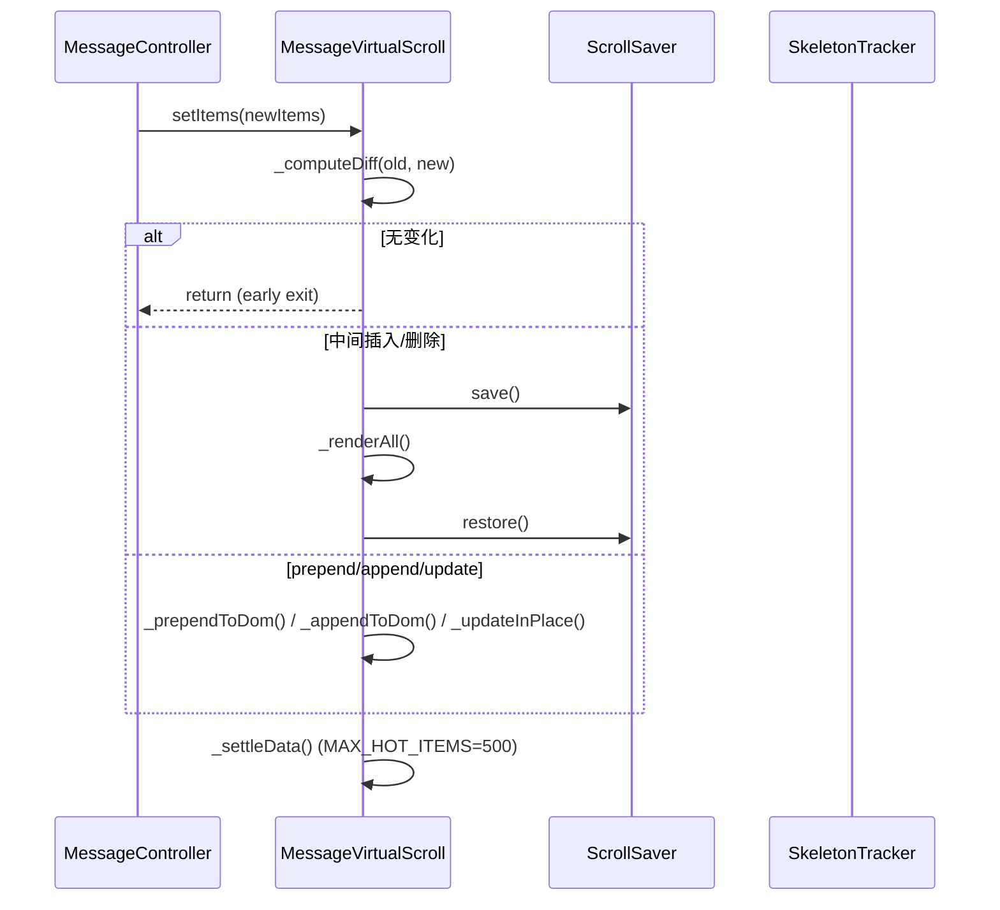
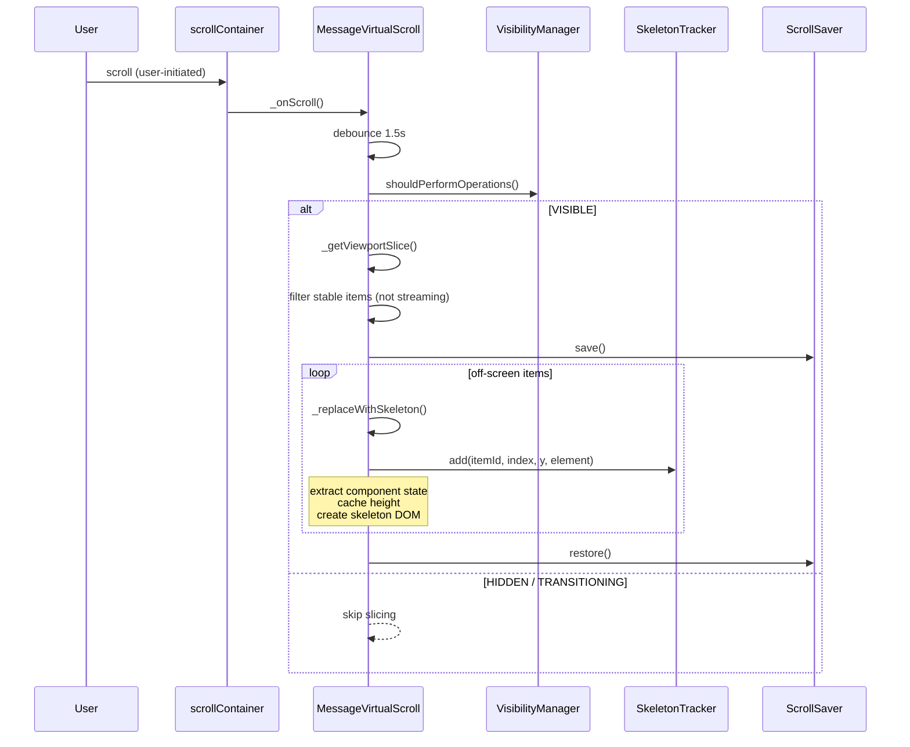
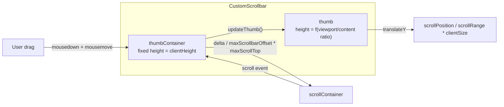

# MessageVirtualScroll

Telegram 风格的消息虚拟滚动系统：骨架屏占位、可见性状态机、热/冷数据分离、滚动位置保持。

**所属 package**: `component`

## 关键代码文件

- [utils/message-virtual-scroll.ts](~/Workspaces/rtc-agent/web-components/packages/component/src/utils/message-virtual-scroll.ts) — 核心类 `MessageVirtualScroll<T>`，2196 行
- [utils/visibility-manager.ts](~/Workspaces/rtc-agent/web-components/packages/component/src/utils/visibility-manager.ts) — 可见性状态机 `VisibilityManager`
- [utils/skeleton-tracker.ts](~/Workspaces/rtc-agent/web-components/packages/component/src/utils/skeleton-tracker.ts) — 骨架屏生命周期管理 `SkeletonTracker`
- [utils/scroll-saver.ts](~/Workspaces/rtc-agent/web-components/packages/component/src/utils/scroll-saver.ts) — 滚动位置保持 `ScrollSaver`（移植自 Telegram Web）
- [utils/message-skeleton.ts](~/Workspaces/rtc-agent/web-components/packages/component/src/utils/message-skeleton.ts) — 骨架屏 DOM 生成器 `MessageSkeletonGenerator`
- [utils/custom-scrollbar.ts](~/Workspaces/rtc-agent/web-components/packages/component/src/utils/custom-scrollbar.ts) — 自定义滚动条 `CustomScrollbar`（移植自 Telegram Web）
- [components/content-area/rtc-message-list.ts](~/Workspaces/rtc-agent/web-components/packages/component/src/components/content-area/rtc-message-list.ts) — 消费方，`<rtc-message-list>` 组件

## 架构概览



## 5 阶段演进

| Phase | 名称 | 核心能力 |
| ----- | ---- | -------- |
| 1 | Skeleton Placeholder | 离屏消息替换为骨架屏 DOM，保持滚动高度 |
| 2 | Skeleton Restoration | 滚动回可见区域时恢复骨架屏为真实 DOM |
| 3 | Visibility State Machine | Tab 切换/窗口失焦时暂停所有操作 |
| 4 | Stream Awareness | 流式输出中的消息不可被骨架化 |
| 5 | Hot/Cold + Resize | 热/冷数据分离（MAX_HOT_ITEMS=500）；容器 resize 重建坐标 |

## 可见性状态机



## 骨架屏生命周期



## 数据流

### setItems 路径



### Viewport Slicing 路径



## 关键设计决策

### 1. 事件驱动切片（非定时器）

```text
// Event-driven slicing: no periodic timer.
// Slicing is triggered by scroll events (1.5s debounce) and container resize.
// This matches Telegram's architecture and avoids background-tab bugs.
```

— [message-virtual-scroll.ts:298-300](~/Workspaces/rtc-agent/web-components/packages/component/src/utils/message-virtual-scroll.ts#L298-L300)

### 2. 用户/程序滚动区分

```text
// _setupInteractionTracking(): tracks pointer (mouse/touch) and keyboard
// interactions on the scroll container.
// This allows _onScroll to skip viewport slicing for programmatic scrolls (auto-scroll).
```

— [message-virtual-scroll.ts:1061-1063](~/Workspaces/rtc-agent/web-components/packages/component/src/utils/message-virtual-scroll.ts#L1061-L1063)

### 3. 累积滚动调整（批量恢复）

```text
// Uses cumulative scroll adjustment: captures viewport position once before
// the batch, then adjusts scrollTop by the total height difference of all
// elements restored above the viewport in a single operation.
```

— [message-virtual-scroll.ts:1351-1354](~/Workspaces/rtc-agent/web-components/packages/component/src/utils/message-virtual-scroll.ts#L1351-L1354)

### 4. 热/冷数据分离

```text
// Cold storage: historical messages that have been settled out of the hot window.
// Items are moved here when _items exceeds MAX_HOT_ITEMS.
// The repository serves as the authoritative external cache; we only track a
// settled counter for logging — no secondary buffer, to avoid memory leaks.
```

— [message-virtual-scroll.ts:244-249](~/Workspaces/rtc-agent/web-components/packages/component/src/utils/message-virtual-scroll.ts#L244-L249)

### 5. StatefulComponent 接口

消息组件实现 `StatefulComponent` 接口，在骨架化前保存状态（如 Markdown 渲染结果），恢复时注入，避免视觉闪烁：

```typescript
export interface StatefulComponent {
    getState(): Record<string, unknown>;
    setState(state: Record<string, unknown>): void;
}
```

实现方：`rtc-message`、`rtc-user-message`、`rtc-error-message`。

## ScrollSaver 算法

移植自 Telegram Web 的滚动位置保持算法。核心思路：

1. `save()`: 记录可见元素的 `getBoundingClientRect()`
2. DOM 变化（prepend/append/delete）
3. `restore()`: 找到锚点元素，计算位置偏移，调整 `scrollTop`

三级降级链：

1. 使用保存的锚点元素
2. 锚点脱离 DOM → 重新查询可见元素
3. 仍无锚点 → 使用 `scrollHeight` 差值降级

## CustomScrollbar

移植自 Telegram Web，解决原生滚动条在 prepend 内容时的跳动问题。



关键保护：容器尺寸为 0 时跳过计算，避免 `NaN/Infinity`。

## 跨维度关联

- [[UIUpdate]] — UIUpdateBus 触发 MessageController 更新 → setItems()
- [[BusHandler]] — Session 变更导致消息列表刷新
- [[ControllerPattern]] — MessageController 驱动虚拟滚动
- [[ComponentHierarchy]] — `<rtc-message-list>` 是消费方
- [[VisibilityState]] — 可见性状态机控制 skeletonize/restore 操作许可
- [[ScrollSaver]] — DOM 变更前后保存和恢复滚动位置
