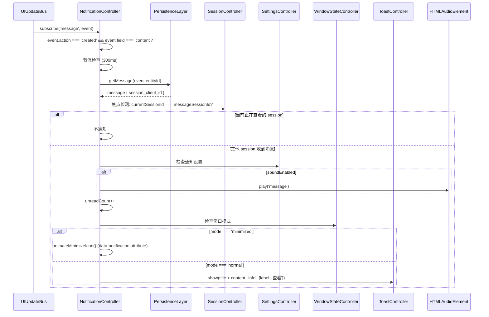
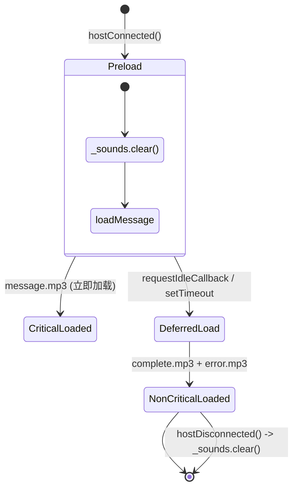
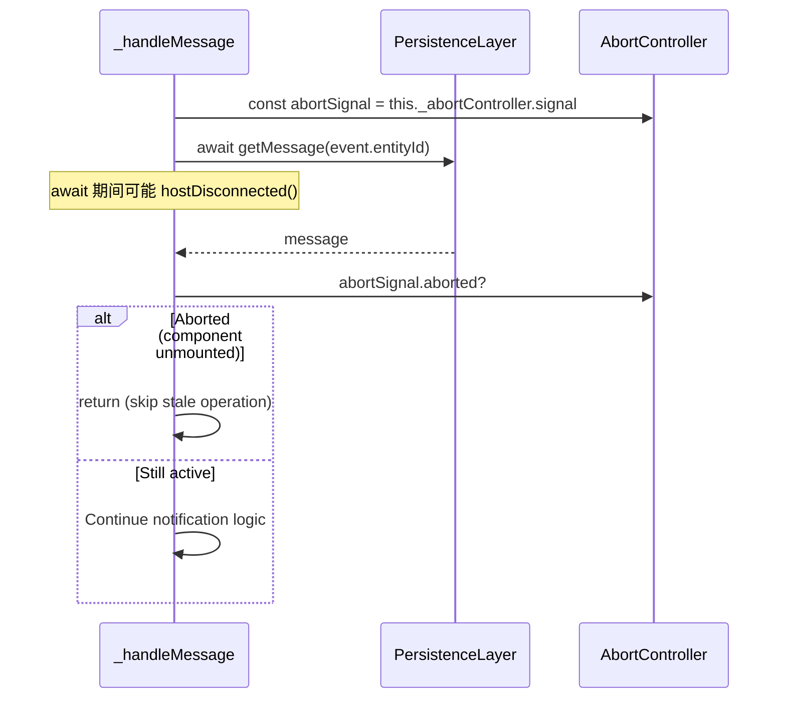

# NotificationController

轻量级通知系统：UIUpdateBus 订阅、焦点检测、声音/Toast/动画多通道通知。

**所属 package**: `component`

## 关键代码文件

- [notification.controller.ts](~/Workspaces/rtc-agent/web-components/packages/component/src/controllers/notification.controller.ts) — `NotificationController` 类

## 职责

监听新消息事件，根据焦点检测逻辑决定是否触发通知。通知展示方式取决于窗口状态（正常模式 -> Toast，最小化模式 -> 图标动画）。

## 数据流



## 焦点检测规则

| 场景 | currentSessionId | messageSessionId | 是否通知 |
| ---- | ---------------- | ---------------- | -------- |
| 当前 session 收到消息 | `"session-A"` | `"session-A"` | 否 |
| 其他 session 收到消息 | `"session-A"` | `"session-B"` | 是 |
| 未选中任何 session | `null` | `"session-B"` | 是 |
| 通知已禁用 | any | any | 否 |

禁用条件：`settings.soundEnabled === false && settings.toastEnabled === false`。

## 音效管理



音效加载策略：

- **关键音效** (`message.mp3`) — 立即加载
- **非关键音效** (`complete.mp3`, `error.mp3`) — 延迟加载（`requestIdleCallback` 优先，`setTimeout(2000)` 兜底）
- 加载失败时降级处理：不影响 Toast 和动画功能

## 通知节流

`NOTIFY_THROTTLE_MS = 300` — 防止快速连续消息导致 UI 卡顿。

## 状态结构

```typescript
interface NotificationState {
    unreadCount: number;        // 未读计数
    lastNotificationAt: number; // 最后通知时间戳
}

interface NotificationActions {
    markAsRead(): void;   // 清零未读 + 清除动画
    clearAll(): void;      // 重置为默认状态
}
```

## 导航跳转

用户点击 Toast 的"查看"按钮后：

1. `SessionController.switchSession(sessionId)` — 切换到目标会话
2. `markAsRead()` — 清除未读计数
3. 派发 `rtc-notification-click` CustomEvent — 通知外部监听者

## 清理安全

- `AbortController` 保护异步操作：`hostDisconnected()` 时 abort，防止断开后继续操作
- `_busUnsubscribe?.()` 先清理再重建：防止 disconnect/reconnect 循环中泄漏订阅
- `_sounds.clear()` 在 disconnect 时清空：防止 stale 引用

### AbortController 模式



`_handleMessage()` 在 `await` 前捕获 `abortSignal`，`await` 后检查 `signal.aborted`。如果组件已卸载（`hostDisconnected()` 调用了 `abort()`），跳过后续操作。

`hostDisconnected()` 中重置 `AbortController`：`this._abortController.abort()` + `this._abortController = new AbortController()`，确保下次连接使用新的控制器。

## 关键注释摘录

> **焦点检测** — [notification.controller.ts:283-307](~/Workspaces/rtc-agent/web-components/packages/component/src/controllers/notification.controller.ts#L283-L307)
>
> ```text
> 判断是否应该触发通知
>
> 场景：
> - 用户在 session A 看消息，session B 收到新消息 → 通知
> - 用户在 session A 看消息，session A 收到新消息 → 不通知
> - 用户没在看任何 session → 通知所有新消息
> - 用户禁用通知 → 所有消息都不通知
> ```

<!-- separator -->

> **最小化动画** — [notification.controller.ts:390-393](~/Workspaces/rtc-agent/web-components/packages/component/src/controllers/notification.controller.ts#L390-L393)
>
> ```text
> 通过 host 元素设置 data-notification 属性，
> CSS 通过 `:host([data-notification])` 选择器触发动画。
> 动画会一直持续，直到用户展开窗口或点击 bubble。
> ```

## 跨维度关联

- [[UIUpdateBus]] — 通知数据来源：订阅 `message` entity 的 `created` 事件
- [[ControllerPattern]] — 标准 ReactiveController 模式
- [[ContextSystem]] — 通过 `NotificationContext` 向 UI 组件分发状态
- [[ComponentEvents]] — 派发 `rtc-notification-click` 事件
- [[ConcurrencyPatterns]] — AbortController 取消模式的典型使用场景
