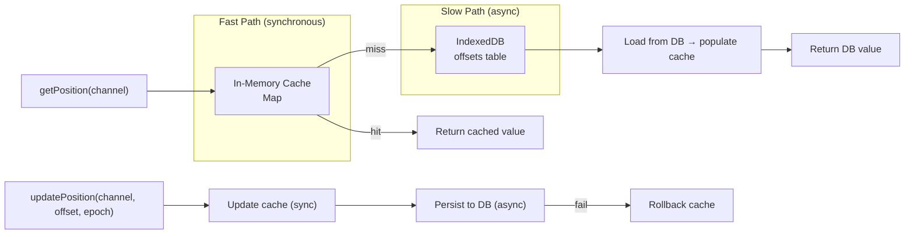
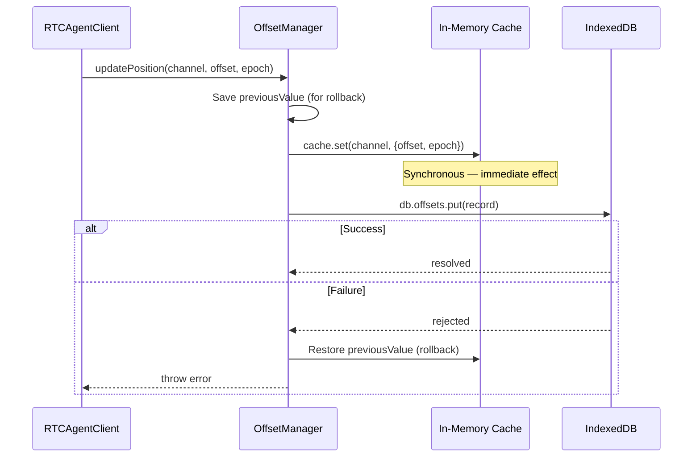
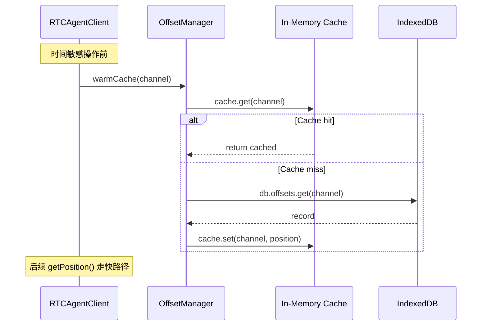

# Offset

OffsetManager：两级缓存（内存 + IndexedDB）的 offset/epoch 管理。

**所属 package**: `persistence`

## 关键代码文件

- [offset-manager.ts](~/Workspaces/rtc-agent/web-components/packages/persistence/src/offset-manager.ts) — `OffsetManager` 类 + `getOffsetManager()` 单例

## 两级缓存架构



## 写入策略：Write-Through



## 读取策略：Read-Through

1. **Cache hit** — 直接返回副本（防止外部修改缓存数据）
2. **Cache miss** — 从 IndexedDB 加载 → 填充缓存 → 返回副本

## 为什么需要两级缓存

> **同步读取需求** — [offset-manager.ts:6-19](~/Workspaces/rtc-agent/web-components/packages/persistence/src/offset-manager.ts#L6-L19)
> _This design ensures that after the first read or write, subsequent reads are synchronous, avoiding race conditions in time-sensitive code paths like scheduleUpdate._

`RTCAgentClient.scheduleUpdate()` 在 Centrifuge 回调中执行，回调必须同步返回。如果 `getPosition()` 总是异步，回调就需要 await，导致 Centrifuge 的消息处理被阻塞，可能触发 ping/pong 超时。

## 单例管理

```typescript
let offsetManagerInstance: OffsetManager | null = null;

export function getOffsetManager(): OffsetManager {
  if (!offsetManagerInstance) {
    offsetManagerInstance = new OffsetManager();
  }
  return offsetManagerInstance;
}
```

## 关键方法

| Method | Sync/Async | Description |
| -------- | ----------- | ------------- |
| `getPosition(channel)` | async (快路径同步) | Cache hit → 同步返回；Cache miss → 异步加载 |
| `updatePosition(channel, offset, epoch)` | async | Write-through: 先写缓存，再写 DB |
| `clearPosition(channel)` | async | 清除缓存 + DB |
| `reset()` / `clearAll()` | async | 清除所有记录 |
| `warmCache(channel)` | async | 预热缓存：显式加载到内存（等同于 getPosition，但意图明确） |
| `invalidateCache(channel)` | sync | 仅清除缓存（下次读从 DB 加载） |
| `invalidateAllCache()` | sync | 清除整个缓存（测试或外部修改 DB 后使用） |
| `isCached(channel)` | sync | 检查缓存状态（调试用） |
| `getCacheSize()` | sync | 缓存条目数（监控用） |

## 缓存预热场景

`warmCache()` 用于在时间敏感操作前预热缓存，确保后续 `getPosition()` 调用走快路径：



典型用途：

- **断开连接前** — `disconnect()` 调用 `offsetManager.reset()` 清除所有缓存
- **重连后** — 首次 Publication 到达时自动触发 cache miss → 从 DB 加载
- **测试** — `invalidateCache()` 强制下次读从 DB 加载，验证持久化正确性

## 关键注释摘录

> **Write-through 一致性** — [offset-manager.ts:69-81](~/Workspaces/rtc-agent/web-components/packages/persistence/src/offset-manager.ts#L69-L81)
> _Uses write-through strategy: both in-memory cache and IndexedDB are updated. The cache is updated synchronously first, ensuring that subsequent getPosition calls return the updated value immediately. If IndexedDB write fails, the cache is rolled back to maintain consistency._

## 跨维度关联

- [[Publication]] — offset 在 Publication 处理后更新
- [[Database]] — offsets 表存储
- [[SharedWorker]] — OffsetManager 在 Worker 内运行
- [[Connection]] — reconnect 时 offset 状态保留
