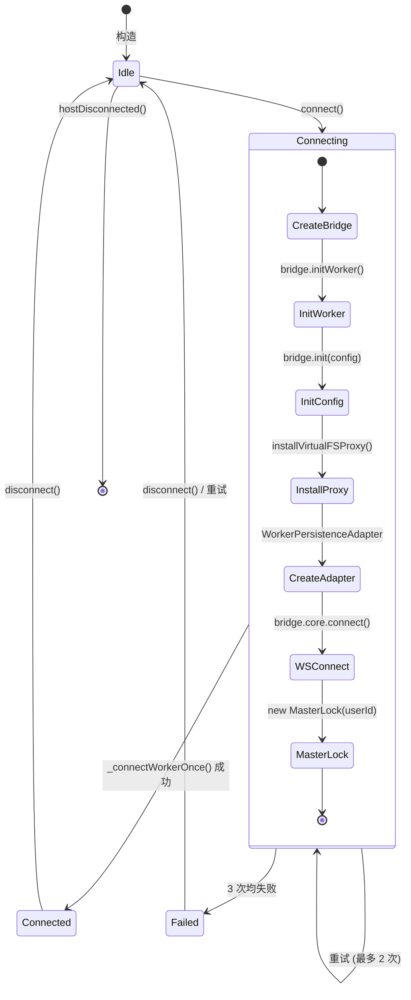
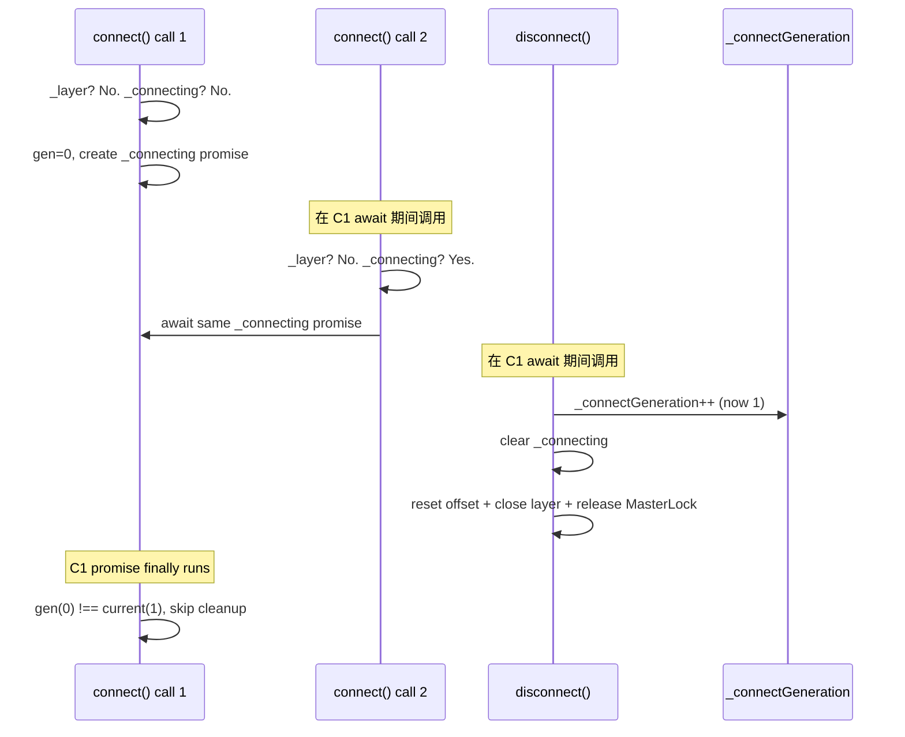
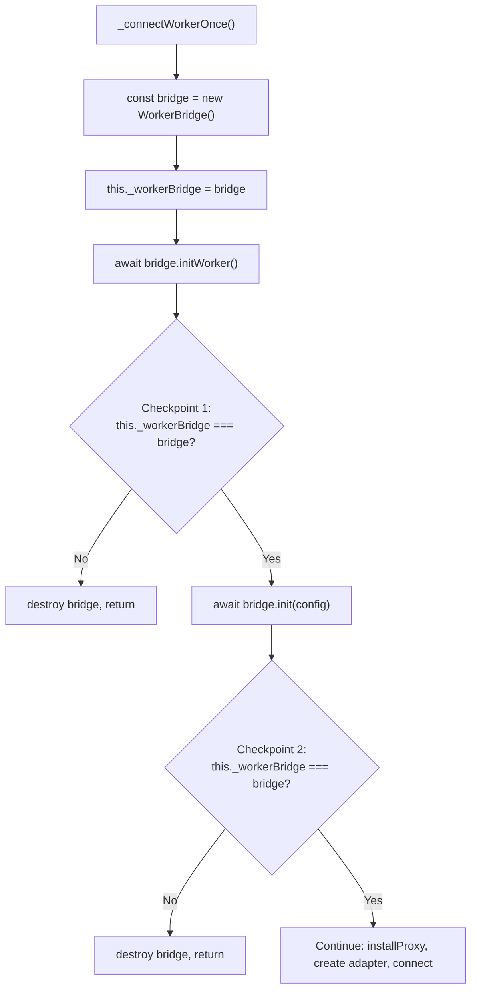

# PersistenceController

PersistenceLayer 生命周期管理：SharedWorker 桥接、连接重试、Worker 适配器。

**所属 package**: `component`

## 关键代码文件

- [persistence.controller.ts](~/Workspaces/rtc-agent/web-components/packages/component/src/controllers/persistence.controller.ts) — `PersistenceController` 类 + `WorkerPersistenceAdapter` 内部类

## 职责

`PersistenceController` 是组件层与持久化层的唯一桥梁。它不直接创建 `PersistenceLayer`，而是通过 `WorkerBridge` + Comlink 在 SharedWorker 内部创建，然后在主线程提供一个 `WorkerPersistenceAdapter` 适配器。

## 生命周期



## 连接竞争保护

### Generation Counter



关键机制：`_connectGeneration` 计数器。`disconnect()` 递增计数器，使旧的 `_connecting` promise 的 `finally` 块失效，避免清除新连接的 `_connecting` 引用。

### 本地变量捕获 + 检查点

`_connectWorkerOnce()` 在 `await` 点使用本地变量捕获 + 检查点机制，防止 React StrictMode 双挂载导致的竞态：



设计要点：

- **本地变量捕获**: `const bridge` 在 `await` 前捕获实例，避免 `await` 后访问 `this._workerBridge` 时已被 `disconnect()` 修改
- **检查点验证**: 每个 `await` 后检查 `this._workerBridge === bridge`，如果被 `disconnect()` 打断，优雅退出并清理
- **disconnect() 对称保护**: `disconnect()` 也使用本地变量捕获 `layer` 和 `workerBridge`，仅在 `this._layer === layer` 时才清除（防止清除新连接创建的实例）

## React StrictMode 兼容

React StrictMode 触发 mount → unmount → remount 循环，导致 `connectedCallback → disconnectedCallback → connectedCallback`。三种技术组合解决：

| 技术 | 用途 |
| --- | --- |
| 本地变量捕获 | `await` 后访问正确的实例 |
| 检查点机制 | `await` 后验证实例未被替换 |
| Generation counter | 防止旧 promise 的 `finally` 清除新连接 |

## WorkerPersistenceAdapter

`WorkerPersistenceAdapter` 是 `PersistenceLayer` 的 Comlink 代理适配器。它实现了 `PersistenceLayer` 的公共接口，内部通过 `Remote<WorkerPersistenceCore>` 转发到 SharedWorker。

| 方法类别 | 支持 | 说明 |
| -------- | ---- | ---- |
| 连接 | connect/disconnect/reconnect | 透传到 Worker |
| 查询 | listSessions/listMessages/getSession/getMessage/listRtc/getNextRtcToProcess | 透传到 Worker |
| 操作 | sendMessage/insertLocalMessage/stopTurn/closeSession/openSession/compactSession/submitRtcResult/forkSession/deleteSession/updateSessionTitle | 透传到 Worker |
| 受限 | getClient() | **抛出错误** — 用 `onConnectionStateChange()` 替代 |
| 受限 | getEntityRepository() | **抛出错误** — 当前无调用方 |
| 受限 | getOffsetManager() | 返回仅含 `reset()` 的 shim |

## 连接状态统一接口

```typescript
// 获取当前连接状态
async getConnectionState(): Promise<ConnectionState>

// 监听连接状态变更
onConnectionStateChange(listener): () => void
```

这两个方法通过 `WorkerBridge` 获取，而非直接访问 `RTCAgentClient`（Client 在 Worker 内部，主线程无法直接访问）。

## 配置

| 属性 | 来源 | 说明 |
| ---- | ---- | ---- |
| `databaseName` | `set databaseName(value)` | 自定义 DB 名前缀，最终格式为 `{prefix}-{userId}` |
| `workerUrl` | `set workerUrl(value)` | 自定义 SharedWorker 脚本 URL（CDN 部署时使用） |
| `client.endpoint` | `AUTH_CONFIG.wsEndpoint` | WebSocket 端点 |
| `client.getToken` | `AuthController.getAccessTokenAsync()` | Token 获取回调 |
| `client.onTokenExpired` | `AuthController.handleTokenExpired()` | Token 过期回调 |
| `client.deviceId` | `getOrCreateDeviceId()` | 设备标识 |
| `client.userId` | `AuthController.state.userId` | 用户标识 |

## 关键注释摘录

> **Generation counter** — [persistence.controller.ts:253-266](~/Workspaces/rtc-agent/web-components/packages/component/src/controllers/persistence.controller.ts#L253-L266)
> _Connection generation counter for race-condition prevention. When disconnect() clears `_connecting` while the underlying Promise is still in-flight, a subsequent connect() can set a new `_connecting`. When the OLD Promise finally resolves, its `finally` block would wrongly clear the NEW `_connecting`, leaving the new connection attempt invisible to the concurrency guard — leading to duplicate connection attempts and inconsistent state._

<!-- separator -->

> **Adapter 语义** — [persistence.controller.ts:39-48](~/Workspaces/rtc-agent/web-components/packages/component/src/controllers/persistence.controller.ts#L39-L48)
> _WorkerPersistenceAdapter 结构上匹配 PersistenceLayer，但以下方法语义不同：getClient() throws（用 PersistenceController.onConnectionStateChange 替代）；getEntityRepository() throws（当前无调用方）；getOffsetManager() 返回仅含 reset() 的 shim。当修改 PersistenceLayer 公共 API 时，必须同步更新 WorkerPersistenceAdapter。_

## 跨维度关联

- [[Connection]] — PersistenceController 驱动 WebSocket 连接
- [[ConnectionState]] — 连接状态通过 WorkerBridge 获取
- [[WorkerBridge]] — SharedWorker 通信桥
- [[MasterLock]] — Master Tab 选举在 connect 后启动
- [[AuthController]] — Token 获取与用户认证
- [[PersistenceLayer]] — Worker 内部的实际持久化层实现
- [[LocalStorage]] — AuthController 使用 localStorage 持久化 Token
- [[ConcurrencyPatterns]] — Generation Counter + Checkpoint 模式的典型使用场景
