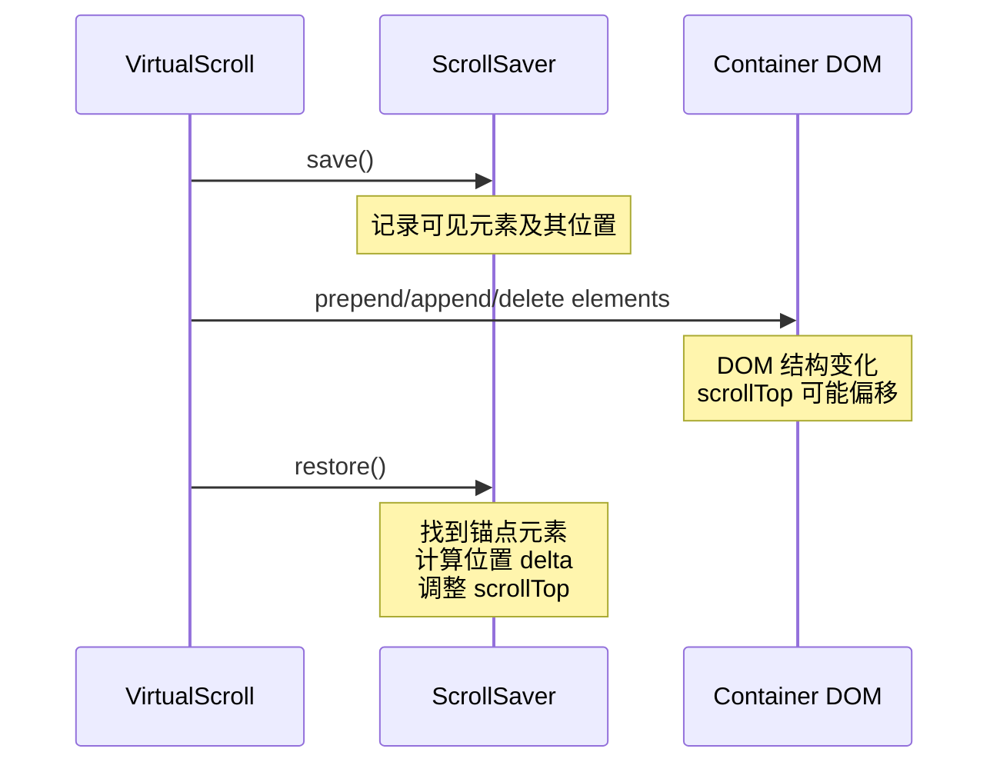
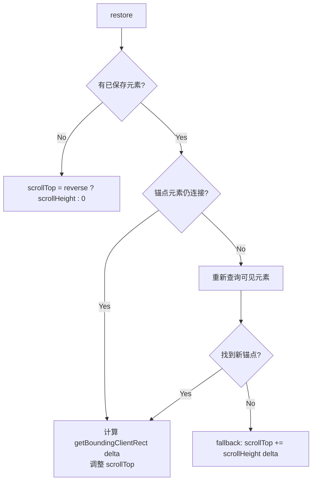
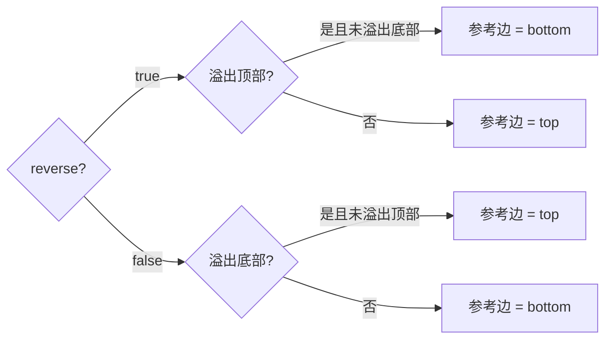
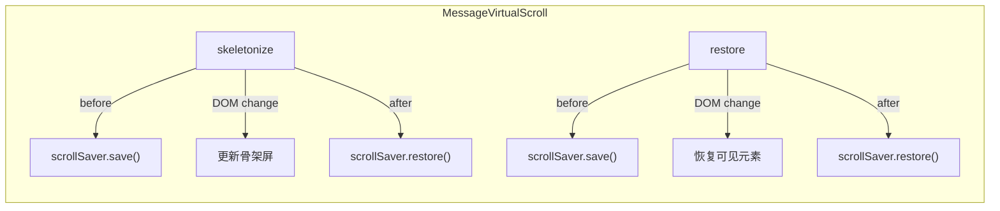

# ScrollSaver

Telegram 风格的滚动位置保持：在 DOM 变更（prepend/append/delete）前后保存和恢复滚动位置。

**所属 package**: `component`

## 关键代码文件

- [utils/scroll-saver.ts](~/Workspaces/rtc-agent/web-components/packages/component/src/utils/scroll-saver.ts) — ScrollSaver 实现
- [utils/message-virtual-scroll.ts](~/Workspaces/rtc-agent/web-components/packages/component/src/utils/message-virtual-scroll.ts) — 主要消费者

## 核心概念



## 算法

### 1. save() — 记录状态

- 遍历容器中匹配 `query` 选择器的所有元素
- 记录在容器视口内可见的元素及其 `getBoundingClientRect()`
- 记录当前 `scrollTop` 和 `scrollHeight`

### 2. restore() — 恢复位置

三级 fallback 链：



### 锚点选择

- `reverse = true`（prepend 模式，从顶部加载）：锚点为第一个可见元素
- `reverse = false`（append 模式，从底部加载）：锚点为最后一个可见元素

### 位置参考边

根据元素是否溢出容器视口，选择 `top` 或 `bottom` 作为参考边：



## 与 VirtualScroll 的集成



## 关键注释摘录

> **来源** — [scroll-saver.ts:1-4](~/Workspaces/rtc-agent/web-components/packages/component/src/utils/scroll-saver.ts#L1-L4)
>
> ```text
> ScrollSaver - Preserves scroll position across DOM changes.
> Directly ported from Telegram Web's ScrollSaver.
> ```

> **Fallback 链** — [scroll-saver.ts:40-46](~/Workspaces/rtc-agent/web-components/packages/component/src/utils/scroll-saver.ts#L40-L46)
>
> ```text
> Fallback chain (matching Telegram Web's algorithm):
> 1. Try the saved anchor element
> 2. If anchor disconnected → re-query visible elements, pick new anchor
> 3. If still no anchor → fall back to scrollHeight delta
> ```

## 跨维度关联

- [[MessageVirtualScroll]] — ScrollSaver 的主要消费者
- [[VisibilityState]] — 与可见性状态机协作，确保只在 VISIBLE 状态下执行 restore
