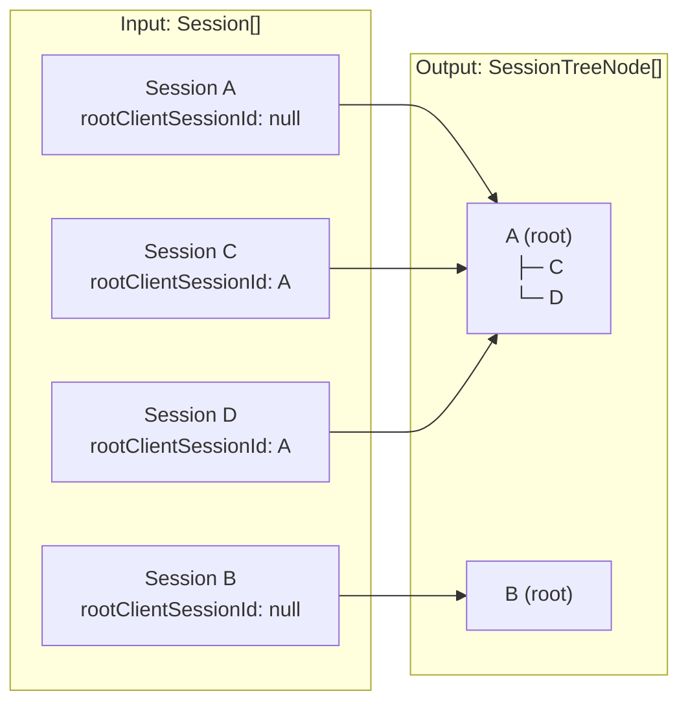
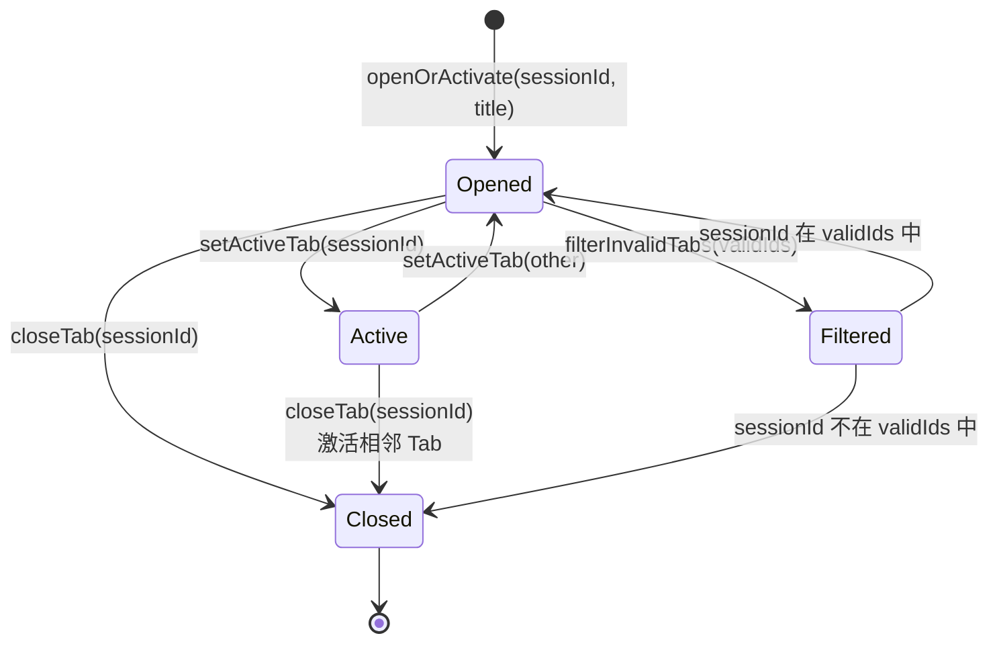
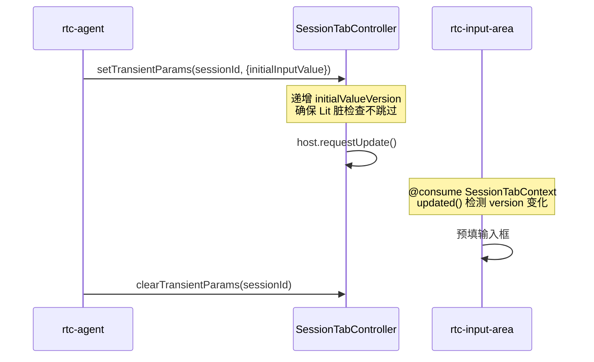
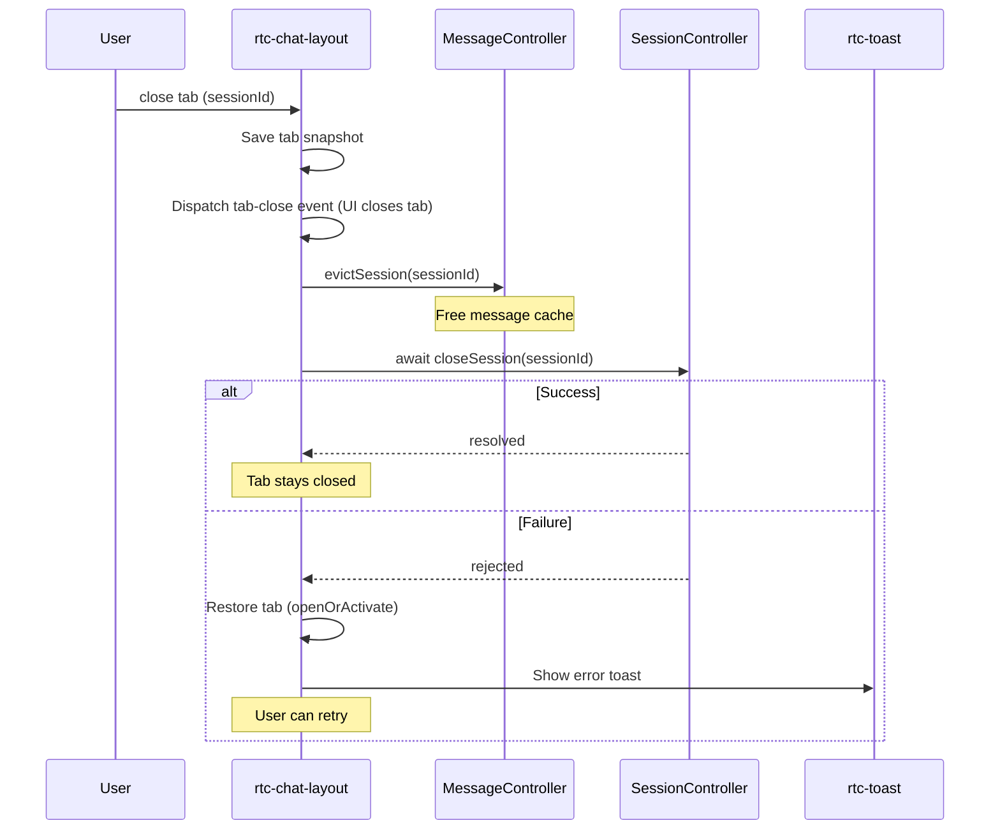
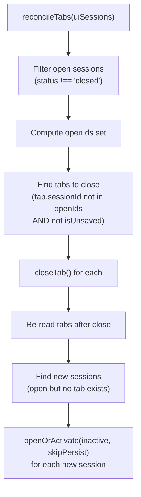

# SessionManagement

会话树（Session Tree）与会话标签页（Session Tab）的状态管理与 UI 交互。

**所属 package**: `component`

## 关键代码文件

- [controllers/session-tree.controller.ts](~/Workspaces/rtc-agent/web-components/packages/component/src/controllers/session-tree.controller.ts) — SessionTreeController：平铺 session 列表 -> 层级树构建
- [controllers/session-tab.controller.ts](~/Workspaces/rtc-agent/web-components/packages/component/src/controllers/session-tab.controller.ts) — SessionTabController：Tab 页签管理（打开/关闭/切换）
- [helpers/session-loader.ts](~/Workspaces/rtc-agent/web-components/packages/component/src/components/rtc-agent/helpers/session-loader.ts) — Session 加载 + Tab 对账（loadSessions / reconcileTabs）
- [components/session-tree/rtc-session-tree.ts](~/Workspaces/rtc-agent/web-components/packages/component/src/components/session-tree/rtc-session-tree.ts) — 会话树容器组件（ARIA Treeview + 键盘导航）
- [components/session-tree/rtc-session-tree-item.ts](~/Workspaces/rtc-agent/web-components/packages/component/src/components/session-tree/rtc-session-tree-item.ts) — 递归树节点组件（内联重命名、展开/折叠）
- [components/session-tree/rtc-session-tab-bar.ts](~/Workspaces/rtc-agent/web-components/packages/component/src/components/session-tree/rtc-session-tab-bar.ts) — Tab 栏组件
- [components/session-tree/rtc-session-tab.ts](~/Workspaces/rtc-agent/web-components/packages/component/src/components/session-tree/rtc-session-tab.ts) — 单个 Tab 组件
- [contexts/session-tree.ts](~/Workspaces/rtc-agent/web-components/packages/component/src/contexts/session-tree.ts) — SessionTreeContext 定义
- [contexts/session-tab.ts](~/Workspaces/rtc-agent/web-components/packages/component/src/contexts/session-tab.ts) — SessionTabContext 定义

## SessionTreeController：平铺 -> 层级树

将平铺的 `Session[]` 列表构建为层级树结构：

- `rootClientSessionId` 为空的 session 作为根节点
- 其余 session 按 `rootClientSessionId` 分组，挂到对应根节点的 `children` 中
- 根节点按 `updatedAt` 降序排列（最近的在上）
- 子节点按 `createdAt` 升序排列（最早的在左）



### 展开/折叠状态

展开状态存储在 `Map<sessionId, boolean>` 中，可选持久化到 `localStorage`（key: `rtc:session-tree-expanded`）。默认全部折叠。

`rebuildTree(sessions)` 由外部（root 组件）在 session 列表变化时调用。展开状态在重建时保留，不受 session 列表变化影响。

## SessionTabController：Tab 页签管理

管理对话页面的 Tab 页签，核心规则：

| 规则 | 说明 |
|------|------|
| 同一 session 只开一个 Tab | `openOrActivate()` 幂等：已存在则切换 |
| 关闭活动 Tab 自动激活相邻 Tab | 优先右侧，否则左侧 |
| Tab 标题保护 | 已有真实标题的 Tab 不被占位标题覆盖 |
| 活动 Tab 持久化 | `localStorage` key: `rtc:active-tab` |
| Unsaved Tab 特殊处理 | `isUnsaved === true` 的 Tab 即使 session 不存在也保留 |

### Tab 生命周期



### 标题同步机制

DB 是标题的权威来源。`updateTabTitles(sessionTitleMap)` 将 DB 中的最新标题同步到 Tab：

- UIUpdateBus 推送的 session 变更（用户 rename 或 AI 生成）已先写入 DB
- Tab 跟随 DB 更新，跳过条件：DB 标题为空、与当前标题相同、session 不在 DB 中

### 瞬态参数（Transient Params）

Tab 支持瞬态 UI 参数（`initialInputValue`、`noticeMessage`），用于在切换到 Tab 时触发输入框预填或通知显示。



### Tab 关闭错误恢复

[rtc-chat-layout.ts:637-727](~/Workspaces/rtc-agent/web-components/packages/component/src/components/chat-layout/rtc-chat-layout.ts#L637-L727)

Tab 关闭采用乐观更新 + 错误回滚模式。UI 立即关闭 Tab，后端 `closeSession` RPC 异步执行；失败时恢复 Tab 并显示错误 Toast：



关键设计（Fix 44）：

- **乐观更新**: 先关闭 UI，后通知后端。用户感知零延迟。
- **Tab 快照**: 关闭前保存 `{sessionId, title}` 用于失败恢复。
- **缓存清理**: 关闭时立即调用 `MessageController.evictSession()` 释放内存。
- **双重 try/catch**: 恢复逻辑本身也被 try/catch 包裹，防止组件卸载期间的 unhandled rejection。

## Tab 对账（reconcileTabs）

Gap fill / BulkUpdate 后，DB 中的 session 列表可能已变化（其他 Tab/client 创建、关闭或删除了 session）。`reconcileTabs()` 增量修补 Tab 栏以匹配当前 DB 状态：



与首次加载的 `restoreTabsFromDB` 区别：

|特性|restoreTabsFromDB (首次)|reconcileTabs (后续)|
|----|------------------------|--------------------|
|触发时机|`initialLoadDone === false`|`initialLoadDone === true`|
|Tab 排序|按 `updatedAt` 降序|保留用户已有顺序|
|激活策略|恢复 `storedActiveId`|不打扰用户当前操作|
|新 Tab 激活|按存储的 activeId 激活|`activate: false`|
|幂等性|全量重建|增量修补，多次调用无副作用|

```typescript
// 幂等安全：多次调用无副作用，已存在的 tab 不会被重复打开或重排。
```

— [session-loader.ts:277](~/Workspaces/rtc-agent/web-components/packages/component/src/components/rtc-agent/helpers/session-loader.ts#L277)

### 无限制 Session 加载

`listSessions()` 不设置默认上限（commit `a2e95c3` 移除了 50-session 限制），加载全部 session。原因：

- Tab 对账需要完整的 session 列表才能正确判断哪些 Tab 应关闭
- 对于典型使用场景（< 1000 sessions），IndexedDB 全量加载性能可接受
- 若性能成为瓶颈，可考虑虚拟滚动或游标分页

## Session Tree 键盘导航

`<rtc-session-tree>` 实现 ARIA Treeview 的 roving tabindex 模式：

| 按键 | 行为 |
|------|------|
| ArrowDown / ArrowUp | 在可见项列表中移动焦点 |
| ArrowRight | 展开折叠的节点 |
| ArrowLeft | 折叠展开的节点 |
| Enter / Space | 选中当前焦点项 |
| Home / End | 跳到第一项/最后一项 |

可见项列表通过深度优先遍历（composed tree walk）穿越递归 Shadow DOM 构建。

## Overlay 面板的 Session 管理

`<rtc-session-panel>` 通过 `@floating-ui/dom` 定位，由 `<rtc-input-area>` 管理。用于快速切换/搜索 session，与 Session Tree 共享 `SessionTreeContext` 数据。

## 关键注释摘录

> **标题保护** — [session-tab.controller.ts:212-216](~/Workspaces/rtc-agent/web-components/packages/component/src/controllers/session-tab.controller.ts#L212-L216)
>
> ```text
> 保护已有真实标题的 Tab 不被占位标题覆盖
> ```

> **Tree 刷新说明** — [rtc-session-tree.ts:117-120](~/Workspaces/rtc-agent/web-components/packages/component/src/components/session-tree/rtc-session-tree.ts#L117-L120)
>
> ```text
> Session 列表由 UIUpdateBus 实时同步（服务端变更自动推送），无手动刷新逻辑。
> 保留按钮但给出提示，避免用户困惑。
> ```

## 跨维度关联

- [[ControllerPattern]] — SessionTreeController 和 SessionTabController 遵循 Controller 模式
- [[ContextSystem]] — 通过 SessionTreeContext 和 SessionTabContext 向 UI 提供状态
- [[BusHandler]] — UIUpdateBus 事件触发 session 列表重建
- [[ComponentHierarchy]] — Session Tree 和 Tab Bar 在 Chat Layout 区域
- [[ChatLayout]] — ChatLayout 编排 Tab 生命周期（unsaved Tab / 关闭恢复 / Fork 流程）
- [[LocalStorage]] — 展开状态和活动 Tab 持久化到 localStorage
