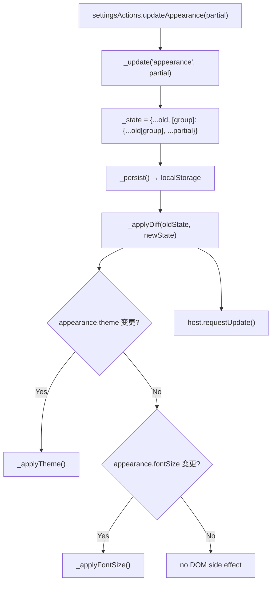
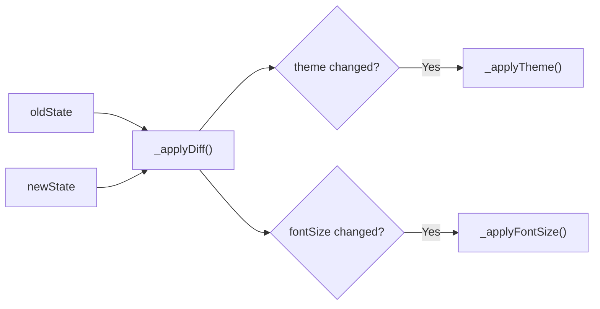
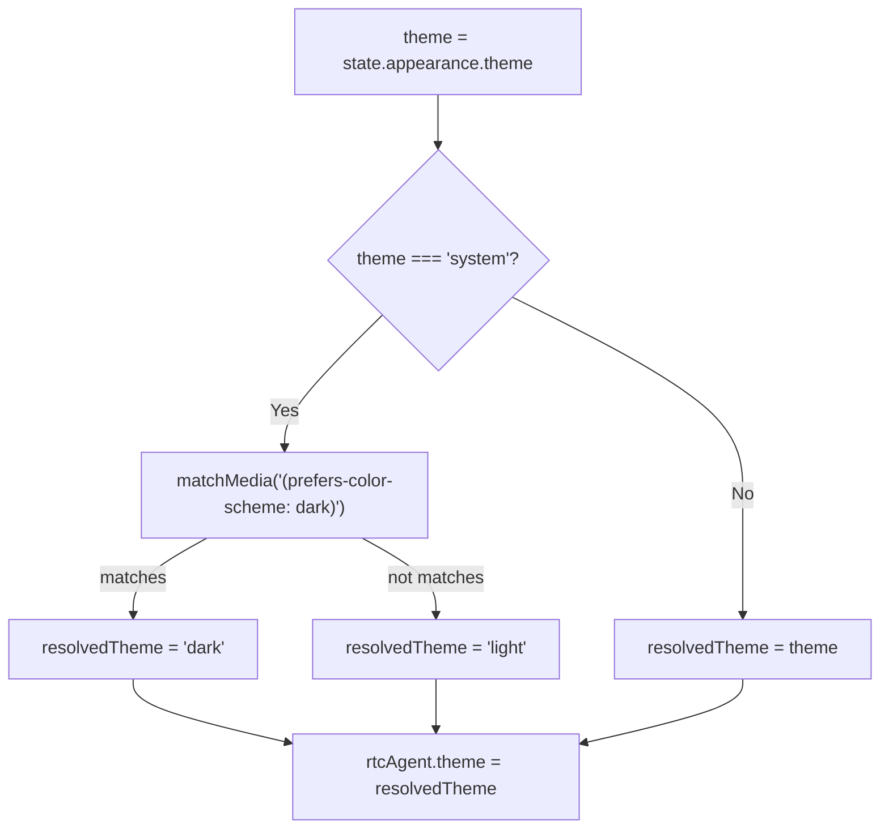
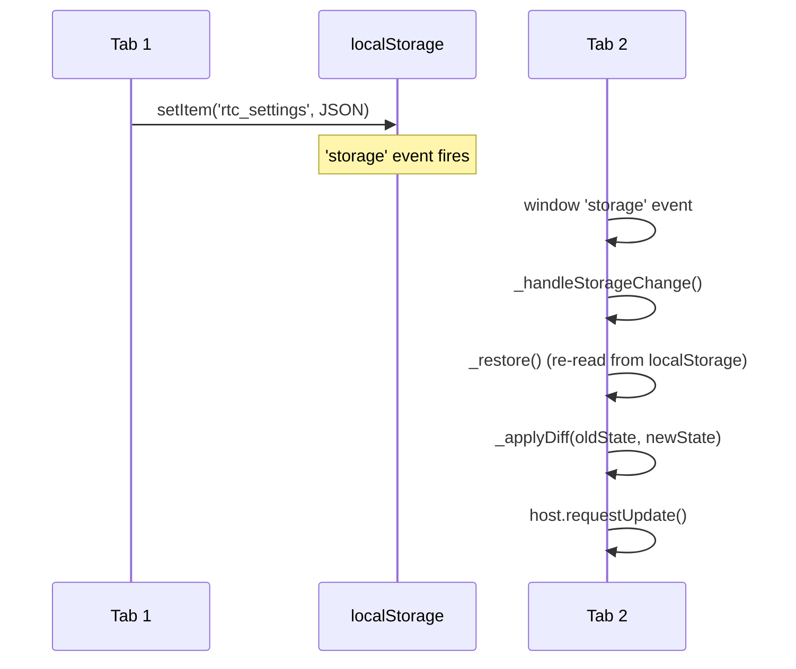
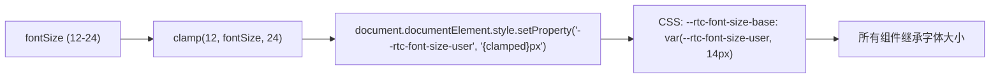
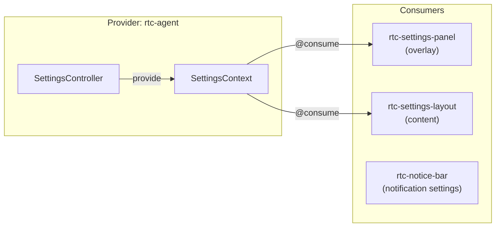

# SettingsSystem

全局设置系统：分组状态管理、DOM 副作用、多 Tab 同步、localStorage 持久化。

**所属 package**: `component`

## 关键代码文件

- [controllers/settings.controller.ts](~/Workspaces/rtc-agent/web-components/packages/component/src/controllers/settings.controller.ts) — SettingsController：状态管理、DOM 副作用、多 Tab 同步
- [contexts/settings.ts](~/Workspaces/rtc-agent/web-components/packages/component/src/contexts/settings.ts) — `SettingsContext` 定义：分组状态接口、默认值
- [components/settings/rtc-settings-panel.ts](~/Workspaces/rtc-agent/web-components/packages/component/src/components/settings/rtc-settings-panel.ts) — 设置面板 overlay（ESC 关闭）
- [components/settings-layout/rtc-settings-layout.ts](~/Workspaces/rtc-agent/web-components/packages/component/src/components/settings-layout/rtc-settings-layout.ts) — 设置内容布局：导航 + 内容区

## 设置分组

| 分组 | 字段 | 默认值 | DOM 副作用 |
|------|------|--------|------------|
| `appearance` | `theme: 'light' \| 'dark' \| 'system'` | `'system'` | 设置 `rtc-agent.theme` 属性 |
| `appearance` | `fontSize: number` (12-24) | `14` | 设置 `--rtc-font-size-user` CSS 变量 |
| `chat` | `sendShortcut: 'Enter' \| 'Ctrl+Enter'` | `'Enter'` | 无（消费者处理） |
| `chat` | `density: 'compact' \| 'comfortable'` | `'comfortable'` | 无（消费者处理） |
| `files` | `autoSave: boolean` | `true` | 无（消费者处理） |
| `files` | `defaultViewMode: 'edit' \| 'preview' \| 'split'` | `'split'` | 无（消费者处理） |
| `notifications` | `soundEnabled: boolean` | `true` | 无（消费者处理） |
| `notifications` | `toastEnabled: boolean` | `true` | 无（消费者处理） |

## 状态更新流程



### 增量 DOM 副作用

`_applyDiff()` 仅对实际变更的属性执行 DOM 操作，避免不必要的副作用：



`chat` / `files` / `notifications` 变更不触发 DOM 副作用，由消费组件通过 `@consume` 自行响应。

## Theme 解析



`matchMedia` 监听在 `hostConnected()` 中注册，系统主题变化时自动响应（仅当 theme === 'system'）。

## 多 Tab 同步



多 Tab 同步通过 `window.addEventListener('storage', ...)` 实现。当一个 Tab 修改 localStorage 时，其他 Tab 收到 `storage` 事件，重新读取并应用变更。

## Font Size 应用



字体大小设置在 `document.documentElement`（`<html>`）上，通过 CSS 变量穿透 Shadow DOM 边界。

## Context 消费



## 用户覆盖机制

如果宿主应用在 `<rtc-agent>` 元素上显式设置了 `theme` 属性，SettingsController 不会覆盖它：

```typescript
const rtcAgent = this.host.closest('rtc-agent') || this.host;
const userSetTheme = rtcAgent.hasAttribute('theme');
if (!userSetTheme) {
    this._applyTheme();
}
```

这允许宿主应用通过 HTML 属性锁定主题，不受设置面板影响。

## 关键注释摘录

> **增量 DOM 副作用** — [settings.controller.ts:157-167](~/Workspaces/rtc-agent/web-components/packages/component/src/controllers/settings.controller.ts#L157-L167)
>
> ```text
> chat/files/notifications changes don't require DOM operations
> Consumer components handle these via context subscription
> ```
> 仅 appearance 变更触发 DOM 副作用，其他分组的变更由消费者自行处理。

> **多 Tab 同步清理** — [settings.controller.ts:55-57](~/Workspaces/rtc-agent/web-components/packages/component/src/controllers/settings.controller.ts#L55-L57)
>
> ```text
> Clean up listeners from a previous connect cycle (disconnect → reconnect)
> to prevent leaked event listeners accumulating on window / media query.
> ```
> 在 `hostConnected()` 开始时先清理旧监听器，防止 disconnect/reconnect 循环累积重复监听器。

> **Font size CSS 变量** — [settings.controller.ts:191-193](~/Workspaces/rtc-agent/web-components/packages/component/src/controllers/settings.controller.ts#L191-L193)
>
> ```text
> tokens.ts defines --rtc-font-size-base as var(--rtc-font-size-user, 14px)
> so setting --rtc-font-size-user overrides the base size globally
> ```
> 使用 `--rtc-font-size-user` 作为覆盖点，默认值 `14px` 在 CSS 中定义。

## 跨维度关联

- [[ControllerPattern]] — SettingsController 是 Controller 模式的实现
- [[LocalStorage]] — 设置持久化到 `rtc_settings` key
- [[I18nTheme]] — theme 设置与 locale 系统交互
- [[DesignSystem]] — font size 通过 CSS 变量影响 Design Token 系统
- [[WindowConfig]] — `embedded` 模式下的设置面板行为
