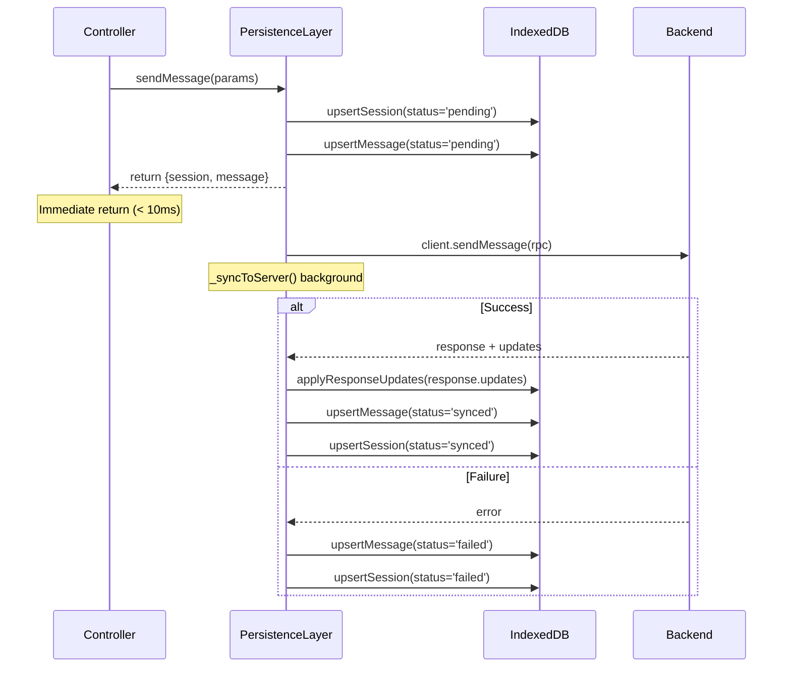
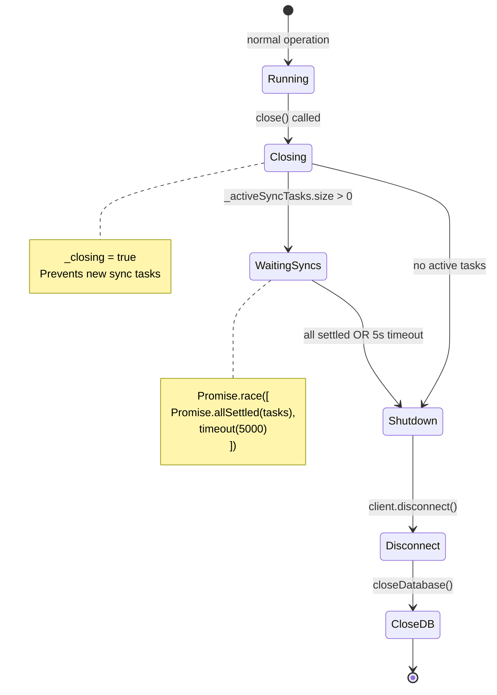
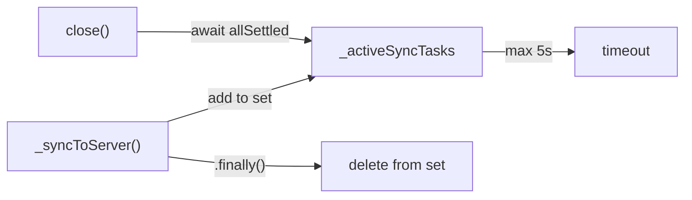
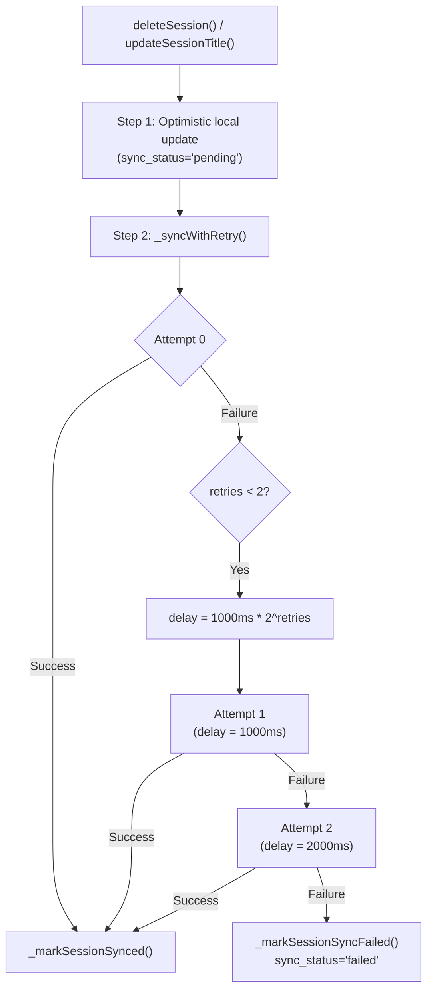
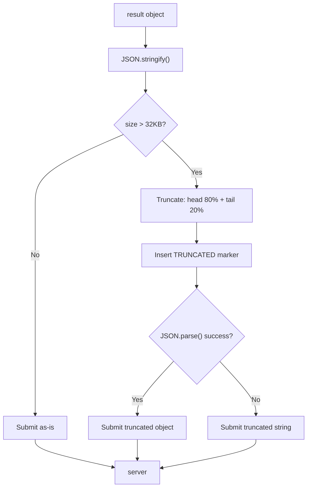
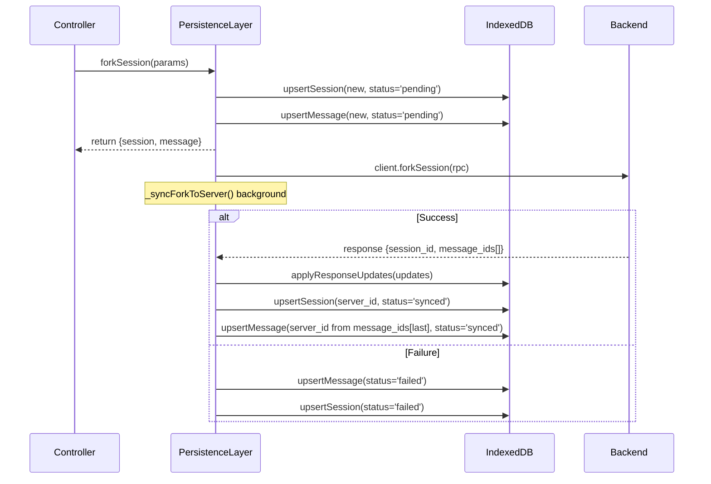
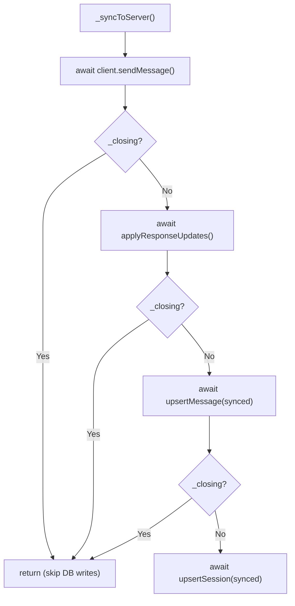

# SyncPattern

PersistenceLayer 的乐观同步、优雅关闭与重试退避模式。

**所属 package**: `persistence`

## 关键代码文件

- [index.ts:41-48](~/Workspaces/rtc-agent/web-components/packages/persistence/src/index.ts#L41-L48) — `PersistenceLayer` 类定义 + `_activeSyncTasks` / `_closing` 字段
- [index.ts:244-325](~/Workspaces/rtc-agent/web-components/packages/persistence/src/index.ts#L244-L325) — `sendMessage()` — 乐观写入 + 后台同步
- [index.ts:215-230](~/Workspaces/rtc-agent/web-components/packages/persistence/src/index.ts#L215-L230) — `close()` — 优雅关闭（等待活跃同步任务）
- [index.ts:608-631](~/Workspaces/rtc-agent/web-components/packages/persistence/src/index.ts#L608-L631) — `_syncWithRetry()` — 指数退避重试
- [index.ts:651-725](~/Workspaces/rtc-agent/web-components/packages/persistence/src/index.ts#L651-L725) — `submitRtcResult()` — 大结果截断策略

## 乐观写入模式（Local-First）

所有写操作遵循"本地优先"原则：先写入 IndexedDB 立即返回，再异步同步到服务器。



关键设计：

- **写入前检查 `_closing`** — 防止在关闭过程中写入已关闭的数据库
- **每次 DB 操作前再检查** — `_syncToServer()` 中每个 await 之后都检查 `_closing`，确保不会在关闭期间执行写入
- **silent 写入** — 本地写入使用 `{ silent: true }` 避免触发 UIUpdateBus 噪声

## 优雅关闭序列

`close()` 等待活跃同步任务完成（最多 5 秒），然后断开连接并关闭数据库。



关键代码模式：

```typescript
// index.ts:215-230
async close(): Promise<void> {
    this._closing = true;
    if (this._activeSyncTasks.size > 0) {
        const timeout = new Promise<void>(resolve => setTimeout(resolve, 5000));
        await Promise.race([
            Promise.allSettled(Array.from(this._activeSyncTasks)),
            timeout,
        ]);
    }
    this.disconnect();
    await closeDatabase();
}
```

## 同步任务跟踪

`_activeSyncTasks` 是一个 `Set<Promise<void>>`，用于跟踪所有进行中的后台同步任务。



```typescript
// persistence-layer.ts:330-333
private _trackSyncTask(task: Promise<void>): void {
    this._activeSyncTasks.add(task);
    task.finally(() => this._activeSyncTasks.delete(task));
}
```

## 指数退避重试

`_syncWithRetry()` 用于 session 删除和标题更新操作，采用指数退避策略。



常量：

| Constant | Value | Description |
| --- | --- | --- |
| `SYNC_MAX_RETRIES` | 3 | 最大尝试次数 |
| `SYNC_BASE_DELAY_MS` | 1000 | 基础延迟 1 秒 |

重试序列：1s → 2s → 4s（指数退避），共 3 次尝试。

注意：重试是异步执行的（fire-and-forget），不阻塞调用方。失败后 session 标记为 `sync_status='failed'`，后续操作可再次触发同步。

## 大结果截断策略

`submitRtcResult()` 对提交给服务器的结果数据进行大小限制，防止超过 Centrifuge 消息大小上限。



阈值：32KB（为消息头和序列化开销预留空间，Centrifuge 默认上限 64KB）。

截断策略：保留头部 80% + 尾部 20%，中间插入 `\n\n... [TRUNCATED: original size X bytes] ...\n\n`。

## Fork 操作的乐观同步

`forkSession()` 遵循相同的本地优先模式，但涉及两个实体的协调。



注意：新消息的 `server_id` 从 `response.result.message_ids` 的最后一个元素获取（服务器按顺序返回：复制的历史消息 + 新消息）。

## _closing 守卫模式

`_closing` 标志贯穿所有异步写入路径，确保关闭过程中不会执行数据库写入。



每个 `await` 之后都检查 `_closing`，因为 await 期间 `close()` 可能已被调用。

## 关键注释摘录

> **优雅关闭** — [index.ts:214-230](~/Workspaces/rtc-agent/web-components/packages/persistence/src/index.ts#L214-L230)
>
> ```text
> Close the database.
> Waits for active sync tasks to complete (with timeout) before closing.
> ```

> **OffsetManager 写穿缓存** — [index.ts:58-62](~/Workspaces/rtc-agent/web-components/packages/persistence/src/index.ts#L58-L62)
>
> ```text
> OffsetManager uses write-through caching: first call may hit IndexedDB,
> but subsequent calls return from in-memory cache (effectively synchronous).
> This design prevents race conditions in scheduleUpdate's deduplication logic.
> ```

> **_closing 守卫** — [index.ts:449-451](~/Workspaces/rtc-agent/web-components/packages/persistence/src/index.ts#L449-L451)
>
> ```text
> Fix: Bail out if closing (prevent writes to closed database)
> ```

## 跨维度关联

- [[PersistenceLayer]] — PersistenceLayer 完整架构
- [[EntityRepository]] — 底层 CRUD 层，SyncPattern 通过 EntityRepository 写入数据库
- [[ConnectionState]] — 连接断开影响同步状态
- [[SyncStatus]] — sync_status 字段的三态流转（pending / synced / failed）
- [[Offset]] — OffsetManager 的写穿缓存与同步偏移管理
- [[ConcurrencyPatterns]] — 相关但不同：ConcurrencyPatterns 关注 UI 层竞态，SyncPattern 关注持久化层同步
