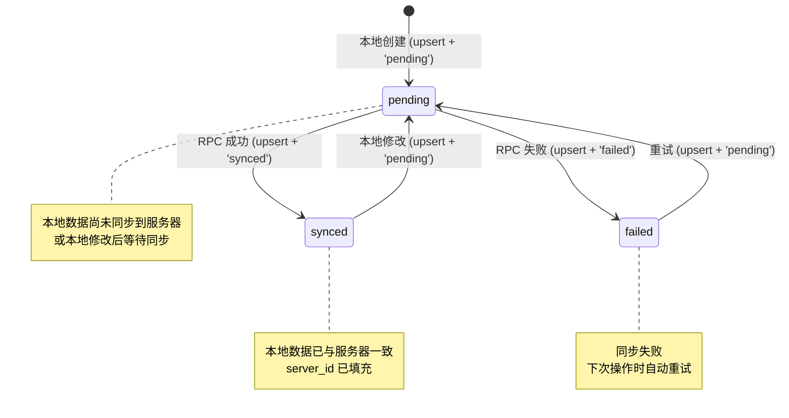
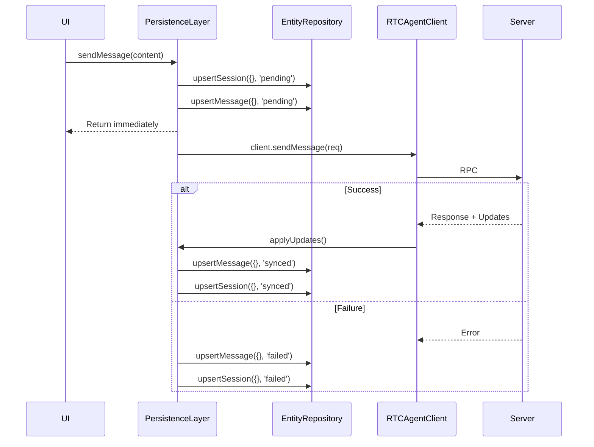
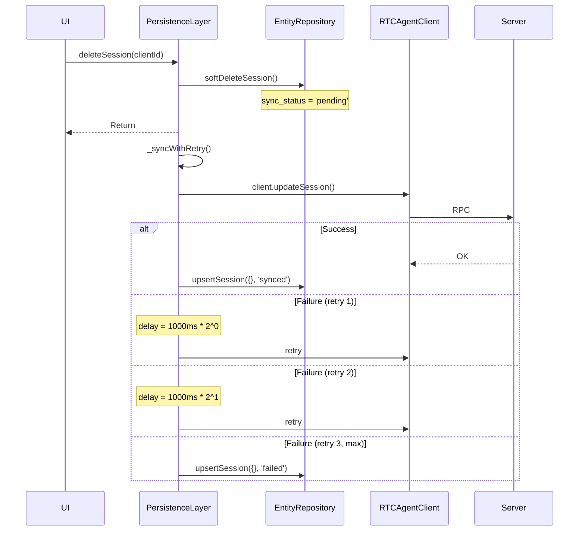

# SyncStatus

实体同步状态：pending / synced / failed 的流转。

**所属 package**: `persistence`

## 关键代码文件

- [database.ts:12](~/Workspaces/rtc-agent/web-components/packages/persistence/src/database.ts#L12) — `SyncStatus` 类型定义
- [entity-repository.ts](~/Workspaces/rtc-agent/web-components/packages/persistence/src/entity-repository.ts) — `EntityRepository` 中 sync_status 的读写

## 状态定义

```typescript
type SyncStatus = 'pending' | 'synced' | 'failed';
```

## 状态机



## 典型流转场景

### sendMessage（乐观写入）



### deleteSession / updateSessionTitle（带重试的乐观写入）



## 重试策略

```typescript
// PersistenceLayer
static readonly SYNC_MAX_RETRIES = 3;
static readonly SYNC_BASE_DELAY_MS = 1000;

// Exponential backoff: delay = BASE_DELAY * 2^retries
// retry 0: 1000ms
// retry 1: 2000ms
// retry 2: 4000ms
```

## 关键设计

1. **乐观写入** — 本地先写 `pending` 状态，立即返回 UI，后台异步同步
2. **优雅降级** — RPC 失败时标记 `failed`，下次操作时自动重试
3. **关闭保护** — `PersistenceLayer._closing` 标志防止关闭期间写入已关闭的数据库
4. **指数退避** — 重试间隔按 2^n 增长，避免对服务器造成压力

## 跨维度关联

- [[IndexedDB]] — sync_status 存储在 entities 表中
- [[UIUpdateBus]] — sync_status 变化触发 UI 更新事件
- [[Connection]] — 连接断开时 RPC 失败，标记为 `failed`
- [[Offset]] — offset 推进在 sync_status 更新之后
- [[EntityRepository]] — upsert 方法管理 sync_status 的读写
- [[PersistenceLayer]] — _syncToServer 中处理成功/失败的 sync_status 转换
- [[SyncPattern]] — 乐观同步、优雅关闭、指数退避重试的详细模式
