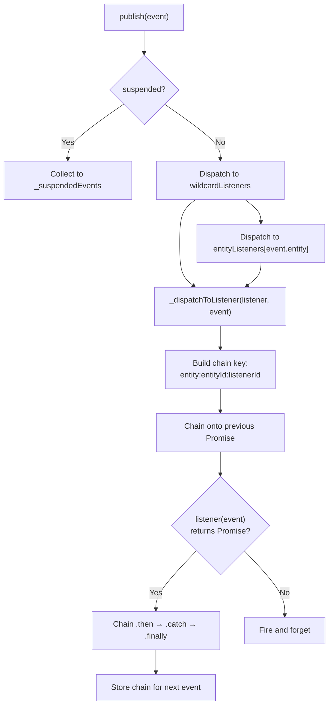
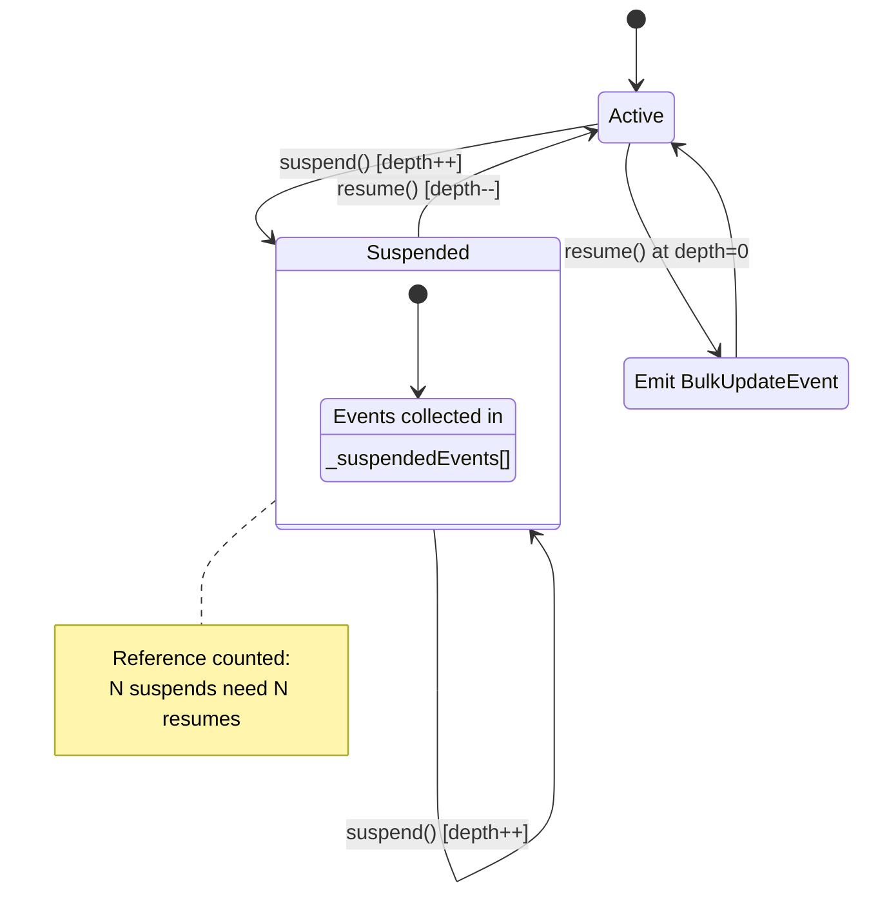
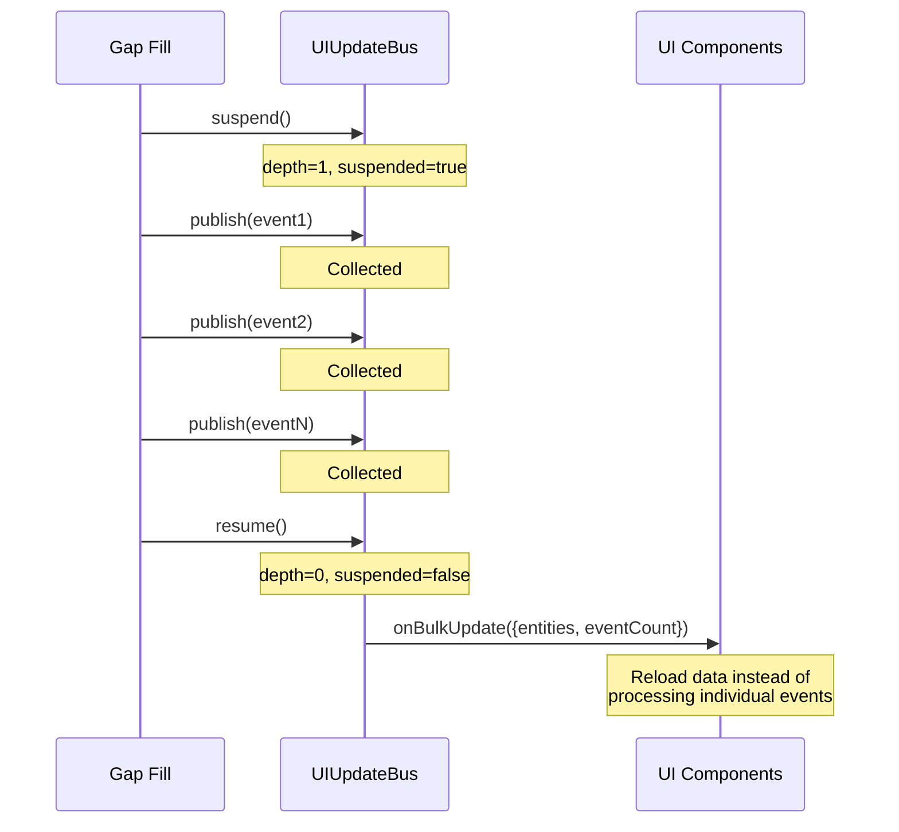
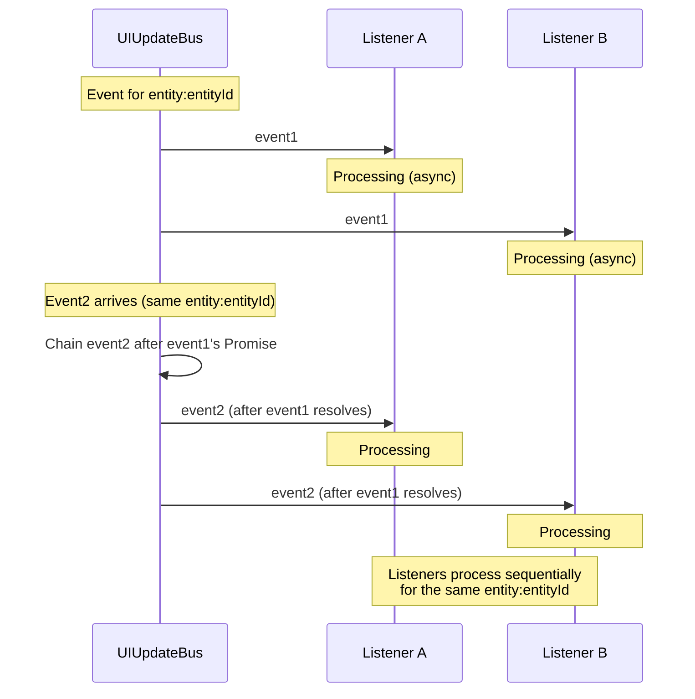
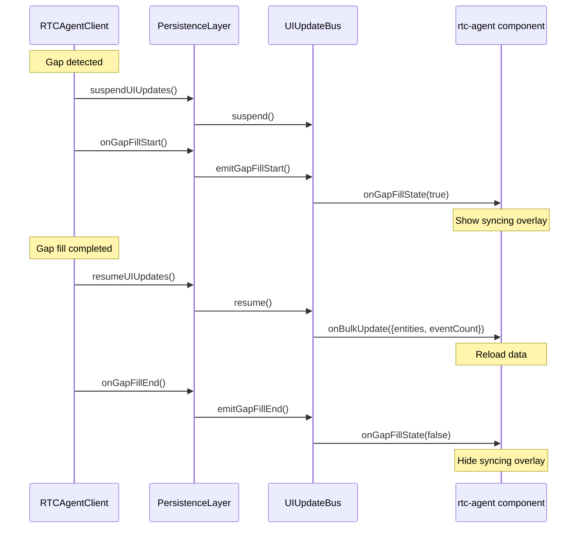

# UIUpdate

UIUpdateBus：per-entity 队列化分发、suspend/resume 批量控制。

**所属 package**: `persistence`

## 关键代码文件

- [ui-update-bus.ts](~/Workspaces/rtc-agent/web-components/packages/persistence/src/ui-update-bus.ts) — `UIUpdateBus` 类 + `getUIUpdateBus()` 单例

## 核心能力

| 能力 | 描述 |
| ------ | ------ |
| Entity 过滤订阅 | `subscribe(entity, listener)` 只接收特定实体类型的事件 |
| 通配符订阅 | `subscribe(listener)` 接收所有事件 |
| Per-listener 队列化 | 同一 (entity, entityId, listener) 的事件串行处理，防止竞态 |
| Suspend/Resume | 批量操作期间暂停分发，恢复时发出 `BulkUpdateEvent` |
| Gap Fill 状态 | `emitGapFillStart()` / `emitGapFillEnd()` 通知 UI 同步状态 |
| 超时保护 | 单个 listener Promise 超时 10s 后自动跳过 |
| 安全定时器 | suspend 超过 30s 自动 force resume |

## 事件结构

```typescript
interface UIUpdateEvent {
  entity: UpdateEntity;      // 'session' | 'message' | 'rtc' | 'file' | ...
  action: UpdateAction;      // 'created' | 'updated' | 'deleted'
  entityId: string;
  field: string;             // Dot-notation, e.g. 'title', 'content.0.text'
  oldValue: unknown;
  newValue: unknown;
}
```

## 分发流程



## Suspend/Resume 机制





## Per-Listener 队列化



## Gap Fill 状态事件

除了 `UIUpdateEvent` 和 `BulkUpdateEvent`，UIUpdateBus 还提供 Gap Fill 状态事件，用于通知 UI 层进入/退出同步状态（显示/隐藏同步遮罩）。



### API

| 方法 | 说明 |
| ---- | ---- |
| `emitGapFillStart()` | 发出同步开始事件（`isSyncing: true`） |
| `emitGapFillEnd()` | 发出同步结束事件（`isSyncing: false`） |
| `onGapFillState(listener)` | 订阅 Gap Fill 状态变化，返回取消订阅函数 |

```typescript
type GapFillStateListener = (isSyncing: boolean) => void;
```

### 触发条件

Gap Fill 状态事件仅在 gap 超过 `SUSPEND_THRESHOLD`（100）时触发。小 gap 不触发 suspend/resume，也不触发 Gap Fill 状态事件。

[client.ts:843-847](~/Workspaces/rtc-agent/web-components/packages/client/src/client.ts#L843-L847)

```typescript
if (gapSize > SUSPEND_THRESHOLD) {
    this.options.resumeUIUpdates?.();
    this.options.onGapFillEnd?.();
}
```

## 关键参数

| Parameter | Value | Purpose |
| ----------- | ------- | --------- |
| `CHAIN_TIMEOUT_MS` | 10,000 | 单个 listener Promise 超时时间 |
| `MAX_SUSPEND_MS` | 30,000 | suspend 最大持续时间，超时自动 force resume |

## 关键注释摘录

> **Per-entity 队列化设计** — [ui-update-bus.ts:56-60](~/Workspaces/rtc-agent/web-components/packages/persistence/src/ui-update-bus.ts#L56-L60)
> _Events for the same (entity, entityId) are queued per listener, ensuring sequential processing and preventing race conditions._

> **Error handling** — [ui-update-bus.ts:129-131](~/Workspaces/rtc-agent/web-components/packages/persistence/src/ui-update-bus.ts#L129-L131)
> _Error handling: Both sync and async errors are caught by .catch() to prevent the Promise chain from breaking. A broken chain would cause all subsequent events for this (entity, entityId, listener) to be dropped._

## 跨维度关联

- [[Publication]] — Publication 处理后触发 UIUpdateBus.publish()
- [[EntityRepository]] — EntityRepository 的 upsert 方法发出 UIUpdateEvent
- [[SharedWorker]] — WorkerCore 订阅 Worker 内的 UIUpdateBus，广播到主线程
- [[SyncStatus]] — sync_status 变化也会触发 UI 更新事件
