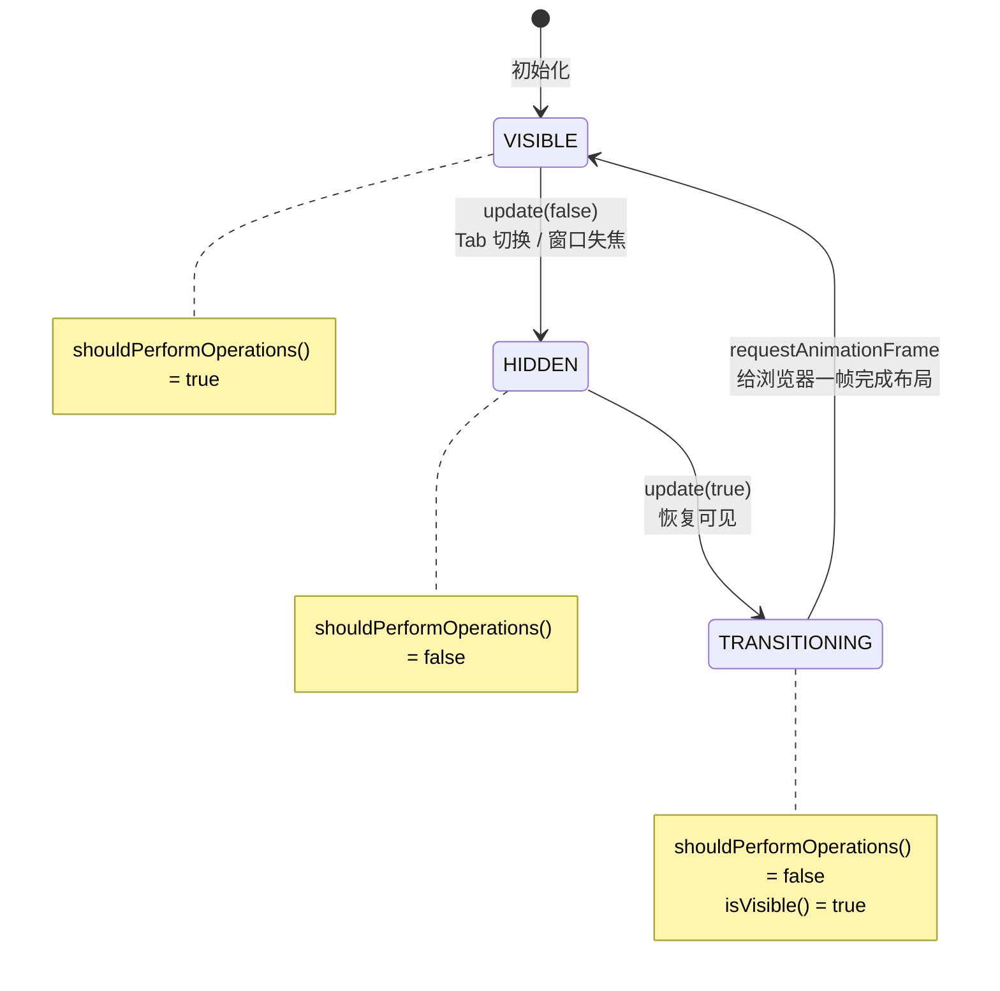
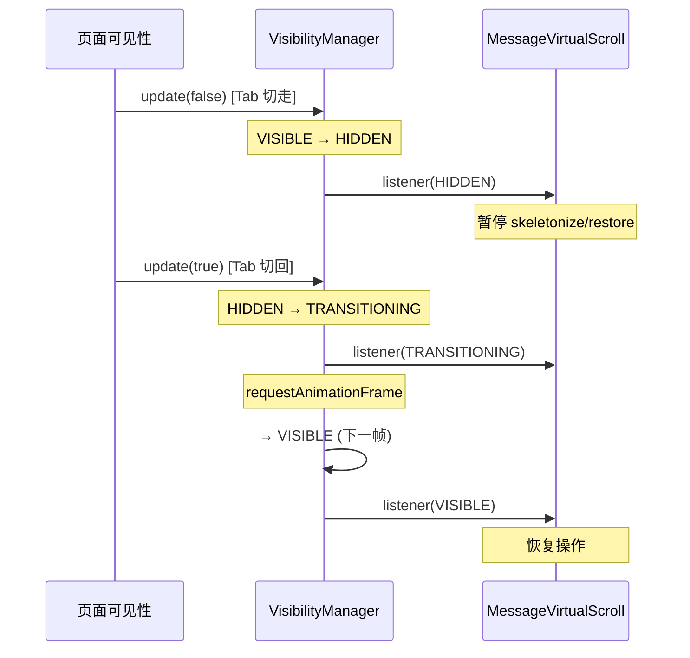

# VisibilityState

虚拟滚动的可见性状态机：确保 Tab 切换、窗口失焦时暂停操作，恢复可见时同步重建状态。

**所属 package**: `component`

## 关键代码文件

- [utils/visibility-manager.ts](~/Workspaces/rtc-agent/web-components/packages/component/src/utils/visibility-manager.ts) — VisibilityManager：可见性状态机实现
- [utils/message-virtual-scroll.ts](~/Workspaces/rtc-agent/web-components/packages/component/src/utils/message-virtual-scroll.ts) — 主要消费者，使用 `shouldPerformOperations()` 控制操作

## 解决的问题

虚拟滚动在以下场景会出现状态不一致：

1. **Tab 切换**（CSS `visibility: hidden`）— 虚拟滚动仍在执行 skeletonize/restore 操作
2. **浏览器窗口失焦**（`document.hidden`）— 状态无法及时同步
3. **从不可见恢复到可见** — 骨架屏无法正确恢复

## 状态机



### 状态说明

| 状态 | `shouldPerformOperations()` | `isVisible()` | 含义 |
|------|---------------------------|---------------|------|
| `VISIBLE` | `true` | `true` | 可见且活跃，可执行骨架屏/恢复操作 |
| `HIDDEN` | `false` | `false` | 不可见，暂停所有操作 |
| `TRANSITIONING` | `false` | `true` | 从 hidden 到 visible 的过渡期，等待浏览器完成布局 |

## 使用模式



## 关键 API

| 方法 | 说明 |
|------|------|
| `update(isVisible: boolean)` | 更新可见性状态，触发状态转换 |
| `shouldPerformOperations()` | 检查是否应执行操作（仅 VISIBLE 为 true） |
| `isVisible()` | 检查是否可见（VISIBLE 或 TRANSITIONING） |
| `onStateChange(listener)` | 注册状态变化监听器，返回取消函数 |
| `dispose()` | 清空监听器，重置状态 |

## 关键注释摘录

> **TRANSITIONING 状态的必要性** — [visibility-manager.ts:78-83](~/Workspaces/rtc-agent/web-components/packages/component/src/utils/visibility-manager.ts#L78-L83)
>
> ```text
> 从 HIDDEN 到 VISIBLE 需要经过 TRANSITIONING 过渡状态
> 给浏览器一帧时间完成布局，然后转为 VISIBLE
> ```

## 跨维度关联

- [[MessageVirtualScroll]] — VisibilityManager 的主要消费者
- [[ComponentHierarchy]] — 由 `<rtc-content-area>` 创建并管理
