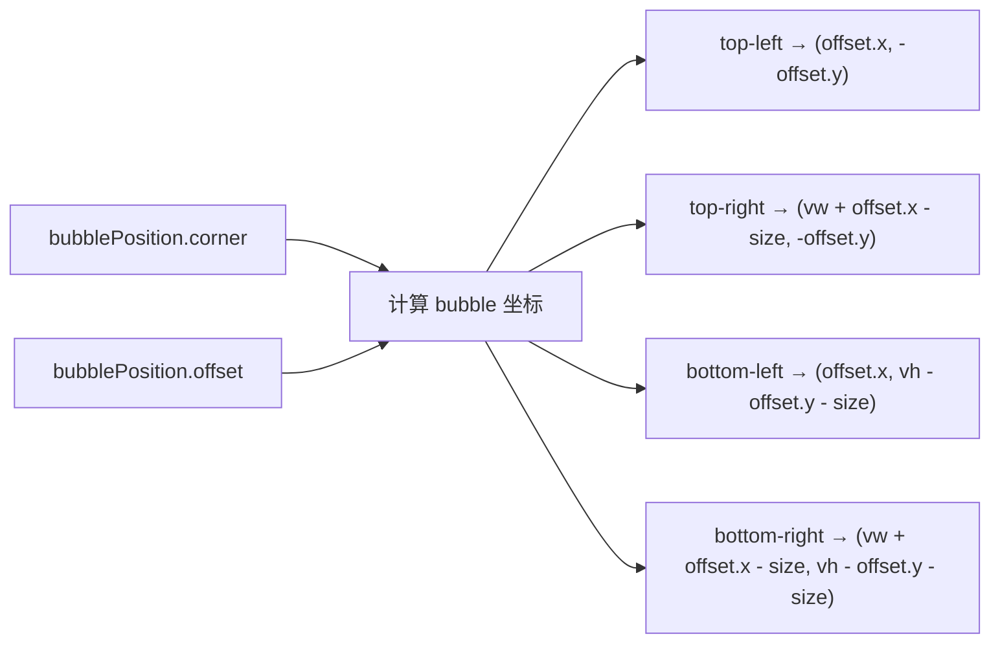
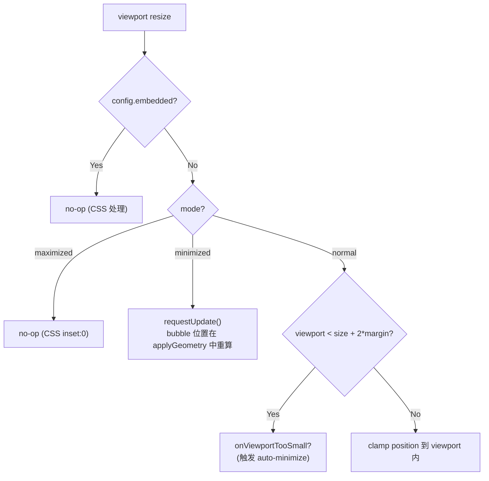
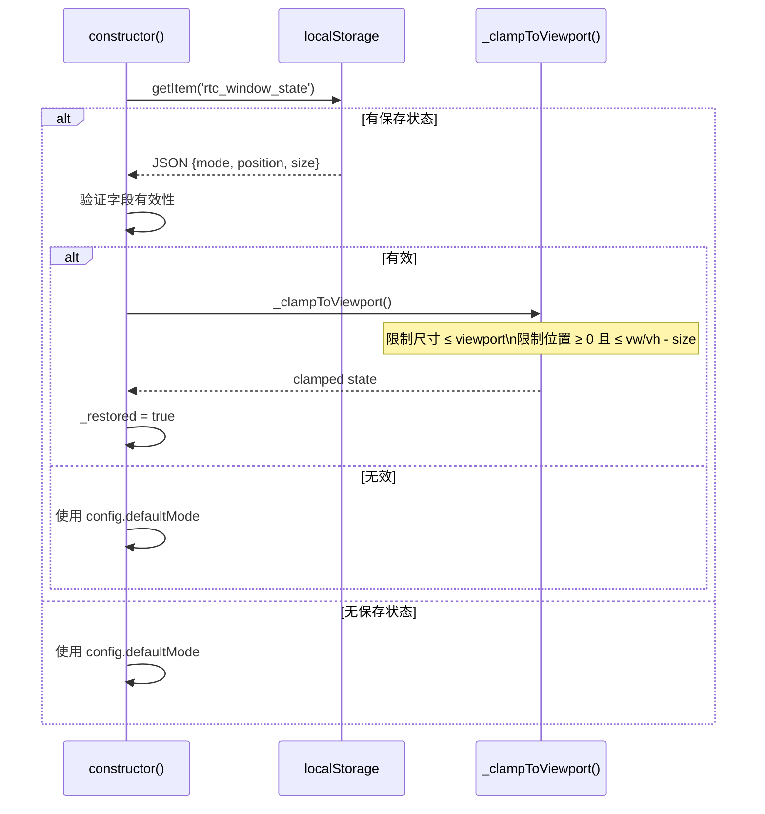
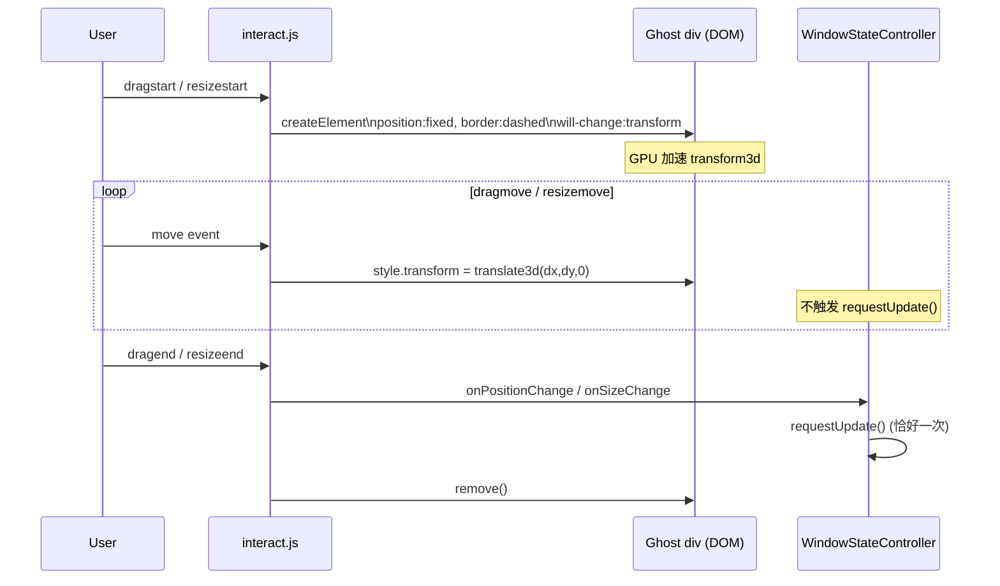
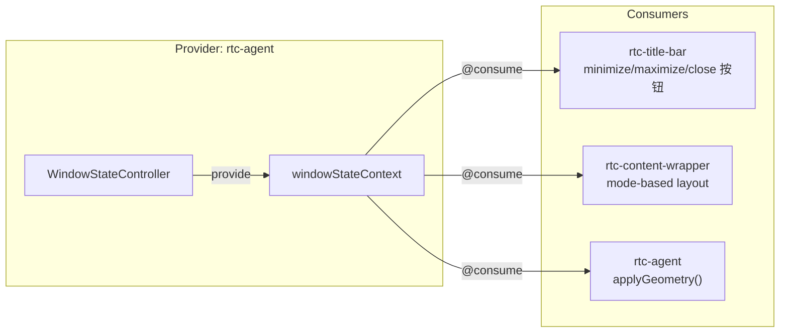

# WindowSystem

浮动窗口状态机：normal / minimized / maximized 三模态切换、viewport 自适应、bubble 定位、localStorage 持久化。

**所属 package**: `component`

## 关键代码文件

- [controllers/window-state.controller.ts](~/Workspaces/rtc-agent/web-components/packages/component/src/controllers/window-state.controller.ts) — 窗口状态管理：mode/position/size 状态机、localStorage 持久化、viewport clamp
- [controllers/window-interaction.controller.ts](~/Workspaces/rtc-agent/web-components/packages/component/src/controllers/window-interaction.controller.ts) — 拖拽/缩放交互：interact.js 封装、ghost preview、键盘模式
- [contexts/window-state.ts](~/Workspaces/rtc-agent/web-components/packages/component/src/contexts/window-state.ts) — `WindowStateContext` 定义：`WindowState` / `WindowStateActions` / `DEFAULT_WINDOW_STATE`
- [components/rtc-agent/rtc-agent.ts](~/Workspaces/rtc-agent/web-components/packages/component/src/components/rtc-agent/rtc-agent.ts) — 根组件消费 WindowStateContext，调用 `applyGeometry()`
- [components/title-bar/rtc-title-bar.ts](~/Workspaces/rtc-agent/web-components/packages/component/src/components/title-bar/rtc-title-bar.ts) — 标题栏：minimize/maximize/close 按钮触发 WindowStateActions
- [components/content-wrapper/rtc-content-wrapper.ts](~/Workspaces/rtc-agent/web-components/packages/component/src/components/content-wrapper/rtc-content-wrapper.ts) — 内容容器：根据 window mode 切换布局

## 窗口状态机

```mermaid
stateDiagram-v2
    [*] --> Normal: initial / restore from localStorage

    Normal --> Minimized: minimize()
    Normal --> Maximized: maximize()

    Minimized --> Normal: restore()
    Note right of Minimized: lastState 保存 normal 时的 position/size\nrestore 时根据 bubblePosition.corner 重新计算初始位置

    Maximized --> Normal: restore()
    Maximized --> Minimized: minimize()
    Minimized --> Maximized: maximize()

    Note over Normal: position/size 由 inline style 控制
    Note over Maximized: CSS inset:0 接管布局
    Note over Minimized: 收缩为 40×40 bubble，position:fixed
```

## 窗口几何应用

`WindowStateController.applyGeometry(el)` 根据当前 mode 将状态映射为 DOM inline style：

```mermaid
flowchart TD
    A["applyGeometry(el)"] --> B{el.hasAttribute('data-embedded')?}
    B -->|Yes| C["清除所有 inline geometry<br/>CSS position:relative 接管"]
    B -->|No| D{mode?}
    D -->|normal| E["el.style.left/top = position\nel.style.width/height = size\n清除 bubble inline style"]
    D -->|minimized| F["计算 bubble 位置<br/>(基于 bubblePosition.corner)\nel.style.left/top = bubbleX/Y\n清除 width/height (CSS 设为 40×40)\nbubble 设 position:fixed"]
    D -->|maximized| G["清除所有 inline geometry<br/>CSS inset:0 接管"]
```

### Bubble 定位算法

minimized 模式下，bubble 位置由 `bubblePosition.corner` + `bubblePosition.offset` 计算：



offset 使用笛卡尔坐标系：正值远离角落，负值朝向中心。

## Viewport 自适应

`_handleViewportResize()` 在窗口 `resize` 事件中触发，处理不同 mode 下的 viewport 变化：



## localStorage 持久化

持久化字段：`mode` / `position` / `size`（剔除 `lastState`，恢复后无意义）。



`_clampToViewport()` 确保刷新后窗口不会溢出视口（DevTools 打开/关闭/缩放可能导致视口变化）。

## 交互控制器

`WindowInteractionController` 使用 interact.js 处理拖拽和缩放，通过 ghost preview 避免 Lit 重渲染：



### 键盘模式

| 按键 | 行为 |
|------|------|
| Enter / Space | 进入 move 模式 |
| 方向键 | 10px 步进移动（Shift: 20px） |
| Escape | 退出 move 模式 |

### 关键设计

| 技术 | 用途 |
|------|------|
| Ghost element | 虚线边框 div，transform3d GPU 加速，替代 Lit 重渲染 |
| `_cachedMargin` | 缓存 `getComputedStyle` 结果，避免 move 期间重复计算 |
| Deferred config | 交互进行中的 `setConfig()` 延迟到 `dragend`/`resizeend` 后执行 |
| Idempotent enable | `_isEnabled` 标志防止重复创建 interact 实例 |

## Context 消费



## 关键注释摘录

> **序列化时剔除 transient 字段** — [window-state.controller.ts:26](~/Workspaces/rtc-agent/web-components/packages/component/src/controllers/window-state.controller.ts#L26)
>
> ```typescript
> type PersistedWindowState = Omit<WindowState, 'lastState'>;
> ```
> `lastState` 在 restore 后无意义，不参与持久化。

> **viewport clamp 原因** — [window-state.controller.ts:211](~/Workspaces/rtc-agent/web-components/packages/component/src/controllers/window-state.controller.ts#L211)
>
> ```text
> 刷新后浏览器 devtools、缩放比例可能已变化，
> 直接恢复上次的位置可能导致窗口溢出视口（如被右侧 devtools 遮挡）。
> ```

> **Bubble position:fixed** — [window-state.controller.ts:420-421](~/Workspaces/rtc-agent/web-components/packages/component/src/controllers/window-state.controller.ts#L420-L421)
>
> ```text
> The .bubble inside shadow DOM cannot rely on position:absolute; inset:0
> because the shadow DOM layout may be offset from the host's visual position.
> ```
> 使用 `position:fixed` 确保 bubble 相对于 viewport 定位，与 host 的 fixed 定位一致。

## 跨维度关联

- [[ControllerPattern]] — WindowStateController 和 WindowInteractionController 是 Controller 模式的典型实现
- [[LocalStorage]] — 窗口状态持久化到 localStorage
- [[WindowConfig]] — `ResolvedWindowConfig` 控制初始模式和尺寸约束
- [[I18nTheme]] — WindowStateController 与 Theme 独立，但都通过 `rtc-agent` 元素的属性控制
- [[ChatLayout]] — embedded 模式下的布局处理
