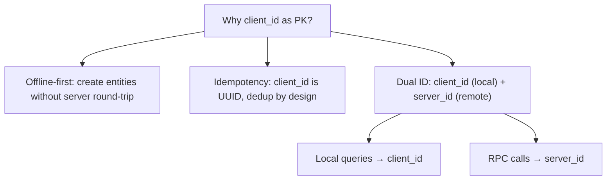

# IndexedDB

Dexie 封装：8 个版本迁移、6 张表结构、索引设计。

**所属 package**: `persistence`

## 关键代码文件

- [database.ts](~/Workspaces/rtc-agent/web-components/packages/persistence/src/database.ts) — `RTCAgentDatabase` 类、表类型定义、单例管理

## 表结构详情

### sessions

| Field | Type | Index | Description |
|-------|------|-------|-------------|
| `client_id` | string | PK | 客户端生成的幂等 ID |
| `server_id` | string? | indexed | 服务器 UUID |
| `sync_status` | SyncStatus | indexed | 同步状态 |
| `status` | string | indexed | 会话状态 (active/closed) |
| `updated_at` | string | indexed | 更新时间（排序用） |
| `title` | string | — | 会话标题 |
| `agent_prompt` | string | — | Agent 提示词 |
| `device_id` | string? | indexed | 设备 ID |
| `deleted_at` | string? | — | 软删除时间 |

### messages

| Field | Type | Index | Description |
|-------|------|-------|-------------|
| `client_id` | string | PK | 客户端 ID |
| `server_id` | string? | indexed | 服务器 ID |
| `session_client_id` | string | indexed | 关联会话 |
| `role` | string | — | user/assistant/tool/system |
| `content` | string | — | JSON 序列化内容 |
| `streaming_status` | string | — | pending/streaming/completed/failed |
| `created_at` | string | indexed | 创建时间（排序用） |
| `parent_client_id` | string? | — | 父消息引用 |

### fileSystemEntries

| Field | Type | Index | Description |
|-------|------|-------|-------------|
| `path` | string | PK | 文件路径 |
| `type` | string | indexed | function/scenario/script/index |
| `content` | string | — | 文件内容 |
| `metadata.group` | string | indexed | 所属组 |
| `metadata.tags` | string[] | multi-entry indexed | 标签（多值索引） |
| `metadata.editedByUser` | boolean | — | 用户编辑保护标志 |

### turns

| Field | Type | Index | Description |
|-------|------|-------|-------------|
| `client_id` | string | PK | 客户端生成的 Turn ID |
| `server_id` | string? | indexed | 服务器 UUID |
| `sync_status` | SyncStatus | indexed | 同步状态 |
| `session_client_id` | string | indexed | 关联会话的 client_id |
| `status` | string | indexed | Turn 状态 (pending/running/completed/failed) |
| `tool_name` | string | — | 工具名称 |
| `tool_params` | string | — | JSON 序列化工具参数 |
| `tool_result` | string? | — | JSON 序列化工具结果 |

### rtcs

| Field | Type | Index | Description |
|-------|------|-------|-------------|
| `client_id` | string | PK | 客户端生成的 RTC ID |
| `server_id` | string? | indexed | 服务器 UUID |
| `sync_status` | SyncStatus | indexed | 同步状态 |
| `session_client_id` | string | indexed | 关联会话的 client_id |
| `session_device_id` | string? | indexed | 冗余的 session.device_id（执行时过滤，v8 添加） |
| `turn_id` | string? | indexed | 关联 Turn |
| `tool_name` | string | — | 工具名称 |
| `tool_params` | string | — | JSON 序列化工具参数 |
| `tool_result` | string? | — | JSON 序列化工具结果 |
| `offset` | number | indexed | Centrifuge offset（处理排序） |
| `status` | string | indexed | RTC 状态 (pending/failed) |

### offsets

| Field | Type | Index | Description |
|-------|------|-------|-------------|
| `channel` | string | PK | Centrifuge 通道名（如 `topic:u=xxx`） |
| `offset` | number | — | 当前已处理的 offset |
| `epoch` | string | — | 当前 epoch（服务器重启后变更） |
| `updatedAt` | number | — | 最后更新时间戳 |

## 主键设计原则



## 版本迁移策略

1. **v1→v2 (PK 迁移)** — clear + add 替代 update（因 PK 变更无法 update）
2. **v2→v5 (索引添加)** — 只需更新 stores 定义
3. **v5→v6 (新表)** — 添加 fileSystemEntries 表
4. **v7→v8 (数据回填)** — 遍历 RTC 记录，从关联 session 回填 session_device_id

## 关键注释摘录

> **PK 迁移策略** — [database.ts:156-160](~/Workspaces/rtc-agent/web-components/packages/persistence/src/database.ts#L156-L160)
>
> ```text
> Data migration: v1 PK was id (server UUID), v2 PK is client_id.
> Since update(key, changes) looks up by the new PK, old records may lack client_id,
> causing update to find no target row and silently fail. Use clear + add instead.
> ```

## 跨维度关联

- [[Database]] — 数据库生命周期
- [[Offset]] — offsets 表
- [[VirtualFS]] — fileSystemEntries 表
- [[SyncStatus]] — sync_status 字段
