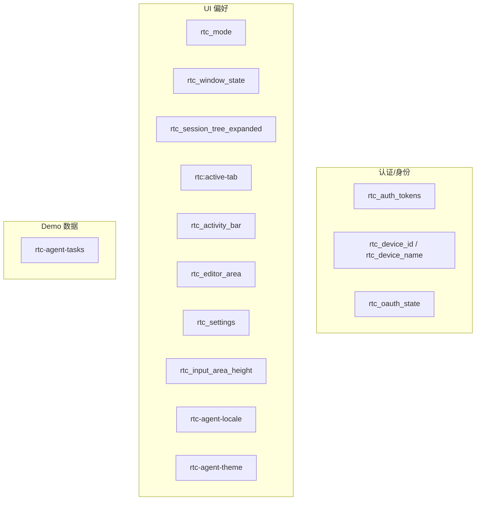
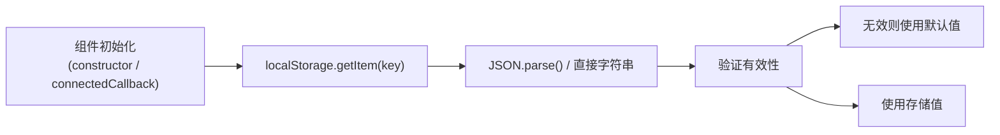
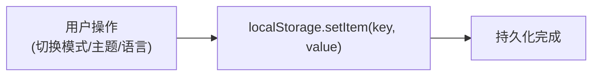

# LocalStorage

localStorage 使用模式：UI 偏好持久化、认证 Token、设备身份、Demo 数据。

**所属 package**: `component`（主消费者）/ `persistence`（部分读取）

## 关键代码文件

- [config/auth.ts:96-114](~/Workspaces/rtc-agent/web-components/packages/component/src/config/auth.ts#L96-L114) — `STORAGE_KEYS` 常量定义（集中管理所有 key）
- [core/i18n.ts:60-98](~/Workspaces/rtc-agent/web-components/packages/component/src/core/i18n.ts#L60-L98) — locale 持久化
- [core/theme.ts:9-45](~/Workspaces/rtc-agent/web-components/packages/component/src/core/theme.ts#L9-L45) — theme 持久化
- [controllers/mode.controller.ts:53-76](~/Workspaces/rtc-agent/web-components/packages/component/src/controllers/mode.controller.ts#L53-L76) — mode 持久化
- [storage.ts](~/Workspaces/rtc-agent/web-components/packages/component/src/storage.ts) — Demo Task 数据（localStorage 直存，不经过 VirtualFS）

## Key 清单

| Key | 写入者 | 数据格式 | 说明 |
|-----|--------|----------|------|
| `rtc_auth_tokens` | `AuthController` | JSON | OAuth2 access_token + refresh_token |
| `rtc_device_id` | `DeviceIdentity` | string | 设备 UUID |
| `rtc_device_name` | `DeviceIdentity` | string | 设备名称 |
| `rtc_oauth_state` | `OAuth2Client` | string | CSRF state 参数 |
| `rtc_mode` | `ModeController` | `'manual' \| 'edit' \| 'plan' \| 'auto' \| 'bypass'` | AI 工作模式 |
| `rtc_window_state` | `WindowStateController` | JSON | 窗口 mode/position/size |
| `rtc_session_tree_expanded` | `SessionTreeController` | JSON | `sessionId → isExpanded` 映射 |
| `rtc:active-tab` | `SessionTabController` | string | 上次活动的 sessionId（刷新后恢复） |
| `rtc_activity_bar` | `ActivityController` | JSON | active activity + sidebarVisible |
| `rtc_editor_area` | `EditorAreaController` | JSON | 打开的 tabs + activeFilePath |
| `rtc_settings` | `SettingsController` | JSON | 全局设置状态 |
| `rtc_input_area_height` | — | number | 输入区域高度（resize handle 位置） |
| `rtc-agent-locale` | `I18n` | `'zh-CN' \| 'en-US'` | 语言偏好 |
| `rtc-agent-theme` | `Theme` | `'light' \| 'dark' \| 'system'` | 主题偏好 |
| `rtc-agent-tasks` | `storage.ts` | JSON (Task[]) | Demo 任务数据 |

## 分类



## 访问模式

所有 localStorage 访问都包裹在 `try/catch` 中，因为：

```text
// localStorage may be unavailable (private browsing, quota exceeded)
```

### 读取链



### 写入链



## 与 IndexedDB / VirtualFS 的边界

| 存储层 | 用途 | 数据特征 |
|--------|------|----------|
| **localStorage** | UI 偏好、认证 Token | 小量、字符串、跨 Tab 共享、同步读写 |
| **IndexedDB** | 域模型持久化（Session/Message/Turn/Rtc/VFS） | 大量、结构化、异步读写、事务保护 |
| **VirtualFS** | Agent 可读文档（函数文档、场景） | 文件式、路径寻址、基于 IndexedDB |

localStorage 不存储域模型数据。Demo 的 Task 数据是例外——直接存 localStorage 而不经过 VirtualFS，因为 Task 不需要被 Agent 读取。

## 关键注释摘录

> **集中管理 key** — [auth.ts:96](~/Workspaces/rtc-agent/web-components/packages/component/src/config/auth.ts#L96)
>
> ```typescript
> export const STORAGE_KEYS = { ... } as const;
> ```
> 所有 localStorage key 集中在 `STORAGE_KEYS` 常量中定义，避免散落在各处的字符串字面量。

> **localStorage 降级** — [i18n.ts:68-75](~/Workspaces/rtc-agent/web-components/packages/component/src/core/i18n.ts#L68-L75)
>
> ```text
> localStorage unavailable — fall through to browser language
> ```
> localStorage 不可用时降级到浏览器语言，不阻断初始化流程。

## 跨维度关联

- [[AuthController]] — Token 存储在 localStorage
- [[DeviceIdentity]] — Device ID 存储在 localStorage
- [[I18nTheme]] — locale 和 theme 各自独立使用 localStorage
- [[ControllerPattern]] — 多个 Controller 在初始化时恢复 localStorage 状态
- [[IndexedDB]] — 与 localStorage 的边界划分
- [[SessionManagement]] — SessionTreeController 和 SessionTabController 使用 localStorage 持久化展开状态和活动 Tab
- [[EditorSystem]] — EditorAreaController 使用 localStorage 持久化标签页元数据和光标位置
- [[WindowSystem]] — WindowStateController 使用 localStorage 持久化窗口状态
- [[SettingsSystem]] — SettingsController 使用 localStorage 持久化全局设置，支持多 Tab 同步
