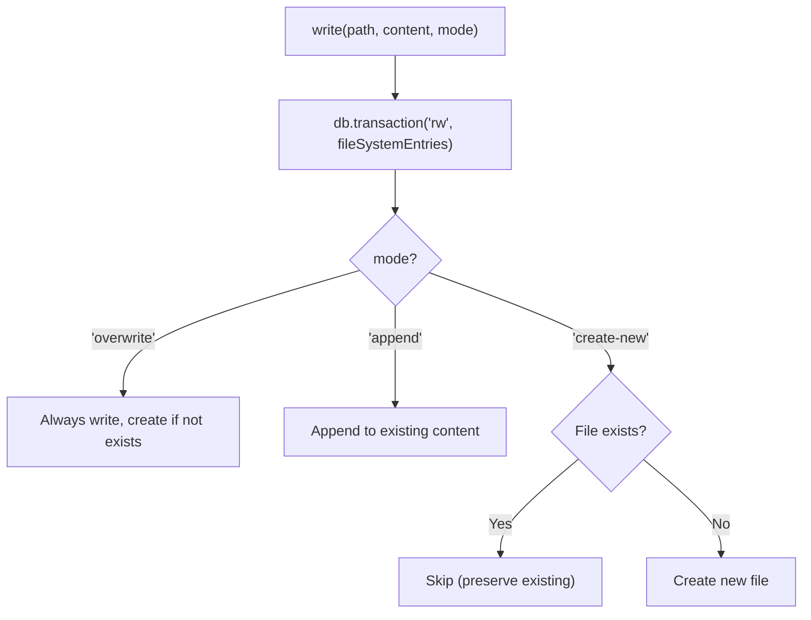
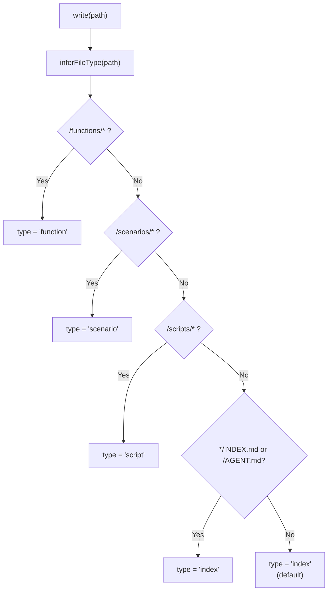
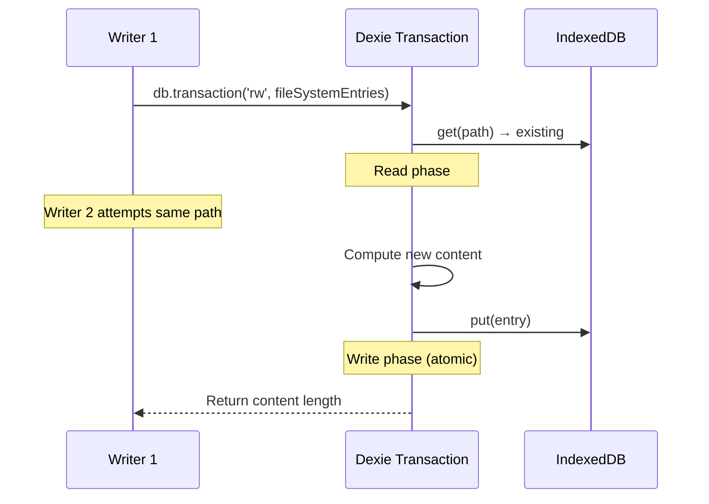
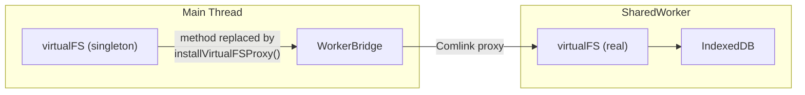
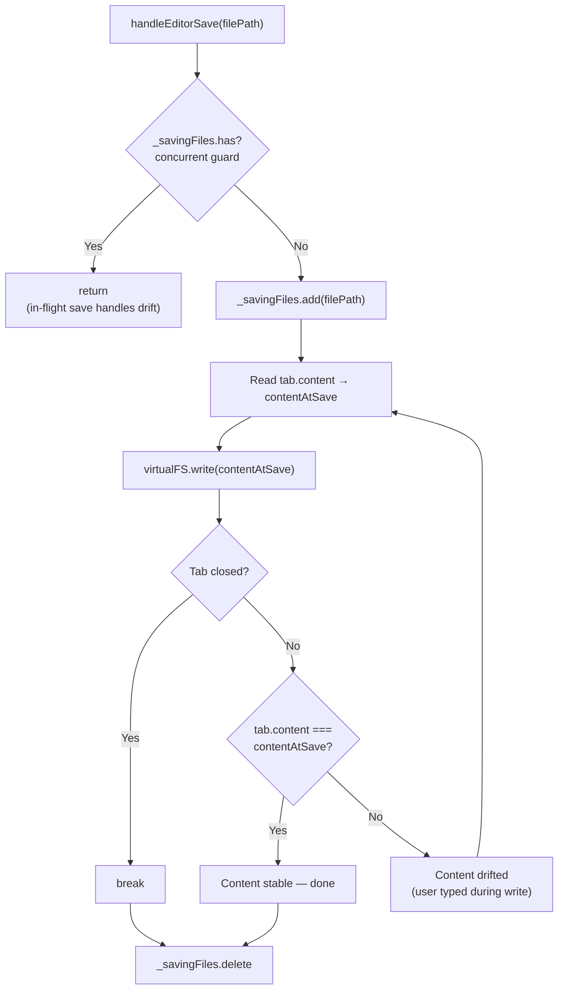
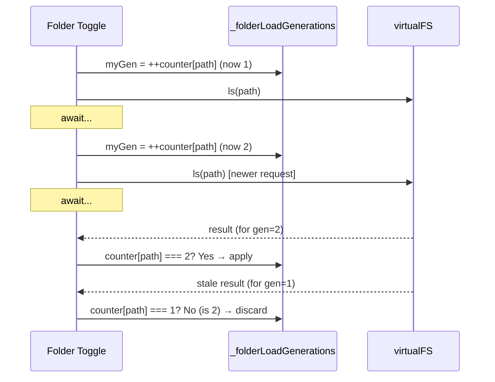

# VirtualFS

虚拟文件系统：path 寻址、事务性 read-modify-write、range 查询优化。

**所属 package**: `persistence`

## 关键代码文件

- [virtual-fs.ts](~/Workspaces/rtc-agent/web-components/packages/persistence/src/virtual-fs.ts) — `VirtualFS` 类（Class-based 设计，便于注入不同 DB 实例）
- [virtual-fs-init.ts](~/Workspaces/rtc-agent/web-components/packages/persistence/src/virtual-fs-init.ts) — `initializeVirtualFS()` 初始化

## API 一览

| Method | Description |
|--------|-------------|
| `read(path, offset?, limit?)` | 读取文件内容（支持分段读取，offset 为 1-indexed 行号） |
| `write(path, content, mode?, metadata?)` | 写入文件（事务保护，overwrite/append/create-new） |
| `edit(path, oldString, newString, replaceAll?)` | 字符串替换（事务保护，replaceAll=false 时多匹配报错） |
| `ls(path?)` | 列出目录内容（range 查询优化） |
| `find(pattern, path?)` | 按文件名搜索（glob 模式，range 查询优化） |
| `grep(pattern, path?, caseSensitive?, maxResults?)` | 按内容搜索（range 查询优化） |
| `queryByType(type)` | 按类型查询（function/scenario/script/index） |
| `exists(path)` | 检查文件是否存在 |
| `remove(path)` | 删除文件 |

## 写入模式



`write()` 和 `edit()` 均包裹在 Dexie 事务中，防止并发 read-modify-write 导致的数据损坏。

## 文件类型推断

`write()` 在写入时自动推断文件类型（`inferFileType`），用于索引和查询：



`function` 类型还会提取 group 名称（`extractGroupFromPath`）：`/functions/user/register.md` → group = `user`。

## edit() 方法

`edit()` 执行字符串替换，事务保护：

```typescript
async edit(path, oldString, newString, replaceAll = false): Promise<{ replaced: number }>
```

行为：
- `replaceAll=false`（默认）：oldString 必须唯一匹配。0 匹配 → 报错；>1 匹配 → 报错（要求提供更多上下文）
- `replaceAll=true`：替换所有匹配项
- `oldString === newString` → 报错（无变更）
- `oldString` 为空 → 报错

## 事务保护



**适用场景**: `write()`（read existing → append → write）和 `editFile()`（read → string replace → write）。事务确保同一 path 的并发操作串行执行。

## 范围查询优化

`ls()` / `find()` / `grep()` 使用 `where('path').startsWith(prefix)` 代替 `.filter(entry => entry.path.startsWith(prefix))`：

```typescript
// Before (全表扫描)
const entries = await db.fileSystemEntries
  .filter(entry => entry.path.startsWith(prefix))
  .toArray();

// After (索引加速)
const entries = await db.fileSystemEntries
  .where('path')
  .startsWith(prefix)
  .toArray();
```

`startsWith` 利用 IndexedDB 的 B-tree 索引进行范围查找，避免遍历全部记录。

## 文件路径约定

```
/
├── AGENT.md              # Agent 系统提示词（自动生成）
├── functions/
│   ├── INDEX.md          # 函数索引（自动生成）
│   ├── task/
│   │   ├── list.md       # task.list 文档
│   │   └── create.md     # task.create 文档
│   └── system/
│       └── delay.md      # system.delay 文档
└── scenarios/
    ├── INDEX.md          # 场景索引（自动生成）
    ├── greeting.md       # 场景文档
    └── code-review.md    # 场景文档
```

## Worker 代理

主线程无法直接访问 IndexedDB。`WorkerBridge.installVirtualFSProxy()` 将 `virtualFS` 的方法替换为 Comlink 代理：



## 关键注释摘录

> **Class-based 设计** — [virtual-fs.ts:1-12](~/Workspaces/rtc-agent/web-components/packages/persistence/src/virtual-fs.ts#L1-L12)
> _Class-based structure (rather than module-level functions): facilitates injecting different database instances or configurations in the future_

> **事务保护** — [virtual-fs.ts:192](~/Workspaces/rtc-agent/web-components/packages/persistence/src/virtual-fs.ts#L192)
> _Wrap read-modify-write in transaction to prevent race conditions_

> **edit() 事务保护** — [virtual-fs.ts:542](~/Workspaces/rtc-agent/web-components/packages/persistence/src/virtual-fs.ts#L542)
> _Wrap read-modify-write in transaction to prevent race conditions (edit method)_

> **Range 查询** — [virtual-fs.ts:267](~/Workspaces/rtc-agent/web-components/packages/persistence/src/virtual-fs.ts#L267)
> _Use startsWith for efficient index-based query_

## 跨维度关联

- [[IndexedDB]] — fileSystemEntries 表是 VirtualFS 的存储后端
- [[FunctionRegistry]] — 函数文档写入 VirtualFS
- [[Permission]] — editedByUser 保护机制；`handleRestoreDefault()` 重置 editedByUser
- [[SharedWorker]] — VirtualFS 在 Worker 内运行
- [[EntityRepository]] — EntityRepository 同样使用事务保护 upsert
- [[RootComponentHelpers]] — 组件层并发保护模式（handleEditorSave、loadFolderChildren、handleRestoreDefault）
- [[ConcurrencyPatterns]] — 事务保护模式的详细说明与跨模块对比
- [[ToolRegistry]] — 文件操作工具（ls/read/write/edit/find/grep）通过 VirtualFS 执行
- [[WorkerBridge]] — 主线程的 VirtualFS 单例方法被替换为 Comlink 代理
- [[ScriptEngine]] — 脚本执行通过 VirtualFS 读取脚本文件
- [[SkillSystem]] — Scenario 加载通过 VirtualFS 读写场景文档

## 组件层并发保护模式

VirtualFS 提供事务性 API，组件层在此基础上构建更高级的并发保护模式。

### handleEditorSave: Loop-Until-Stable

[vfs-operations.ts:272-335](~/Workspaces/rtc-agent/web-components/packages/component/src/components/rtc-agent/helpers/vfs-operations.ts#L272-L335)

用户可能在保存过程中继续输入，导致"写入瞬间内容已过时"。解决方案是循环写入直到内容稳定：



关键设计：

- **Per-file lock** — `_savingFiles: Set<string>` 防止同一文件的重叠保存（如 Ctrl+S 触发时 auto-save 正在进行）
- **快照比较** — 写入前捕获 `contentAtSave`，写入后比较当前 `tab.content`
- **自然收敛** — 用户停止输入后，最多再循环 1 次即稳定
- **UI 合并** — 整个循环只触发一次 `saveFile()` + 一次 Toast

### loadFolderChildren: Generation Counter

[vfs-operations.ts:126-167](~/Workspaces/rtc-agent/web-components/packages/component/src/components/rtc-agent/helpers/vfs-operations.ts#L126-L167)

快速连续展开/折叠同一文件夹时，多个 `loadFolderChildren` 并发执行。使用 generation counter 确保只有最新一次的结果更新 UI：



Generation counter 在 `finally` 块中清理（`_folderLoadGenerations.delete(path)`），防止长期运行的 Session 中内存泄漏。
